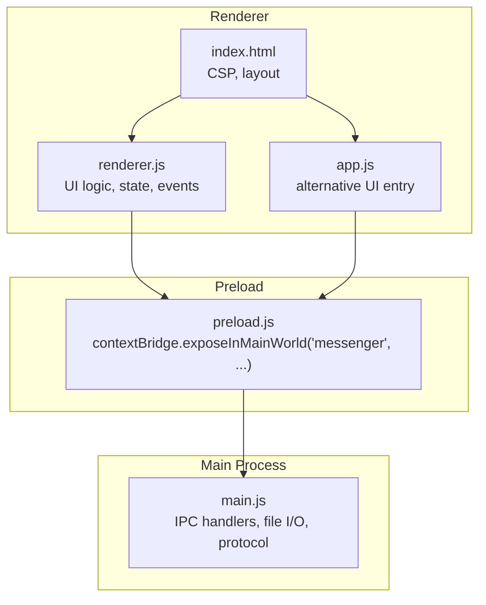
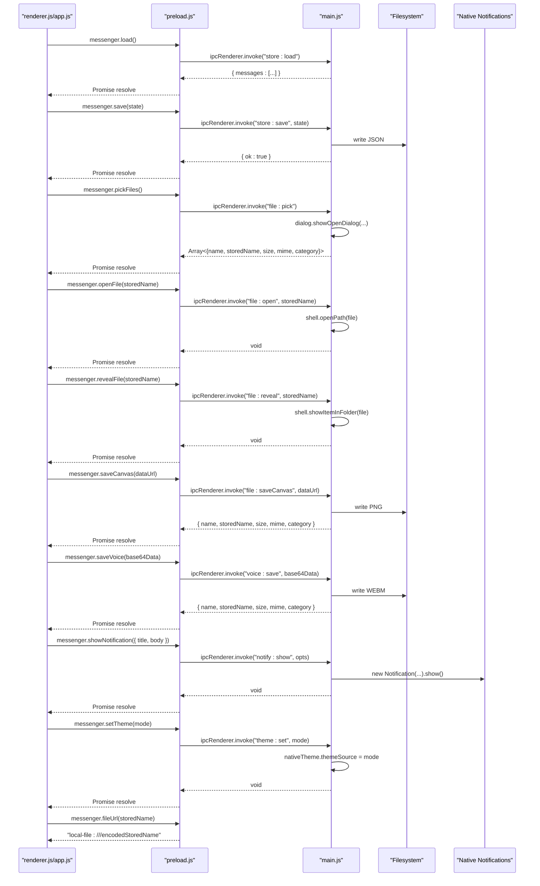
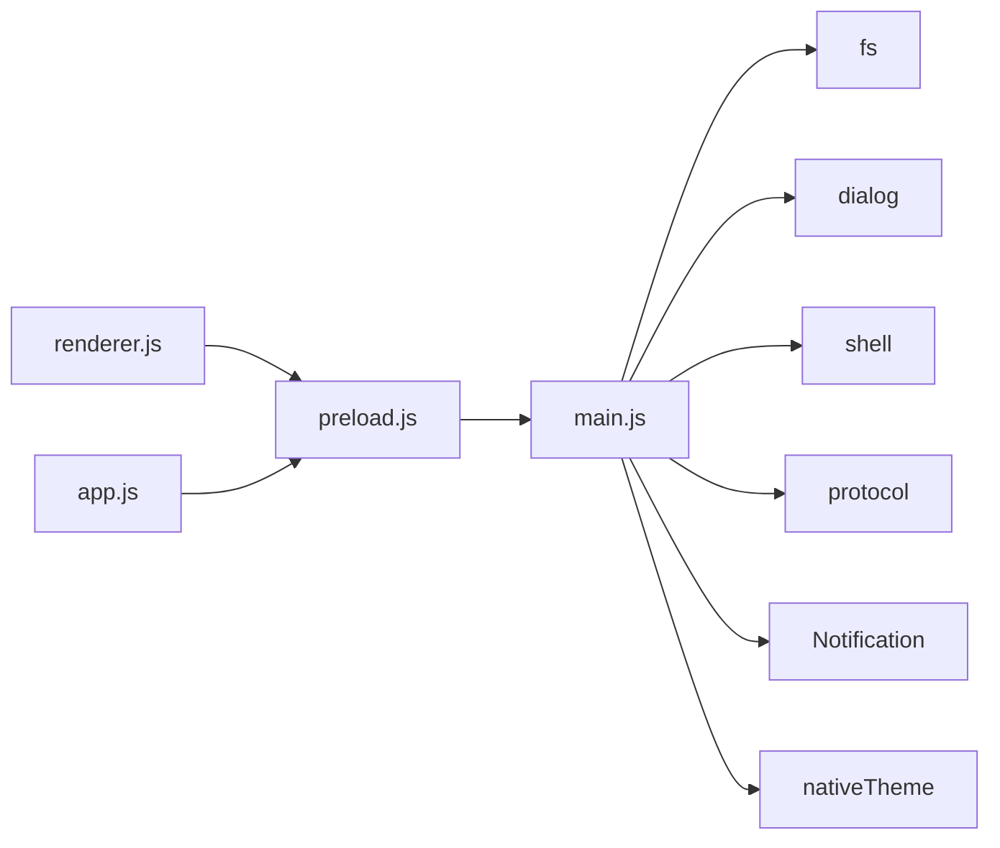

# API Reference

<cite>
**Referenced Files in This Document**
- [preload.js](file://preload.js)
- [main.js](file://main.js)
- [renderer.js](file://renderer.js)
- [app.js](file://app.js)
- [index.html](file://index.html)
</cite>

## Table of Contents
1. [Introduction](#introduction)
2. [Project Structure](#project-structure)
3. [Core Components](#core-components)
4. [Architecture Overview](#architecture-overview)
5. [Detailed Component Analysis](#detailed-component-analysis)
6. [Dependency Analysis](#dependency-analysis)
7. [Performance Considerations](#performance-considerations)
8. [Troubleshooting Guide](#troubleshooting-guide)
9. [Conclusion](#conclusion)
10. [Appendices](#appendices)

## Introduction
This document describes the public API surface exposed to the renderer process via Electron’s contextBridge. The application exposes a single global object named messenger on window, which provides:
- Data methods for message persistence and retrieval
- File operations for picking, saving, opening, revealing, and constructing local file URLs
- Settings API for theme and preference management
- Notification support
- A helper for generating safe local file URLs

The documentation covers method signatures, parameters, return values, async patterns, error handling strategies, security constraints, and concrete usage examples from the codebase.

## Project Structure
At runtime, the main process registers IPC handlers and a custom protocol. The preload script bridges a minimal, secure API into the renderer. Renderer scripts consume this API to implement UI behavior.

**Diagram sources**
- [preload.js:1-17](file://preload.js#L1-L17)
- [main.js:1-176](file://main.js#L1-L176)
- [renderer.js:1-800](file://renderer.js#L1-L800)
- [app.js:1-239](file://app.js#L1-L239)
- [index.html:1-303](file://index.html#L1-L303)

**Section sources**
- [preload.js:1-17](file://preload.js#L1-L17)
- [main.js:1-176](file://main.js#L1-L176)
- [renderer.js:1-800](file://renderer.js#L1-L800)
- [app.js:1-239](file://app.js#L1-L239)
- [index.html:1-303](file://index.html#L1-L303)

## Core Components
The public API is exposed as window.messenger with the following methods:
- load(): Promise<object>
- save(data): Promise<object>
- loadSettings(): Promise<object>
- saveSettings(data): Promise<object>
- pickFiles(): Promise<Array<object>>
- saveCanvas(dataUrl): Promise<object|null>
- openFile(storedName): Promise<void>
- revealFile(storedName): Promise<void>
- saveVoice(base64Data): Promise<object|null>
- showNotification(opts): Promise<void>
- setTheme(mode): Promise<void>
- fileUrl(storedName): string

All data and settings methods are asynchronous and use IPC invoke under the hood. File operations operate within an isolated user-data directory and are validated against path traversal attacks.

**Section sources**
- [preload.js:3-16](file://preload.js#L3-L16)
- [main.js:123-166](file://main.js#L123-L166)

## Architecture Overview
The API follows a strict separation between renderer and main processes:
- Renderer calls window.messenger.* methods
- Preload forwards calls via ipcRenderer.invoke to main process handlers
- Main process performs secure file I/O, dialog interactions, and native notifications
- A custom local-file scheme serves stored files safely

**Diagram sources**
- [preload.js:3-16](file://preload.js#L3-L16)
- [main.js:123-166](file://main.js#L123-L166)
- [main.js:91-101](file://main.js#L91-L101)

## Detailed Component Analysis

### Data Methods
- load()
  - Purpose: Retrieve persisted messages.
  - Parameters: None.
  - Returns: Promise<object> with shape { messages: Array<object> }.
  - Notes: If no data exists, returns default structure with empty messages array.
  - Usage example: See initialization in renderer and app entries.

- save(data)
  - Purpose: Persist current state (messages).
  - Parameters: data — object containing at least { messages: Array<object> }.
  - Returns: Promise<object> with { ok: boolean }.
  - Notes: Ensures parent directories exist before writing; writes formatted JSON.

- deleteMessage(id)
  - Status: Not exposed through window.messenger.
  - Behavior: Deletion is implemented in renderer by marking messages as deleted locally and persisting via save(). There is no dedicated IPC handler for deletion.

- getMessages()
  - Status: Not exposed through window.messenger.
  - Behavior: Use load() to retrieve all messages.

Important note: The documented names getMessages, saveMessage, and deleteMessage do not match the actual API. The real API uses load() and save(), and logical deletion is handled in renderer state.

**Section sources**
- [preload.js:3-6](file://preload.js#L3-L6)
- [main.js:25-37](file://main.js#L25-L37)
- [main.js:123-124](file://main.js#L123-L124)
- [renderer.js:10-14](file://renderer.js#L10-L14)
- [renderer.js:357-368](file://renderer.js#L357-L368)
- [app.js:25-39](file://app.js#L25-L39)

### File Operations
- pickFiles()
  - Purpose: Open a system file picker allowing multiple selection.
  - Parameters: None.
  - Returns: Promise<Array<object>> where each element has fields: name, storedName, size, mime, category.
  - Notes: Copies selected files into an isolated files directory and assigns stable stored names.

- saveCanvas(dataUrl)
  - Purpose: Save canvas drawing as PNG.
  - Parameters: dataUrl — image/png data URL string.
  - Returns: Promise<object|null>. On success, returns { name, storedName, size, mime, category }. On invalid input, returns null.
  - Notes: Extracts base64 payload and writes to files directory.

- saveVoice(base64Data)
  - Purpose: Save voice recording as WEBM audio.
  - Parameters: base64Data — data URL or base64-encoded audio/webm blob.
  - Returns: Promise<object|null>. On success, returns { name, storedName, size, mime, category }. On invalid input, returns null.
  - Notes: Extracts base64 payload and writes to voice directory.

- openFile(storedName)
  - Purpose: Open the stored file using the OS default application.
  - Parameters: storedName — string referencing a previously saved file.
  - Returns: Promise<void>.
  - Notes: Validates storedName against path traversal and resolves to allowed directories.

- revealFile(storedName)
  - Purpose: Reveal the stored file in its folder.
  - Parameters: storedName — string referencing a previously saved file.
  - Returns: Promise<void>.
  - Notes: Validates storedName against path traversal and resolves to allowed directories.

- fileUrl(storedName)
  - Purpose: Generate a safe URL to access a stored file via the local-file scheme.
  - Parameters: storedName — string referencing a previously saved file.
  - Returns: string in format "local-file:///encodedStoredName".
  - Notes: The main process registers a handler for the local-file scheme that validates paths and streams content with correct MIME types.

Security considerations:
- All file paths are normalized and constrained to specific directories (files and voice). Path traversal attempts are rejected.
- The local-file scheme is registered with secure privileges and only serves files within allowed roots.

**Section sources**
- [preload.js:8-15](file://preload.js#L8-L15)
- [main.js:127-158](file://main.js#L127-L158)
- [main.js:53-62](file://main.js#L53-L62)
- [main.js:91-101](file://main.js#L91-L101)
- [main.js:64-80](file://main.js#L64-L80)
- [renderer.js:312-354](file://renderer.js#L312-L354)
- [app.js:54-99](file://app.js#L54-L99)

### Settings API
- loadSettings()
  - Purpose: Load user preferences including appearance and chat background.
  - Parameters: None.
  - Returns: Promise<object> with defaults if none exist: { darkMode: boolean, theme: string, chatBg: string }.

- saveSettings(data)
  - Purpose: Persist settings.
  - Parameters: data — object conforming to the settings schema.
  - Returns: Promise<object> with { ok: boolean }.

- setTheme(mode)
  - Purpose: Apply system-wide theme mode.
  - Parameters: mode — string, either "dark" or "light".
  - Returns: Promise<void>.
  - Notes: Updates nativeTheme.themeSource immediately.

Usage examples:
- Theme toggling and applying are demonstrated in renderer initialization and event handlers.

**Section sources**
- [preload.js:6-7](file://preload.js#L6-L7)
- [preload.js:14](file://preload.js#L14-L14)
- [main.js:39-51](file://main.js#L39-L51)
- [main.js:125-126](file://main.js#L125-L126)
- [main.js:164-166](file://main.js#L164-L166)
- [renderer.js:14-15](file://renderer.js#L14-L15)
- [renderer.js:67-75](file://renderer.js#L67-L75)

### Notifications
- showNotification(opts)
  - Purpose: Show a native notification.
  - Parameters: opts — object with { title: string, body: string }.
  - Returns: Promise<void>.
  - Notes: Only shows if platform supports notifications.

Usage example:
- After sending a message, a notification is displayed.

**Section sources**
- [preload.js:13](file://preload.js#L13-L13)
- [main.js:159-163](file://main.js#L159-L163)
- [renderer.js:367](file://renderer.js#L367-L367)

### Event System
There is no built-in event bus exposed via window.messenger. Instead, the renderer manages UI state and triggers actions directly:
- User interactions (clicks, keydown, drag-and-drop) update local state and call API methods.
- State changes are persisted via save() and reflected in the UI by re-rendering.

Patterns observed:
- Async event handlers await API calls before updating UI or showing feedback.
- Toast notifications provide transient feedback after actions.

**Section sources**
- [renderer.js:123-138](file://renderer.js#L123-L138)
- [renderer.js:529-539](file://renderer.js#L529-L539)
- [renderer.js:542-549](file://renderer.js#L542-L549)
- [renderer.js:552-555](file://renderer.js#L552-L555)
- [renderer.js:633-637](file://renderer.js#L633-L637)

### Concrete Usage Examples
- Loading initial state and settings:
  - See initialization blocks in renderer and app entries.

- Sending a message:
  - Compose text, call addMessage, then save via api.save(state).

- Attaching files:
  - Call api.pickFiles(), append returned metadata to message.files, render, and save.

- Saving whiteboard drawings:
  - Convert canvas to data URL, call api.saveCanvas(dataUrl), append result to message.files, render, and save.

- Opening and revealing files:
  - For each file attachment, call api.openFile(storedName) and api.revealFile(storedName) respectively.

- Constructing local file URLs:
  - Use api.fileUrl(storedName) to generate src attributes for images, videos, and audios.

- Applying theme:
  - Update settings.darkMode and settings.theme, call api.saveSettings(settings), and api.setTheme(mode).

- Showing notifications:
  - Call api.showNotification({ title, body }) after successful actions.

**Section sources**
- [renderer.js:10-15](file://renderer.js#L10-L15)
- [renderer.js:357-368](file://renderer.js#L357-L368)
- [renderer.js:542-549](file://renderer.js#L542-L549)
- [renderer.js:633-637](file://renderer.js#L633-L637)
- [renderer.js:312-354](file://renderer.js#L312-L354)
- [renderer.js:67-75](file://renderer.js#L67-L75)
- [renderer.js:367](file://renderer.js#L367-L367)
- [app.js:25-39](file://app.js#L25-L39)
- [app.js:195-198](file://app.js#L195-L198)
- [app.js:220-224](file://app.js#L220-L224)
- [app.js:54-99](file://app.js#L54-L99)

## Dependency Analysis
The API surface is intentionally small and focused:
- Preload depends on Electron’s contextBridge and ipcRenderer.
- Main depends on Electron APIs for dialogs, shell, protocol, notifications, and filesystem.
- Renderer and app scripts depend solely on window.messenger.

**Diagram sources**
- [preload.js:1-17](file://preload.js#L1-L17)
- [main.js:1-10](file://main.js#L1-L10)
- [main.js:123-166](file://main.js#L123-L166)

**Section sources**
- [preload.js:1-17](file://preload.js#L1-L17)
- [main.js:1-10](file://main.js#L1-L10)
- [main.js:123-166](file://main.js#L123-L166)

## Performance Considerations
- File I/O is synchronous in some helpers but wrapped in async IPC flows; large attachments may block briefly. Consider streaming or chunked uploads for very large files.
- Rendering updates occur after persistence; batching saves could reduce disk writes during rapid interactions.
- Local file serving uses Readable streams for efficient playback of media.

[No sources needed since this section provides general guidance]

## Troubleshooting Guide
Common issues and strategies:
- Invalid or missing base64 payloads:
  - saveCanvas and saveVoice return null when inputs are malformed. Always check for null before appending to message.files.
- File not found:
  - The local-file scheme returns 404 for missing files. Ensure storedName references a valid file and that it was successfully saved.
- Path traversal attempts:
  - safeStoredPath rejects names containing slashes, backslashes, or "..". Validate storedName before calling openFile/revealFile.
- Notifications not shown:
  - Platform may not support notifications; the handler checks Notification.isSupported() before creating one.

Error handling patterns:
- Renderer wraps async calls with try/catch where appropriate (e.g., microphone permission errors).
- UI feedback is provided via toast messages after actions complete.

**Section sources**
- [main.js:133-141](file://main.js#L133-L141)
- [main.js:150-158](file://main.js#L150-L158)
- [main.js:91-101](file://main.js#L91-L101)
- [main.js:53-62](file://main.js#L53-L62)
- [renderer.js:153-177](file://renderer.js#L153-L177)

## Conclusion
The Messenger application exposes a concise, secure API surface via window.messenger. It emphasizes safety through path validation, controlled file storage, and a custom protocol for serving files. The API is fully asynchronous and integrates seamlessly with renderer-side state management and UI updates. While the requested method names differ from the implementation, the functional equivalents are clearly defined and consistently used across the codebase.

[No sources needed since this section summarizes without analyzing specific files]

## Appendices

### Security Constraints and Limitations
- Node integration is disabled in the renderer; direct Node APIs are not available.
- Context isolation is enabled; only explicitly exposed methods are accessible.
- File access is restricted to predefined directories; arbitrary paths are rejected.
- The local-file scheme is registered with secure privileges and enforces MIME type mapping.
- CSP restricts resource loading to self, data:, local-file:, and blob: sources.

**Section sources**
- [main.js:113-118](file://main.js#L113-L118)
- [main.js:7-9](file://main.js#L7-L9)
- [main.js:53-62](file://main.js#L53-L62)
- [index.html:6](file://index.html#L6-L6)