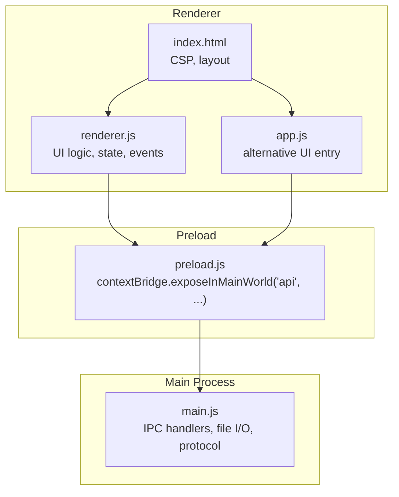
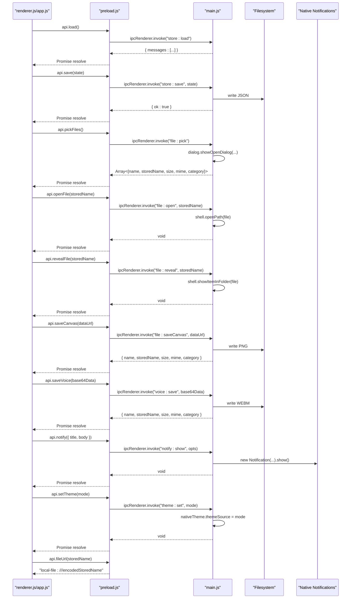
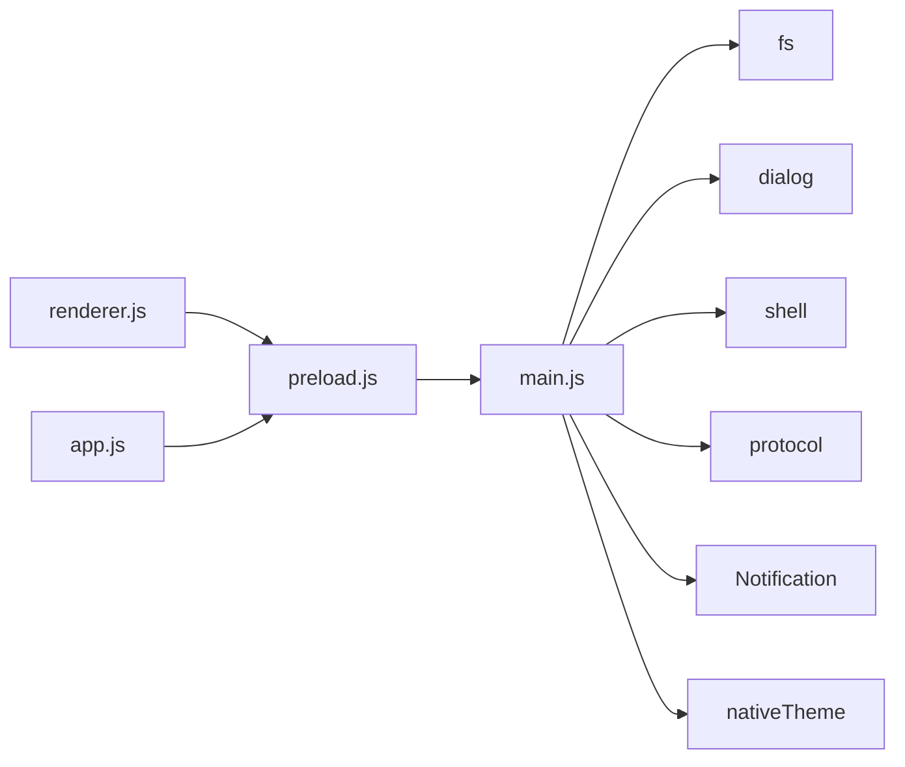

# API Reference

<cite>
**Referenced Files in This Document**
- [preload.js](file://preload.js)
- [main.js](file://main.js)
- [renderer.js](file://renderer.js)
- [app.js](file://app.js)
- [index.html](file://index.html)
</cite>

## Update Summary
**Changes Made**
- Updated API object name from `window.messenger` to `window.api` throughout the documentation
- Added comprehensive documentation for settings management methods (`loadSettings`, `saveSettings`)
- Added detailed documentation for voice recording functionality (`saveVoice`)
- Added system notifications support (`notify`)
- Added theme switching capability (`setTheme`)
- Enhanced file operations documentation with improved error handling patterns
- Updated all usage examples to reflect the correct API surface
- Added new sections for settings API and notification system

## Table of Contents
1. [Introduction](#introduction)
2. [Project Structure](#project-structure)
3. [Core Components](#core-components)
4. [Architecture Overview](#architecture-overview)
5. [Detailed Component Analysis](#detailed-component-analysis)
6. [Dependency Analysis](#dependency-analysis)
7. [Performance Considerations](#performance-considerations)
8. [Troubleshooting Guide](#troubleshooting-guide)
9. [Conclusion](#conclusion)
10. [Appendices](#appendices)

## Introduction
This document describes the public API surface exposed to the renderer process via Electron's contextBridge. The application exposes a single global object named `api` on `window`, which provides:
- Data methods for message persistence and retrieval
- File operations for picking, saving, opening, revealing, and constructing local file URLs
- Settings API for theme and preference management
- Voice recording capabilities
- System notifications support
- Theme switching functionality
- A helper for generating safe local file URLs

The documentation covers method signatures, parameters, return values, async patterns, error handling strategies, security constraints, and concrete usage examples from the codebase.

## Project Structure
At runtime, the main process registers IPC handlers and a custom protocol. The preload script bridges a minimal, secure API into the renderer. Renderer scripts consume this API to implement UI behavior.

**Diagram sources**
- [preload.js:1-17](file://preload.js#L1-L17)
- [main.js:1-155](file://main.js#L1-L155)
- [renderer.js:1-723](file://renderer.js#L1-L723)
- [app.js:1-239](file://app.js#L1-L239)
- [index.html:1-232](file://index.html#L1-L232)

**Section sources**
- [preload.js:1-17](file://preload.js#L1-L17)
- [main.js:1-155](file://main.js#L1-L155)
- [renderer.js:1-723](file://renderer.js#L1-L723)
- [app.js:1-239](file://app.js#L1-L239)
- [index.html:1-232](file://index.html#L1-L232)

## Core Components
The public API is exposed as `window.api` with the following methods:
- `load()`: Promise<object>
- `save(data)`: Promise<object>
- `loadSettings()`: Promise<object>
- `saveSettings(data)`: Promise<object>
- `pickFiles()`: Promise<Array<object>>
- `saveCanvas(dataUrl)`: Promise<object|null>
- `openFile(storedName)`: Promise<void>
- `revealFile(storedName)`: Promise<void>
- `saveVoice(base64Data)`: Promise<object|null>
- `notify(opts)`: Promise<void>
- `setTheme(mode)`: Promise<void>
- `fileUrl(storedName)`: string

All data and settings methods are asynchronous and use IPC invoke under the hood. File operations operate within an isolated user-data directory and are validated against path traversal attacks.

**Section sources**
- [preload.js:3-16](file://preload.js#L3-L16)
- [main.js:64-116](file://main.js#L64-L116)

## Architecture Overview
The API follows a strict separation between renderer and main processes:
- Renderer calls `window.api.*` methods
- Preload forwards calls via `ipcRenderer.invoke` to main process handlers
- Main process performs secure file I/O, dialog interactions, and native notifications
- A custom local-file scheme serves stored files safely

**Diagram sources**
- [preload.js:3-16](file://preload.js#L3-L16)
- [main.js:64-116](file://main.js#L64-L116)
- [main.js:139-147](file://main.js#L139-L147)

## Detailed Component Analysis

### Data Methods
- `load()`
  - Purpose: Retrieve persisted messages.
  - Parameters: None.
  - Returns: Promise<object> with shape `{ messages: Array<object> }`.
  - Notes: If no data exists, returns default structure with empty messages array.
  - Usage example: See initialization in renderer and app entries.

- `save(data)`
  - Purpose: Persist current state (messages).
  - Parameters: `data` — object containing at least `{ messages: Array<object> }`.
  - Returns: Promise<object> with `{ ok: boolean }`.
  - Notes: Ensures parent directories exist before writing; writes formatted JSON.

Important note: The documented names `getMessages`, `saveMessage`, and `deleteMessage` do not match the actual API. The real API uses `load()` and `save()`, and logical deletion is handled in renderer state by marking messages as deleted locally and persisting via `save()`.

**Section sources**
- [preload.js:4-5](file://preload.js#L4-L5)
- [main.js:64-65](file://main.js#L64-L65)
- [renderer.js:706-713](file://renderer.js#L706-L713)
- [app.js:26-27](file://app.js#L26-L27)

### Settings API
- `loadSettings()`
  - Purpose: Load user preferences including appearance and chat background.
  - Parameters: None.
  - Returns: Promise<object> with defaults if none exist: `{ darkMode: boolean, theme: string }`.

- `saveSettings(data)`
  - Purpose: Persist settings.
  - Parameters: `data` — object conforming to the settings schema.
  - Returns: Promise<object> with `{ ok: boolean }`.

- `setTheme(mode)`
  - Purpose: Apply system-wide theme mode.
  - Parameters: `mode` — string, either `"dark"` or `"light"`.
  - Returns: Promise<void>.
  - Notes: Updates `nativeTheme.themeSource` immediately.

Usage examples:
- Theme toggling and applying are demonstrated in renderer initialization and event handlers.

**Section sources**
- [preload.js:6-7](file://preload.js#L6-L7)
- [preload.js:14](file://preload.js#L14-L14)
- [main.js:66-67](file://main.js#L66-L67)
- [main.js:115](file://main.js#L115-L115)
- [renderer.js:61-68](file://renderer.js#L61-L68)
- [renderer.js:709-710](file://renderer.js#L709-L710)

### File Operations
- `pickFiles()`
  - Purpose: Open a system file picker allowing multiple selection.
  - Parameters: None.
  - Returns: Promise<Array<object>> where each element has fields: `name`, `storedName`, `size`, `mime`, `category`.
  - Notes: Copies selected files into an isolated files directory and assigns stable stored names.

- `saveCanvas(dataUrl)`
  - Purpose: Save canvas drawing as PNG.
  - Parameters: `dataUrl` — image/png data URL string.
  - Returns: Promise<object|null>. On success, returns `{ name, storedName, size, mime, category }`. On invalid input, returns null.
  - Notes: Extracts base64 payload and writes to files directory.

- `saveVoice(base64Data)`
  - Purpose: Save voice recording as WEBM audio.
  - Parameters: `base64Data` — data URL or base64-encoded audio/webm blob.
  - Returns: Promise<object|null>. On success, returns `{ name, storedName, size, mime, category }`. On invalid input, returns null.
  - Notes: Extracts base64 payload and writes to voice directory.

- `openFile(storedName)`
  - Purpose: Open the stored file using the OS default application.
  - Parameters: `storedName` — string referencing a previously saved file.
  - Returns: Promise<void>.
  - Notes: Validates storedName against path traversal and resolves to allowed directories.

- `revealFile(storedName)`
  - Purpose: Reveal the stored file in its folder.
  - Parameters: `storedName` — string referencing a previously saved file.
  - Returns: Promise<void>.
  - Notes: Validates storedName against path traversal and resolves to allowed directories.

- `fileUrl(storedName)`
  - Purpose: Generate a safe URL to access a stored file via the local-file scheme.
  - Parameters: `storedName` — string referencing a previously saved file.
  - Returns: string in format `"local-file:///encodedStoredName"`.
  - Notes: The main process registers a handler for the local-file scheme that validates paths and streams content with correct MIME types.

Security considerations:
- All file paths are normalized and constrained to specific directories (files and voice). Path traversal attempts are rejected.
- The local-file scheme is registered with secure privileges and only serves files within allowed roots.

**Section sources**
- [preload.js:8-15](file://preload.js#L8-L15)
- [main.js:69-109](file://main.js#L69-L109)
- [main.js:139-147](file://main.js#L139-L147)
- [renderer.js:175-219](file://renderer.js#L175-L219)
- [app.js:54-99](file://app.js#L54-L99)

### Notifications
- `notify(opts)`
  - Purpose: Show a native notification.
  - Parameters: `opts` — object with `{ title: string, body: string }`.
  - Returns: Promise<void>.
  - Notes: Only shows if platform supports notifications.

Usage example:
- After sending a message, a notification is displayed.

**Section sources**
- [preload.js:13](file://preload.js#L13-L13)
- [main.js:111-113](file://main.js#L111-L113)
- [renderer.js:231](file://renderer.js#L231-L231)

### Event System
There is no built-in event bus exposed via `window.api`. Instead, the renderer manages UI state and triggers actions directly:
- User interactions (clicks, keydown, drag-and-drop) update local state and call API methods.
- State changes are persisted via `save()` and reflected in the UI by re-rendering.

Patterns observed:
- Async event handlers await API calls before updating UI or showing feedback.
- Toast notifications provide transient feedback after actions.

**Section sources**
- [renderer.js:221-232](file://renderer.js#L221-L232)
- [renderer.js:295-303](file://renderer.js#L295-L303)
- [renderer.js:319-328](file://renderer.js#L319-L328)
- [renderer.js:445-452](file://renderer.js#L445-L452)
- [renderer.js:456-461](file://renderer.js#L456-L461)

### Concrete Usage Examples
- Loading initial state and settings:
  - See initialization blocks in renderer and app entries.

- Sending a message:
  - Compose text, call `addMessage`, then save via `api.save(state)`.

- Attaching files:
  - Call `api.pickFiles()`, append returned metadata to message.files, render, and save.

- Saving whiteboard drawings:
  - Convert canvas to data URL, call `api.saveCanvas(dataUrl)`, append result to message.files, render, and save.

- Recording voice notes:
  - Use MediaRecorder API to capture audio, convert to base64, call `api.saveVoice(base64Data)`, append result to message.files, render, and save.

- Opening and revealing files:
  - For each file attachment, call `api.openFile(storedName)` and `api.revealFile(storedName)` respectively.

- Constructing local file URLs:
  - Use `api.fileUrl(storedName)` to generate src attributes for images, videos, and audios.

- Applying theme:
  - Update `settings.darkMode` and `settings.theme`, call `api.saveSettings(settings)`, and `api.setTheme(mode)`.

- Showing notifications:
  - Call `api.notify({ title, body })` after successful actions.

**Section sources**
- [renderer.js:706-718](file://renderer.js#L706-L718)
- [renderer.js:221-232](file://renderer.js#L221-L232)
- [renderer.js:518-542](file://renderer.js#L518-L542)
- [renderer.js:683-687](file://renderer.js#L683-L687)
- [renderer.js:175-219](file://renderer.js#L175-L219)
- [renderer.js:61-68](file://renderer.js#L61-L68)
- [app.js:26-27](file://app.js#L26-L27)
- [app.js:195-198](file://app.js#L195-L198)
- [app.js:220-224](file://app.js#L220-L224)
- [app.js:54-99](file://app.js#L54-L99)

## Dependency Analysis
The API surface is intentionally small and focused:
- Preload depends on Electron's contextBridge and ipcRenderer.
- Main depends on Electron APIs for dialogs, shell, protocol, notifications, and filesystem.
- Renderer and app scripts depend solely on `window.api`.

**Diagram sources**
- [preload.js:1-17](file://preload.js#L1-L17)
- [main.js:1-5](file://main.js#L1-L5)
- [main.js:64-116](file://main.js#L64-L116)

**Section sources**
- [preload.js:1-17](file://preload.js#L1-L17)
- [main.js:1-5](file://main.js#L1-L5)
- [main.js:64-116](file://main.js#L64-L116)

## Performance Considerations
- File I/O is synchronous in some helpers but wrapped in async IPC flows; large attachments may block briefly. Consider streaming or chunked uploads for very large files.
- Rendering updates occur after persistence; batching saves could reduce disk writes during rapid interactions.
- Local file serving uses Readable streams for efficient playback of media.
- Voice recording uses MediaRecorder API with efficient chunk-based data collection.

[No sources needed since this section provides general guidance]

## Troubleshooting Guide
Common issues and strategies:
- Invalid or missing base64 payloads:
  - `saveCanvas` and `saveVoice` return null when inputs are malformed. Always check for null before appending to message.files.
- File not found:
  - The local-file scheme returns 404 for missing files. Ensure storedName references a valid file and that it was successfully saved.
- Path traversal attempts:
  - `safeStoredPath` rejects names containing slashes, backslashes, or "..". Validate storedName before calling `openFile`/`revealFile`.
- Notifications not shown:
  - Platform may not support notifications; the handler checks `Notification.isSupported()` before creating one.
- Microphone access denied:
  - Voice recording requires user permission; handle errors gracefully and show appropriate feedback.

Error handling patterns:
- Renderer wraps async calls with try/catch where appropriate (e.g., microphone permission errors).
- UI feedback is provided via toast messages after actions complete.

**Section sources**
- [main.js:78-88](file://main.js#L78-L88)
- [main.js:99-109](file://main.js#L99-L109)
- [main.js:139-147](file://main.js#L139-L147)
- [main.js:40-45](file://main.js#L40-L45)
- [renderer.js:518-542](file://renderer.js#L518-L542)

## Conclusion
The Messenger application exposes a concise, secure API surface via `window.api`. It emphasizes safety through path validation, controlled file storage, and a custom protocol for serving files. The API is fully asynchronous and integrates seamlessly with renderer-side state management and UI updates. The expanded API surface now includes comprehensive settings management, voice recording capabilities, system notifications, and theme switching functionality, providing a robust foundation for modern desktop messaging applications.

[No sources needed since this section summarizes without analyzing specific files]

## Appendices

### Security Constraints and Limitations
- Node integration is disabled in the renderer; direct Node APIs are not available.
- Context isolation is enabled; only explicitly exposed methods are accessible.
- File access is restricted to predefined directories; arbitrary paths are rejected.
- The local-file scheme is registered with secure privileges and enforces MIME type mapping.
- CSP restricts resource loading to self, data:, local-file:, and blob: sources.
- Voice recording requires explicit user permission and handles denial gracefully.

**Section sources**
- [main.js:125-131](file://main.js#L125-L131)
- [main.js:7-9](file://main.js#L7-L9)
- [main.js:40-45](file://main.js#L40-L45)
- [index.html:6](file://index.html#L6-L6)

### API Method Reference Table

| Method | Parameters | Return Type | Description |
|--------|------------|-------------|-------------|
| `load()` | None | `Promise<object>` | Load persisted messages |
| `save(data)` | `object` | `Promise<object>` | Save current state |
| `loadSettings()` | None | `Promise<object>` | Load user preferences |
| `saveSettings(data)` | `object` | `Promise<object>` | Persist settings |
| `pickFiles()` | None | `Promise<Array<object>>` | Open file picker |
| `saveCanvas(dataUrl)` | `string` | `Promise<object|null>` | Save canvas as PNG |
| `saveVoice(base64Data)` | `string` | `Promise<object|null>` | Save voice recording |
| `openFile(storedName)` | `string` | `Promise<void>` | Open file with OS app |
| `revealFile(storedName)` | `string` | `Promise<void>` | Show file in folder |
| `notify(opts)` | `object` | `Promise<void>` | Show system notification |
| `setTheme(mode)` | `string` | `Promise<void>` | Set system theme |
| `fileUrl(storedName)` | `string` | `string` | Generate safe file URL |