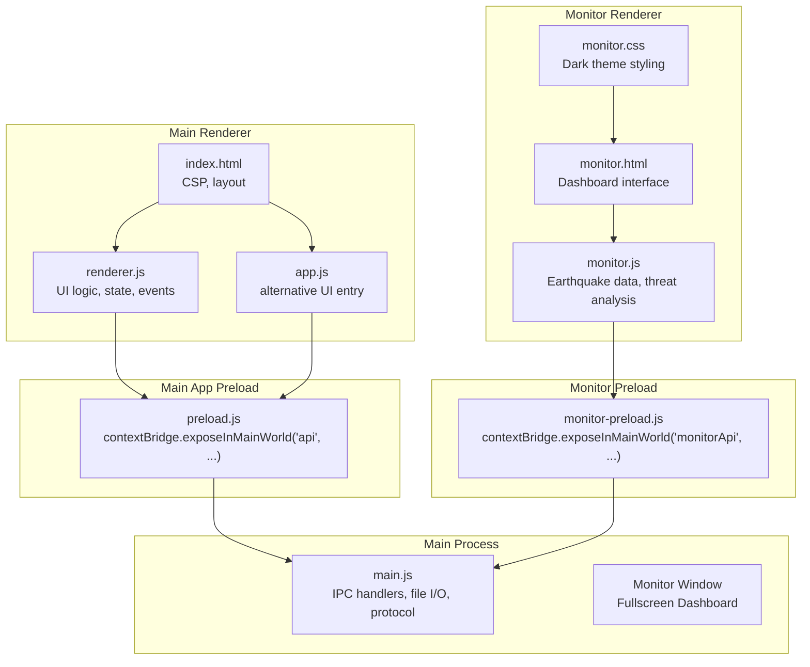
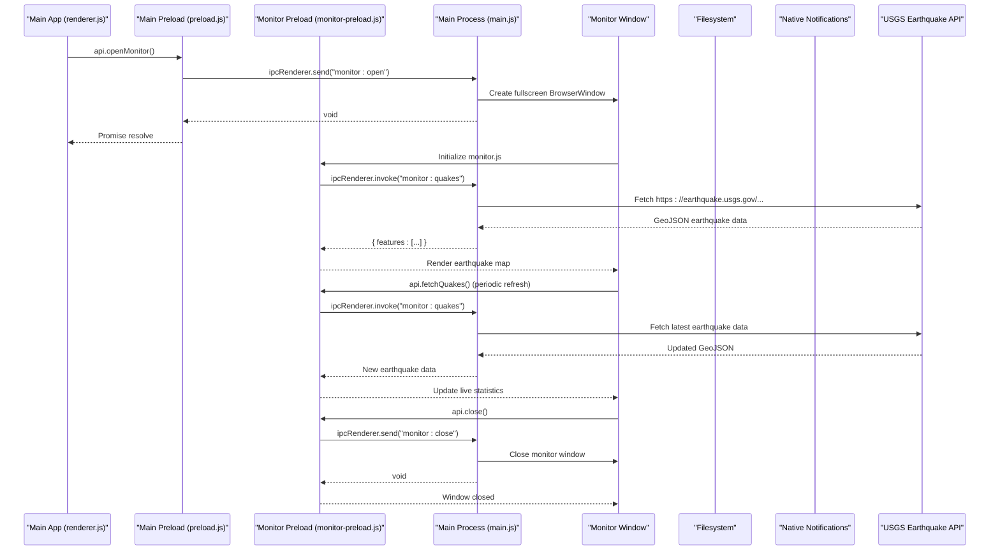
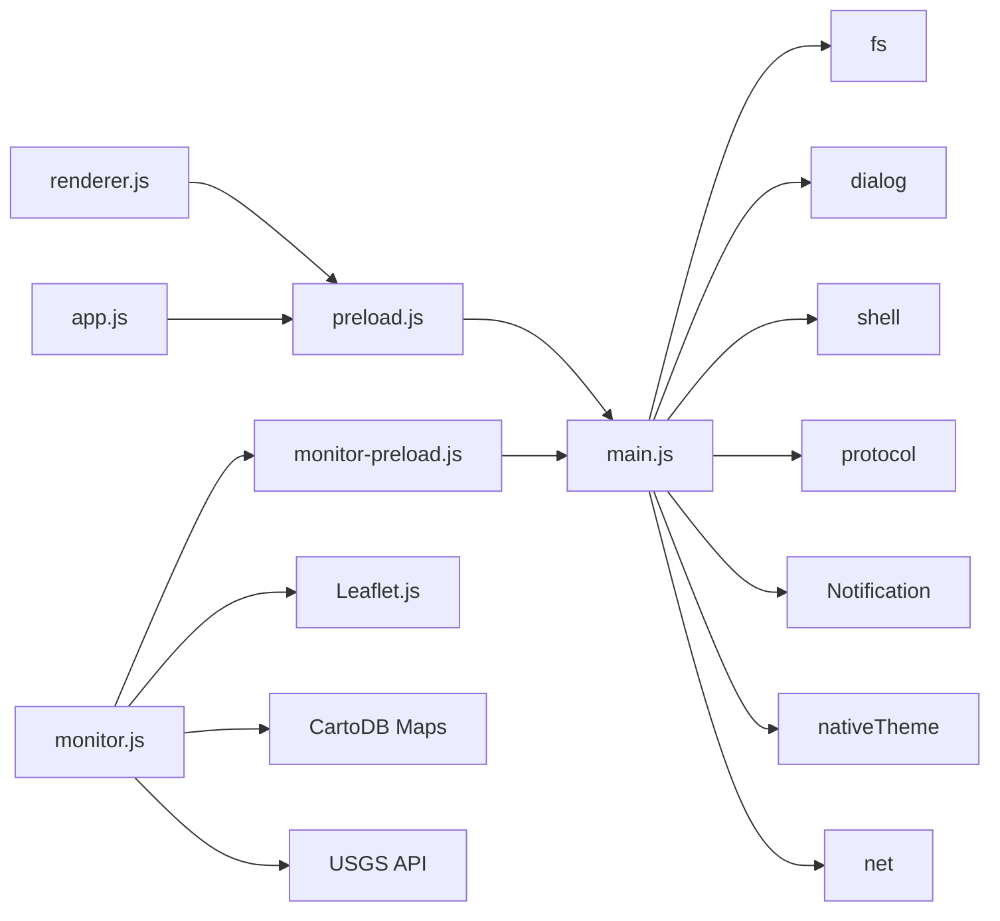

# API Reference

<cite>
**Referenced Files in This Document**
- [preload.js](file://preload.js)
- [main.js](file://main.js)
- [renderer.js](file://renderer.js)
- [app.js](file://app.js)
- [index.html](file://index.html)
- [monitor-preload.js](file://monitor-preload.js)
- [monitor.js](file://monitor.js)
- [monitor.html](file://monitor.html)
</cite>

## Update Summary
**Changes Made**
- Added comprehensive documentation for the World Monitor API (`window.monitorApi`)
- Documented new IPC channels for monitor window management (`monitor:open`, `monitor:close`)
- Added earthquake data fetching API with USGS integration
- Documented monitor-specific security event logging and real-time statistics updates
- Updated architecture diagrams to include monitor window lifecycle
- Added usage examples for accessing the World Monitor from the main application

## Table of Contents
1. [Introduction](#introduction)
2. [Project Structure](#project-structure)
3. [Core Components](#core-components)
4. [Architecture Overview](#architecture-overview)
5. [Detailed Component Analysis](#detailed-component-analysis)
6. [World Monitor API](#world-monitor-api)
7. [Dependency Analysis](#dependency-analysis)
8. [Performance Considerations](#performance-considerations)
9. [Troubleshooting Guide](#troubleshooting-guide)
10. [Conclusion](#conclusion)
11. [Appendices](#appendices)

## Introduction
This document describes the public API surface exposed to the renderer process via Electron's contextBridge. The application exposes two primary global objects:
- `api` on `window`: Core messaging and file operations for the main Messenger interface
- `monitorApi` on `window`: Specialized monitoring capabilities for the World Monitor dashboard

The `api` object provides data methods for message persistence, file operations, settings management, voice recording, system notifications, and theme switching. The `monitorApi` object enables access to real-time seismic data, security event monitoring, and world situation awareness features through a dedicated fullscreen dashboard interface.

The documentation covers method signatures, parameters, return values, async patterns, error handling strategies, security constraints, and concrete usage examples from the codebase.

## Project Structure
At runtime, the main process registers IPC handlers and custom protocols for both the main application and the World Monitor. The preload scripts bridge minimal, secure APIs into their respective renderers. Main renderer scripts consume the core `api` object, while the monitor renderer uses the specialized `monitorApi`.



**Diagram sources**
- [preload.js:1-23](file://preload.js#L1-L23)
- [monitor-preload.js:1-7](file://monitor-preload.js#L1-L7)
- [main.js:1-192](file://main.js#L1-L192)
- [renderer.js:1-725](file://renderer.js#L1-L725)
- [monitor.js:1-965](file://monitor.js#L1-L965)
- [monitor.html:1-195](file://monitor.html#L1-L195)

**Section sources**
- [preload.js:1-23](file://preload.js#L1-L23)
- [monitor-preload.js:1-7](file://monitor-preload.js#L1-L7)
- [main.js:1-192](file://main.js#L1-L192)
- [renderer.js:1-725](file://renderer.js#L1-L725)
- [monitor.js:1-965](file://monitor.js#L1-L965)
- [monitor.html:1-195](file://monitor.html#L1-L195)

## Core Components
The application exposes two distinct API surfaces:

### Main Application API (`window.api`)
- `load()`: Promise<object>
- `save(data)`: Promise<object>
- `loadSettings()`: Promise<object>
- `saveSettings(data)`: Promise<object>
- `pickFiles()`: Promise<Array<object>>
- `saveCanvas(dataUrl)`: Promise<object|null>
- `openFile(storedName)`: Promise<void>
- `revealFile(storedName)`: Promise<void>
- `saveVoice(base64Data)`: Promise<object|null>
- `notify(opts)`: Promise<void>
- `setTheme(mode)`: Promise<void>
- `openMonitor()`: Promise<void>
- `fileUrl(storedName)`: string

### World Monitor API (`window.monitorApi`)
- `fetchQuakes()`: Promise<object|null>
- `close()`: Promise<void>

All data and settings methods are asynchronous and use IPC invoke under the hood. File operations operate within an isolated user-data directory and are validated against path traversal attacks. The monitor API provides specialized functionality for real-time seismic data and security monitoring.

**Section sources**
- [preload.js:3-17](file://preload.js#L3-L17)
- [monitor-preload.js:3-6](file://monitor-preload.js#L3-L6)
- [main.js:64-153](file://main.js#L64-L153)

## Architecture Overview
The API follows a strict separation between renderer and main processes with specialized handling for the World Monitor:
- Main renderer calls `window.api.*` methods for core functionality
- Monitor renderer calls `window.monitorApi.*` methods for monitoring features
- Preload scripts forward calls via `ipcRenderer.invoke`/`ipcRenderer.send` to main process handlers
- Main process performs secure file I/O, dialog interactions, native notifications, and external API calls
- Custom local-file scheme serves stored files safely
- Monitor window operates as a separate fullscreen BrowserWindow with its own preload script



**Diagram sources**
- [preload.js:15](file://preload.js#L15-L15)
- [monitor-preload.js:4-5](file://monitor-preload.js#L4-L5)
- [main.js:118-153](file://main.js#L118-L153)
- [monitor.js:950-961](file://monitor.js#L950-L961)

## Detailed Component Analysis

### Data Methods
- `load()`
  - Purpose: Retrieve persisted messages.
  - Parameters: None.
  - Returns: Promise<object> with shape `{ messages: Array<object> }`.
  - Notes: If no data exists, returns default structure with empty messages array.
  - Usage example: See initialization in renderer and app entries.

- `save(data)`
  - Purpose: Persist current state (messages).
  - Parameters: `data` — object containing at least `{ messages: Array<object> }`.
  - Returns: Promise<object> with `{ ok: boolean }`.
  - Notes: Ensures parent directories exist before writing; writes formatted JSON.

Important note: The documented names `getMessages`, `saveMessage`, and `deleteMessage` do not match the actual API. The real API uses `load()` and `save()`, and logical deletion is handled in renderer state by marking messages as deleted locally and persisting via `save()`.

**Section sources**
- [preload.js:4-5](file://preload.js#L4-L5)
- [main.js:64-65](file://main.js#L64-L65)
- [renderer.js:706-713](file://renderer.js#L706-L713)
- [app.js:26-27](file://app.js#L26-L27)

### Settings API
- `loadSettings()`
  - Purpose: Load user preferences including appearance and chat background.
  - Parameters: None.
  - Returns: Promise<object> with defaults if none exist: `{ darkMode: boolean, theme: string }`.

- `saveSettings(data)`
  - Purpose: Persist settings.
  - Parameters: `data` — object conforming to the settings schema.
  - Returns: Promise<object> with `{ ok: boolean }`.

- `setTheme(mode)`
  - Purpose: Apply system-wide theme mode.
  - Parameters: `mode` — string, either `"dark"` or `"light"`.
  - Returns: Promise<void>.
  - Notes: Updates `nativeTheme.themeSource` immediately.

Usage examples:
- Theme toggling and applying are demonstrated in renderer initialization and event handlers.

**Section sources**
- [preload.js:6-7](file://preload.js#L6-L7)
- [preload.js:14](file://preload.js#L14-L14)
- [main.js:66-67](file://main.js#L66-L67)
- [main.js:115](file://main.js#L115-L115)
- [renderer.js:61-68](file://renderer.js#L61-L68)
- [renderer.js:709-710](file://renderer.js#L709-L710)

### File Operations
- `pickFiles()`
  - Purpose: Open a system file picker allowing multiple selection.
  - Parameters: None.
  - Returns: Promise<Array<object>> where each element has fields: `name`, `storedName`, `size`, `mime`, `category`.
  - Notes: Copies selected files into an isolated files directory and assigns stable stored names.

- `saveCanvas(dataUrl)`
  - Purpose: Save canvas drawing as PNG.
  - Parameters: `dataUrl` — image/png data URL string.
  - Returns: Promise<object|null>. On invalid input, returns null.
  - Notes: Extracts base64 payload and writes to files directory.

- `saveVoice(base64Data)`
  - Purpose: Save voice recording as WEBM audio.
  - Parameters: `base64Data` — data URL or base64-encoded audio/webm blob.
  - Returns: Promise<object|null>. On invalid input, returns null.
  - Notes: Extracts base64 payload and writes to voice directory.

- `openFile(storedName)`
  - Purpose: Open the stored file using the OS default application.
  - Parameters: `storedName` — string referencing a previously saved file.
  - Returns: Promise<void>.
  - Notes: Validates storedName against path traversal and resolves to allowed directories.

- `revealFile(storedName)`
  - Purpose: Reveal the stored file in its folder.
  - Parameters: `storedName` — string referencing a previously saved file.
  - Returns: Promise<void>.
  - Notes: Validates storedName against path traversal and resolves to allowed directories.

- `fileUrl(storedName)`
  - Purpose: Generate a safe URL to access a stored file via the local-file scheme.
  - Parameters: `storedName` — string referencing a previously saved file.
  - Returns: string in format `"local-file:///encodedStoredName"`.
  - Notes: The main process registers a handler for the local-file scheme that validates paths and streams content with correct MIME types.

Security considerations:
- All file paths are normalized and constrained to specific directories (files and voice). Path traversal attempts are rejected.
- The local-file scheme is registered with secure privileges and only serves files within allowed roots.

**Section sources**
- [preload.js:8-15](file://preload.js#L8-L15)
- [main.js:69-109](file://main.js#L69-L109)
- [main.js:139-147](file://main.js#L139-L147)
- [renderer.js:175-219](file://renderer.js#L175-L219)
- [app.js:54-99](file://app.js#L54-L99)

### Notifications
- `notify(opts)`
  - Purpose: Show a native notification.
  - Parameters: `opts` — object with `{ title: string, body: string }`.
  - Returns: Promise<void>.
  - Notes: Only shows if platform supports notifications.

Usage example:
- After sending a message, a notification is displayed.

**Section sources**
- [preload.js:13](file://preload.js#L13-L13)
- [main.js:111-113](file://main.js:111-L113)
- [renderer.js:231](file://renderer.js#L231-L231)

### Event System
There is no built-in event bus exposed via `window.api`. Instead, the renderer manages UI state and triggers actions directly:
- User interactions (clicks, keydown, drag-and-drop) update local state and call API methods.
- State changes are persisted via `save()` and reflected in the UI by re-rendering.

Patterns observed:
- Async event handlers await API calls before updating UI or showing feedback.
- Toast notifications provide transient feedback after actions.

**Section sources**
- [renderer.js:221-232](file://renderer.js#L221-L232)
- [renderer.js:295-303](file://renderer.js#L295-L303)
- [renderer.js:319-328](file://renderer.js#L319-L328)
- [renderer.js:445-452](file://renderer.js#L445-L452)
- [renderer.js:456-461](file://renderer.js#L456-L461)

## World Monitor API

### Monitor Window Management
- `openMonitor()`
  - Purpose: Open the World Monitor dashboard in a fullscreen window.
  - Parameters: None.
  - Returns: Promise<void>.
  - Notes: Creates a new fullscreen BrowserWindow with dark theme and monitor-specific preload script. If already open, focuses existing window instead of creating duplicate.
  - Usage: Accessible via `/world` command in main app message input.

### Earthquake Data Monitoring
- `fetchQuakes()`
  - Purpose: Fetch real-time earthquake data from USGS API.
  - Parameters: None.
  - Returns: Promise<object|null> with GeoJSON format containing earthquake features.
  - Notes: Returns null on network errors or API failures. Falls back to mock data if live fetch fails.
  - Security: Uses Electron's `net.fetch` for secure HTTPS requests with proper CORS handling.

### Monitor Lifecycle
- `close()`
  - Purpose: Close the World Monitor window.
  - Parameters: None.
  - Returns: Promise<void>.
  - Notes: Emits `monitor:close` IPC event to main process for cleanup.

### Real-time Features
The World Monitor includes several real-time data visualization components:

#### Earthquake Statistics
- Total earthquakes in last 24 hours
- Maximum magnitude detected
- Count of significant earthquakes (magnitude 4.5+)
- Average depth calculation

#### Security Threat Monitoring
- Live threat log with categorized security events
- Network activity graphs showing TX/RX rates
- Connected device monitoring
- Alert counter with daily totals

#### Financial Market Data
- Commodity prices (crude oil, gold, silver, etc.)
- Currency exchange rates
- Central bank interest rates
- Prediction market probabilities

#### Global Intelligence
- Country risk assessments with instability and resilience indices
- Route analysis for shipping corridors
- Scenario planning for geopolitical events
- Satellite tracking and military movement indicators

### Usage Examples
Opening the World Monitor from the main application:
```javascript
// Via command in message input
if (val === "/world") {
    api.openMonitor();
}

// Direct API call
api.openMonitor();
```

Fetching earthquake data in the monitor:
```javascript
const earthquakeData = await monitorApi.fetchQuakes();
if (earthquakeData && earthquakeData.features) {
    // Process earthquake features
    earthquakeData.features.forEach(feature => {
        const magnitude = feature.properties.mag;
        const location = feature.properties.place;
        const coordinates = feature.geometry.coordinates;
    });
}
```

Closing the monitor:
```javascript
monitorApi.close();
```

**Section sources**
- [preload.js:15](file://preload.js#L15-L15)
- [monitor-preload.js:3-6](file://monitor-preload.js#L3-L6)
- [main.js:118-153](file://main.js#L118-L153)
- [monitor.js:950-961](file://monitor.js#L950-L961)
- [renderer.js:595-596](file://renderer.js#L595-L596)

### Concrete Usage Examples
- Loading initial state and settings:
  - See initialization blocks in renderer and app entries.

- Sending a message:
  - Compose text, call `addMessage`, then save via `api.save(state)`.

- Attaching files:
  - Call `api.pickFiles()`, append returned metadata to message.files, render, and save.

- Saving whiteboard drawings:
  - Convert canvas to data URL, call `api.saveCanvas(dataUrl)`, append result to message.files, render, and save.

- Recording voice notes:
  - Use MediaRecorder API to capture audio, convert to base64, call `api.saveVoice(base64Data)`, append result to message.files, render, and save.

- Opening and revealing files:
  - For each file attachment, call `api.openFile(storedName)` and `api.revealFile(storedName)` respectively.

- Constructing local file URLs:
  - Use `api.fileUrl(storedName)` to generate src attributes for images, videos, and audios.

- Applying theme:
  - Update `settings.darkMode` and `settings.theme`, call `api.saveSettings(settings)`, and `api.setTheme(mode)`.

- Showing notifications:
  - Call `api.notify({ title, body })` after successful actions.

- Opening World Monitor:
  - Type `/world` in message input or call `api.openMonitor()` programmatically.

- Managing monitor lifecycle:
  - Use `monitorApi.close()` to close the monitor window when needed.

**Section sources**
- [renderer.js:706-718](file://renderer.js#L706-L718)
- [renderer.js:221-232](file://renderer.js#L221-L232)
- [renderer.js:518-542](file://renderer.js#L518-L542)
- [renderer.js:683-687](file://renderer.js#L683-L687)
- [renderer.js:175-219](file://renderer.js#L175-L219)
- [renderer.js:61-68](file://renderer.js#L61-L68)
- [renderer.js:595-596](file://renderer.js#L595-L596)
- [app.js:26-27](file://app.js#L26-L27)
- [app.js:195-198](file://app.js#L195-L198)
- [app.js:220-224](file://app.js#L220-L224)
- [app.js:54-99](file://app.js#L54-L99)
- [monitor.js:950-961](file://monitor.js#L950-L961)

## Dependency Analysis
The API surface is intentionally small and focused with clear separation between main application and monitor functionality:
- Main preload depends on Electron's contextBridge and ipcRenderer for core API exposure
- Monitor preload depends on contextBridge and ipcRenderer for specialized monitoring API
- Main process depends on Electron APIs for dialogs, shell, protocol, notifications, filesystem, and net module
- Monitor window uses Leaflet.js for mapping and CartoDB basemaps
- Renderer and app scripts depend solely on `window.api`
- Monitor script depends on `window.monitorApi` and external mapping libraries



**Diagram sources**
- [preload.js:1-23](file://preload.js#L1-L23)
- [monitor-preload.js:1-7](file://monitor-preload.js#L1-L7)
- [main.js:1-5](file://main.js#L1-L5)
- [main.js:64-153](file://main.js#L64-L153)
- [monitor.js:1-965](file://monitor.js#L1-L965)

**Section sources**
- [preload.js:1-23](file://preload.js#L1-L23)
- [monitor-preload.js:1-7](file://monitor-preload.js#L1-L7)
- [main.js:1-5](file://main.js#L1-L5)
- [main.js:64-153](file://main.js#L64-L153)

## Performance Considerations
- File I/O is synchronous in some helpers but wrapped in async IPC flows; large attachments may block briefly. Consider streaming or chunked uploads for very large files.
- Rendering updates occur after persistence; batching saves could reduce disk writes during rapid interactions.
- Local file serving uses Readable streams for efficient playback of media.
- Voice recording uses MediaRecorder API with efficient chunk-based data collection.
- World Monitor earthquake data fetches every 60 seconds with fallback to mock data on failure.
- Map rendering optimizes performance by clearing and rebuilding layers rather than individual marker updates.
- Financial ticker updates run on 5-second intervals to balance freshness with performance.
- Threat log maintains maximum 50 entries to prevent memory growth.

## Troubleshooting Guide
Common issues and strategies:
- Invalid or missing base64 payloads:
  - `saveCanvas` and `saveVoice` return null when inputs are malformed. Always check for null before appending to message.files.
- File not found:
  - The local-file scheme returns 404 for missing files. Ensure storedName references a valid file and that it was successfully saved.
- Path traversal attempts:
  - `safeStoredPath` rejects names containing slashes, backslashes, or "..". Validate storedName before calling `openFile`/`revealFile`.
- Notifications not shown:
  - Platform may not support notifications; the handler checks `Notification.isSupported()` before creating one.
- Microphone access denied:
  - Voice recording requires user permission; handle errors gracefully and show appropriate feedback.
- Monitor window not opening:
  - Check console logs for "[Main] monitor creation failed" errors. Verify monitor.html exists and preload script loads correctly.
- Earthquake data not loading:
  - Monitor falls back to mock data if USGS API is unavailable. Check network connectivity and CORS policy.
- Map not displaying:
  - Ensure Leaflet.js loads successfully and CartoDB basemap tiles are accessible.

Error handling patterns:
- Renderer wraps async calls with try/catch where appropriate (e.g., microphone permission errors).
- UI feedback is provided via toast messages after actions complete.
- Monitor uses extensive console logging for debugging initialization and data loading.
- Fallback mechanisms ensure monitor remains functional even when external APIs fail.

**Section sources**
- [main.js:78-88](file://main.js#L78-L88)
- [main.js:99-109](file://main.js#L99-L109)
- [main.js:139-147](file://main.js#L139-L147)
- [main.js:40-45](file://main.js#L40-L45)
- [main.js:147-149](file://main.js#L147-L149)
- [monitor.js:954-957](file://monitor.js#L954-L957)
- [renderer.js:518-542](file://renderer.js#L518-L542)

## Conclusion
The Messenger application exposes a concise, secure API surface via `window.api` and `window.monitorApi`. It emphasizes safety through path validation, controlled file storage, and a custom protocol for serving files. The expanded API surface now includes comprehensive settings management, voice recording capabilities, system notifications, theme switching functionality, and a sophisticated World Monitor dashboard for real-time seismic and security monitoring. The dual-API architecture cleanly separates core messaging functionality from specialized monitoring capabilities, providing a robust foundation for modern desktop applications requiring both communication and situational awareness features.

## Appendices

### Security Constraints and Limitations
- Node integration is disabled in both main and monitor renderers; direct Node APIs are not available.
- Context isolation is enabled; only explicitly exposed methods are accessible.
- File access is restricted to predefined directories; arbitrary paths are rejected.
- The local-file scheme is registered with secure privileges and enforces MIME type mapping.
- CSP restricts resource loading to self, data:, local-file:, blob:, and specific external domains.
- Voice recording requires explicit user permission and handles denial gracefully.
- Monitor window uses sandboxed environment with limited webPreferences.
- External API calls (USGS earthquake data) use Electron's secure net.fetch with proper error handling.

**Section sources**
- [main.js:125-131](file://main.js#L125-L131)
- [main.js:7-9](file://main.js#L7-L9)
- [main.js:40-45](file://main.js#L40-L45)
- [index.html:6](file://index.html#L6-L6)
- [monitor.html:5](file://monitor.html#L5-L5)
- [main.js:136-141](file://main.js#L136-L141)

### API Method Reference Table

| Method | Object | Parameters | Return Type | Description |
|--------|--------|------------|-------------|-------------|
| `load()` | `window.api` | None | `Promise<object>` | Load persisted messages |
| `save(data)` | `window.api` | `object` | `Promise<object>` | Save current state |
| `loadSettings()` | `window.api` | None | `Promise<object>` | Load user preferences |
| `saveSettings(data)` | `window.api` | `object` | `Promise<object>` | Persist settings |
| `pickFiles()` | `window.api` | None | `Promise<Array<object>>` | Open file picker |
| `saveCanvas(dataUrl)` | `window.api` | `string` | `Promise<object|null>` | Save canvas as PNG |
| `saveVoice(base64Data)` | `window.api` | `string` | `Promise<object|null>` | Save voice recording |
| `openFile(storedName)` | `window.api` | `string` | `Promise<void>` | Open file with OS app |
| `revealFile(storedName)` | `window.api` | `string` | `Promise<void>` | Show file in folder |
| `notify(opts)` | `window.api` | `object` | `Promise<void>` | Show system notification |
| `setTheme(mode)` | `window.api` | `string` | `Promise<void>` | Set system theme |
| `openMonitor()` | `window.api` | None | `Promise<void>` | Open World Monitor |
| `fileUrl(storedName)` | `window.api` | `string` | `string` | Generate safe file URL |
| `fetchQuakes()` | `window.monitorApi` | None | `Promise<object|null>` | Fetch earthquake data |
| `close()` | `window.monitorApi` | None | `Promise<void>` | Close monitor window |

### World Monitor Features
The World Monitor provides comprehensive situational awareness through:
- **Real-time Earthquake Monitoring**: Live data from USGS with magnitude-based visualization
- **Security Threat Analysis**: Categorized security events with severity levels
- **Financial Market Tracking**: Commodities, currencies, and prediction markets
- **Geopolitical Risk Assessment**: Country stability indices and scenario planning
- **Global Intelligence**: Military movements, satellite tracking, and route analysis
- **System Monitoring**: CPU, memory, network, and disk usage metrics