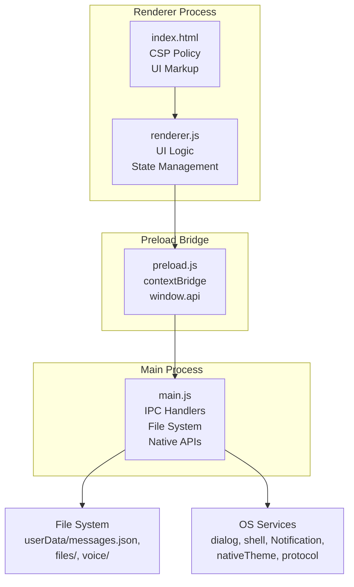
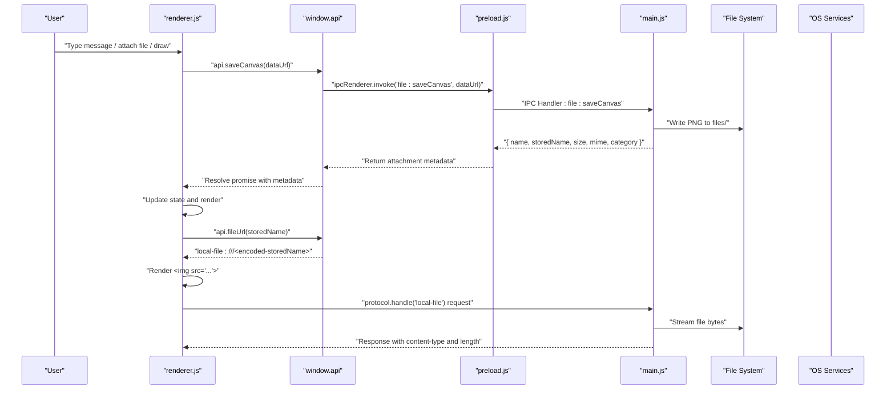
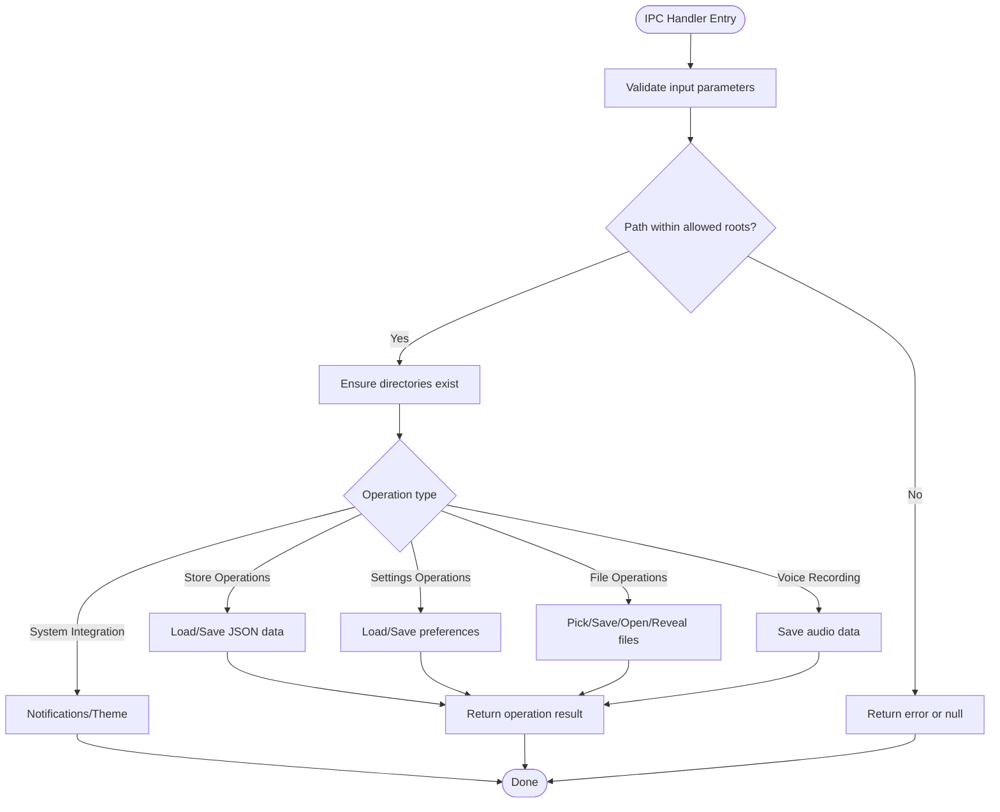
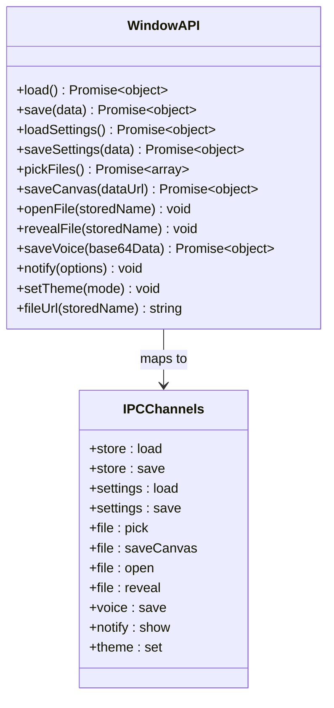
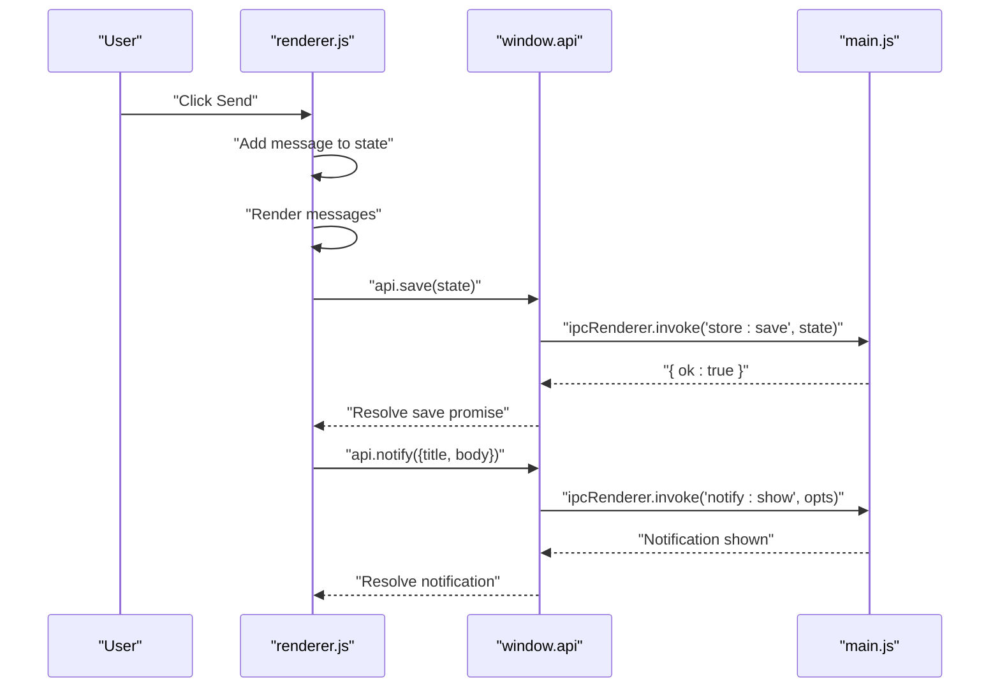
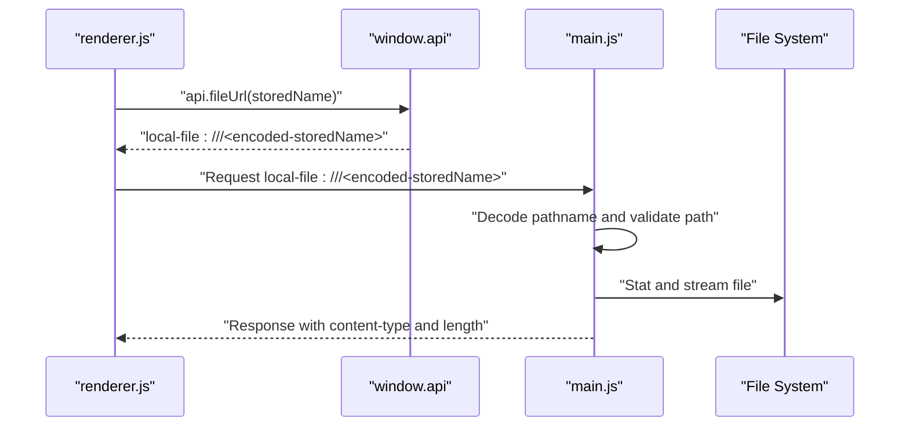
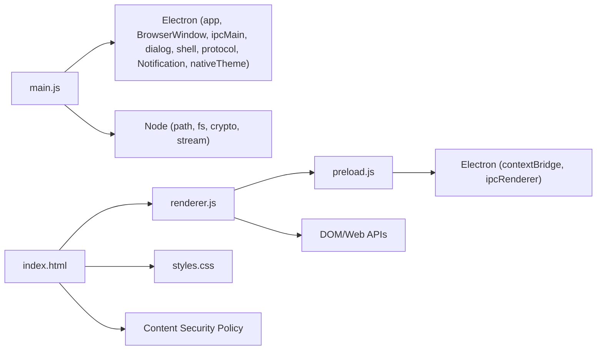

# Architecture Overview

<cite>
**Referenced Files in This Document**
- [main.js](file://main.js)
- [preload.js](file://preload.js)
- [renderer.js](file://renderer.js)
- [index.html](file://index.html)
- [package.json](file://package.json)
</cite>

## Update Summary
**Changes Made**
- Updated preload script documentation to reflect the new `window.api` object structure
- Enhanced IPC communication pattern documentation with expanded channel organization
- Added detailed security model documentation including context isolation and CSP policies
- Expanded component interaction diagrams showing the complete API surface
- Updated main process documentation with new IPC handlers for settings, voice, notifications, and themes
- Enhanced renderer process documentation with new API usage patterns

## Table of Contents
1. [Introduction](#introduction)
2. [Project Structure](#project-structure)
3. [Core Components](#core-components)
4. [Architecture Overview](#architecture-overview)
5. [Detailed Component Analysis](#detailed-component-analysis)
6. [Security Model](#security-model)
7. [IPC Communication Patterns](#ipc-communication-patterns)
8. [API Surface Documentation](#api-surface-documentation)
9. [Dependency Analysis](#dependency-analysis)
10. [Performance Considerations](#performance-considerations)
11. [Troubleshooting Guide](#troubleshooting-guide)
12. [Conclusion](#conclusion)

## Introduction
This document describes the architecture of the Messenger Electron application, focusing on the enhanced separation between the main process, preload security bridge, and renderer process. The application implements a secure, modular design with improved IPC communication patterns, comprehensive API surface through the `window.api` object, and robust security measures including context isolation and Content Security Policy enforcement. It explains how UI interactions flow through well-defined IPC channels to persistent storage while maintaining strict security boundaries.

## Project Structure
The application follows an enhanced Electron layout with clear separation of concerns:
- Main process (main.js): window lifecycle, comprehensive IPC handlers, file system operations, native integrations, custom protocol registration, and application state management.
- Preload script (preload.js): exposes a minimal, typed API surface via `contextBridge` through the `window.api` object, providing secure access to Electron capabilities.
- Renderer process (renderer.js): UI state management, user interactions, rendering logic, and IPC calls through the exposed API.
- HTML/CSS assets (index.html, styles.css): UI markup, styling, and Content Security Policy configuration.
- Package configuration (package.json): entry point, build scripts, and deployment metadata.

**Diagram sources**
- [main.js:1-155](file://main.js#L1-L155)
- [preload.js:1-17](file://preload.js#L1-L17)
- [renderer.js:1-723](file://renderer.js#L1-L723)
- [index.html:1-232](file://index.html#L1-L232)

**Section sources**
- [package.json:1-56](file://package.json#L1-L56)

## Core Components

### Main Process (main.js)
The main process serves as the central coordinator for all privileged operations:
- Application lifecycle management with single-instance enforcement
- Comprehensive JSON persistence for messages and settings
- Secure file handling with path validation and MIME type detection
- Custom protocol implementation for safe local file serving
- Extensive IPC handler registry covering store, settings, file operations, voice recording, notifications, and theme management
- Native integration with system services (dialogs, shell, notifications, theme)

**Updated** Enhanced with additional IPC handlers for settings management, voice recording, system notifications, and theme switching.

### Preload Security Bridge (preload.js)
The preload script provides a secure bridge between renderer and main processes:
- Uses `contextBridge.exposeInMainWorld()` to expose the `window.api` object
- Maps renderer method calls to specific IPC channels without exposing Node/Electron internals
- Provides helper functions for generating safe local-file URLs
- Implements strict API surface limitation with only whitelisted methods

**Updated** Now exposes a comprehensive API surface with 12 methods covering all major application functionality.

### Renderer Process (renderer.js)
The renderer process manages all user-facing functionality:
- Initializes and manages UI state from persisted store and settings
- Handles complex user interactions: message composition, reactions, pinning, editing, deletion, search, and whiteboard drawing
- Manages media capture flows including voice recording and canvas drawing
- Renders attachments using the custom local-file URL scheme
- Persists state changes through the secure preload API

**Updated** Enhanced with new API usage patterns for settings management, voice recording, system notifications, and theme switching.

**Section sources**
- [main.js:1-155](file://main.js#L1-L155)
- [preload.js:1-17](file://preload.js#L1-L17)
- [renderer.js:1-723](file://renderer.js#L1-L723)

## Architecture Overview
The application implements a strict separation of concerns with enhanced security measures:
- Main process owns all privileged operations (filesystem, dialogs, native theme, notifications)
- Preload exposes only necessary methods through the `window.api` object
- Renderer manages UI state and user interactions, calling into the preload API which forwards requests over IPC
- Custom protocol ensures safe file access without direct filesystem exposure

**Diagram sources**
- [renderer.js:683-687](file://renderer.js#L683-L687)
- [preload.js:9](file://preload.js#L9)
- [main.js:78-88](file://main.js#L78-L88)
- [main.js:139-147](file://main.js#L139-L147)

## Detailed Component Analysis

### Main Process Architecture
The main process implements a comprehensive IPC handler system:

**Application Lifecycle Management:**
- Single instance lock prevents multiple app instances
- Window creation with security-focused webPreferences configuration
- Automatic directory initialization for files and voice recordings

**Data Persistence Layer:**
- JSON-based storage for messages and settings
- Synchronous read/write operations for reliability
- Error handling with fallback defaults

**Security Implementation:**
- Safe file path resolution with traversal attack prevention
- MIME type detection and categorization
- Custom protocol handler for secure file serving

**Enhanced IPC Handlers:**
- Store operations: load/save messages
- Settings management: load/save preferences
- File operations: pick, save canvas, open, reveal
- Voice recording: save audio data
- System integration: notifications, theme control

**Diagram sources**
- [main.js:63-116](file://main.js#L63-L116)
- [main.js:40-52](file://main.js#L40-L52)

**Section sources**
- [main.js:1-155](file://main.js#L1-L155)

### Enhanced Preload Security Bridge
The preload script now provides a comprehensive API surface:

**API Surface Design:**
- Exposes `window.api` object with 12 methods
- All methods use `ipcRenderer.invoke()` for async responses
- No direct access to Node/Electron APIs in renderer
- Strict method whitelisting for security

**Method Categories:**
- Data persistence: `load()`, `save()`, `loadSettings()`, `saveSettings()`
- File operations: `pickFiles()`, `saveCanvas()`, `openFile()`, `revealFile()`
- Media handling: `saveVoice()`
- System integration: `notify()`, `setTheme()`
- URL generation: `fileUrl()`

**Diagram sources**
- [preload.js:3-16](file://preload.js#L3-L16)

**Section sources**
- [preload.js:1-17](file://preload.js#L1-L17)

### Enhanced Renderer Process
The renderer process leverages the new API surface:

**State Management:**
- Initializes state from persisted store and settings
- Manages complex UI state including messages, settings, and UI components
- Handles real-time updates and re-rendering

**Enhanced User Interactions:**
- Message composition with rich features (reactions, pinning, editing)
- File attachment workflows with drag-and-drop support
- Voice recording with MediaRecorder API integration
- Whiteboard drawing with canvas manipulation
- Search functionality with highlighting

**New API Usage Patterns:**
- Settings management through `api.loadSettings()` and `api.saveSettings()`
- Voice recording via `api.saveVoice()`
- System notifications through `api.notify()`
- Theme switching with `api.setTheme()`

**Diagram sources**
- [renderer.js:57-58](file://renderer.js#L57-L58)
- [renderer.js:231](file://renderer.js#L231)
- [preload.js:4-13](file://preload.js#L4-L13)

**Section sources**
- [renderer.js:1-723](file://renderer.js#L1-L723)

### Custom Protocol Implementation
The custom `local-file://` protocol provides secure file access:

**Security Features:**
- Path validation against traversal attacks
- MIME type enforcement for proper media handling
- Content-length headers for streaming
- Restricted to known directories only

**Implementation Details:**
- Extracts stored filename from URL
- Validates path against allowed roots
- Streams file content with appropriate headers
- Returns 404 for missing or invalid paths

**Diagram sources**
- [preload.js:15](file://preload.js#L15)
- [main.js:139-147](file://main.js#L139-L147)

**Section sources**
- [main.js:139-147](file://main.js#L139-L147)

## Security Model

### Context Isolation and Sandboxing
The application implements comprehensive security measures:

**Context Isolation:**
- Enabled via `contextIsolation: true` in BrowserWindow configuration
- Prevents direct access to Node.js APIs from renderer
- Isolates renderer context from main process environment

**Node Integration Disabled:**
- `nodeIntegration: false` prevents renderer from accessing Node.js modules
- Eliminates potential security vulnerabilities from arbitrary code execution
- Forces all privileged operations through the preload bridge

**Sandbox Configuration:**
- `sandbox: false` allows necessary functionality while maintaining security
- Combined with context isolation provides balanced security/usability

### Content Security Policy (CSP)
The HTML defines a restrictive CSP policy:

**Policy Restrictions:**
- Default sources restricted to `'self'`
- Scripts limited to `'self'` source
- Styles allow `'unsafe-inline'` for theming functionality
- Images and media permit `'self'`, `data:`, `blob:`, and `local-file:` schemes
- MediaRecorder and blob: schemes enabled for audio/video capture

**Security Benefits:**
- Prevents loading external resources
- Restricts inline script execution
- Allows controlled access to local files through custom protocol
- Enables media capture functionality while maintaining security

**Section sources**
- [main.js:125-130](file://main.js#L125-L130)
- [index.html:6](file://index.html#L6)

## IPC Communication Patterns

### Channel Organization
The application uses organized IPC channels by functional area:

**Store Channels:**
- `store:load` - Load messages from persistent storage
- `store:save` - Save messages to persistent storage

**Settings Channels:**
- `settings:load` - Load application preferences
- `settings:save` - Save application preferences

**File Operation Channels:**
- `file:pick` - Open file selection dialog
- `file:saveCanvas` - Save whiteboard drawings
- `file:open` - Open files with system default application
- `file:reveal` - Show files in system file explorer

**Media Channels:**
- `voice:save` - Save voice recordings

**System Integration Channels:**
- `notify:show` - Display system notifications
- `theme:set` - Change application theme

### Communication Flow
All IPC communication follows a consistent pattern:

1. Renderer calls `window.api.methodName(params)`
2. Preload maps to `ipcRenderer.invoke('channel:name', params)`
3. Main process handles via `ipcMain.handle('channel:name', handler)`
4. Handler performs operation and returns result
5. Result propagates back through the chain

**Section sources**
- [preload.js:3-16](file://preload.js#L3-L16)
- [main.js:63-116](file://main.js#L63-L116)

## API Surface Documentation

### Window API Methods
The `window.api` object provides a comprehensive interface:

**Data Persistence Methods:**
- `load()` - Load messages from storage
- `save(data)` - Save messages to storage
- `loadSettings()` - Load application settings
- `saveSettings(data)` - Save application settings

**File Operation Methods:**
- `pickFiles()` - Open file picker dialog
- `saveCanvas(dataUrl)` - Save canvas drawing as image
- `openFile(storedName)` - Open file with system application
- `revealFile(storedName)` - Show file in file explorer

**Media Handling Methods:**
- `saveVoice(base64Data)` - Save voice recording

**System Integration Methods:**
- `notify(options)` - Show system notification
- `setTheme(mode)` - Set application theme (dark/light)

**Utility Methods:**
- `fileUrl(storedName)` - Generate local-file URL for attachments

**Section sources**
- [preload.js:3-16](file://preload.js#L3-L16)

## Dependency Analysis
High-level dependencies follow a clear hierarchy:

**Main Process Dependencies:**
- Electron modules: app, BrowserWindow, ipcMain, dialog, shell, protocol, Notification, nativeTheme
- Node.js modules: path, fs, crypto, Readable stream

**Preload Bridge Dependencies:**
- Electron modules: contextBridge, ipcRenderer

**Renderer Process Dependencies:**
- DOM APIs and Web APIs (MediaRecorder, FileReader, Canvas)
- Exposed `window.api` interface

**HTML Configuration:**
- Content Security Policy definition
- External resource loading (styles.css, renderer.js)

**Diagram sources**
- [main.js:1-5](file://main.js#L1-L5)
- [preload.js:1](file://preload.js#L1)
- [renderer.js:1-10](file://renderer.js#L1-L10)
- [index.html:6](file://index.html#L6)

**Section sources**
- [package.json:1-56](file://package.json#L1-L56)

## Performance Considerations
The enhanced architecture includes several performance optimizations:

**Streaming File Responses:**
- Uses `Readable.toWeb()` for efficient file streaming
- Reduces memory overhead when serving large media files
- Proper content-length headers enable browser caching

**Asynchronous Operations:**
- All IPC calls use `invoke()` for non-blocking operations
- Promise-based API surface enables proper error handling
- Background processing for file operations

**State Management:**
- Efficient state updates with selective re-rendering
- Debounced operations for typing indicators and search
- Optimized canvas operations for whiteboard functionality

**Memory Management:**
- Proper cleanup of media recorder streams
- Event listener management for performance
- Efficient string operations and DOM manipulation

## Troubleshooting Guide
Common issues and their resolutions:

**Attachment Display Issues:**
- Verify `local-file://` protocol is registered in main process
- Check CSP allows `local-file:` for images/media sources
- Confirm stored filenames resolve within allowed directories
- Validate file existence and permissions

**Voice Recording Problems:**
- Ensure microphone permissions are granted
- Check MediaRecorder API support in browser context
- Verify base64 encoding/decoding works correctly
- Validate audio format compatibility

**Theme Not Applying:**
- Confirm `nativeTheme.themeSource` is set correctly
- Check `api.setTheme()` IPC handler is invoked
- Verify CSS classes are applied to document body
- Validate theme color definitions in styles

**Settings Persistence Issues:**
- Check file permissions for settings.json
- Verify JSON serialization/deserialization
- Confirm IPC handlers for settings channels are registered
- Validate default settings structure

**Security-Related Errors:**
- Review context isolation configuration
- Check CSP policy restrictions
- Verify preload script is properly loaded
- Validate API method availability in renderer

**Section sources**
- [main.js:139-147](file://main.js#L139-L147)
- [main.js:111-115](file://main.js#L111-L115)
- [index.html:6](file://index.html#L6)

## Conclusion
The Messenger Electron application demonstrates a modern, secure desktop application architecture with significant enhancements:

**Security Excellence:**
- Comprehensive context isolation and CSP enforcement
- Minimal attack surface through strict API whitelisting
- Secure file access via custom protocol with path validation
- Separation of privileged and unprivileged code execution contexts

**Architectural Clarity:**
- Well-defined separation between main, preload, and renderer processes
- Organized IPC channel structure by functional area
- Clean API surface through `window.api` object
- Clear data flow from user interactions to persistent storage

**Feature Completeness:**
- Rich messaging interface with reactions, pinning, and editing
- Advanced media handling including voice recording and file attachments
- Comprehensive settings management with theme customization
- System integration through notifications and native file operations

**Developer Experience:**
- Promise-based API surface for modern JavaScript development
- Consistent error handling and response patterns
- Well-documented IPC channels and method signatures
- Modular architecture supporting future enhancements

This architecture balances usability with security, making it suitable for a private, offline-first desktop notebook experience while providing a solid foundation for future feature additions and security improvements.