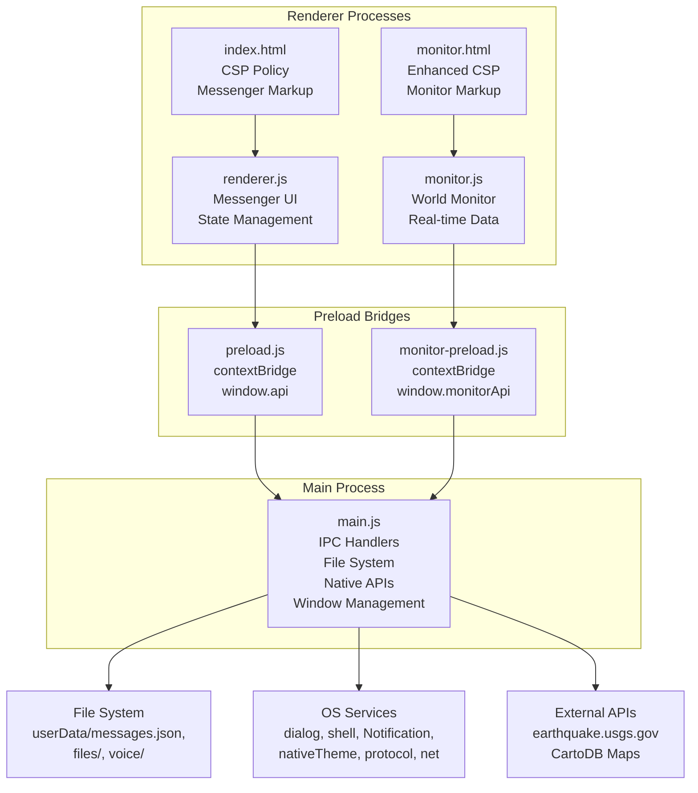
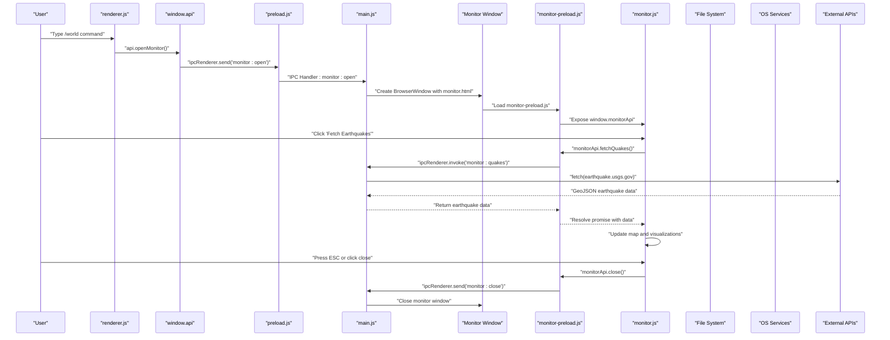
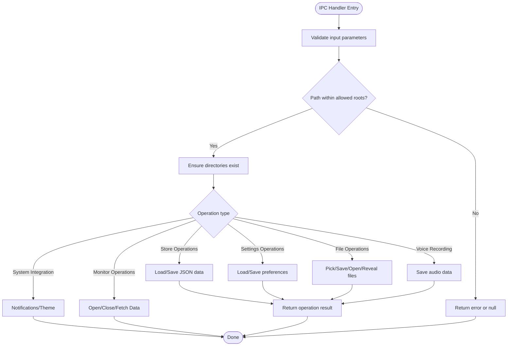
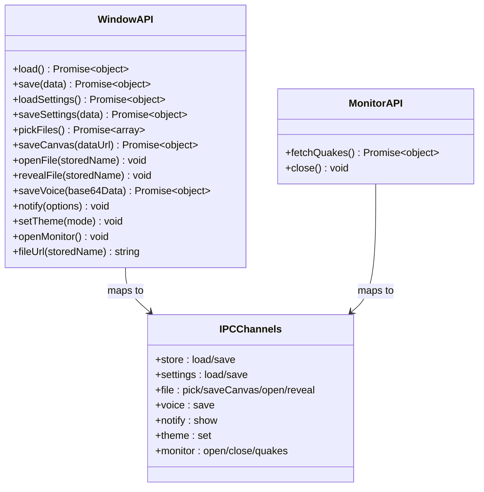
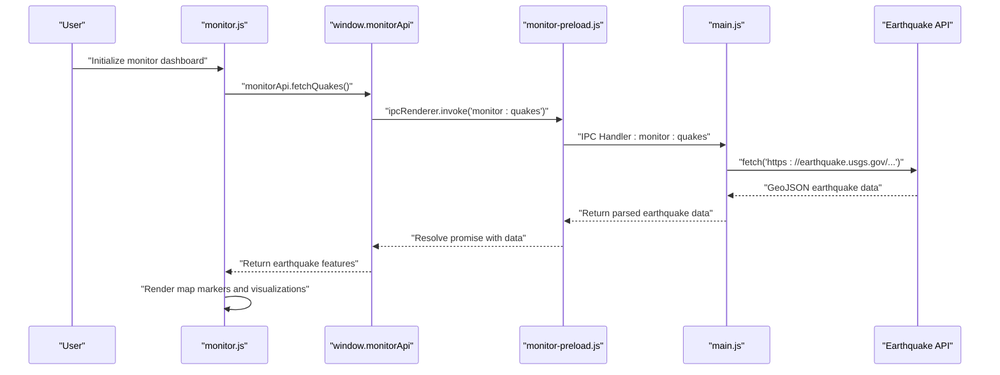
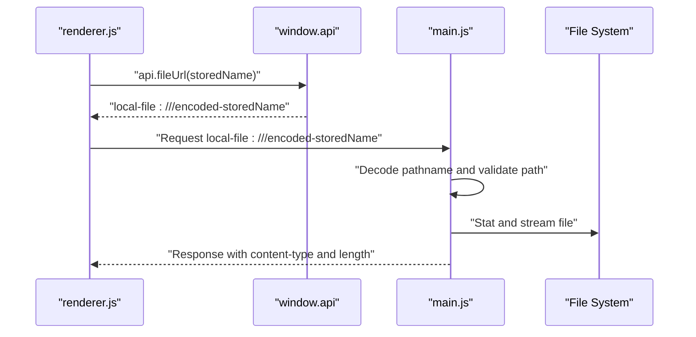
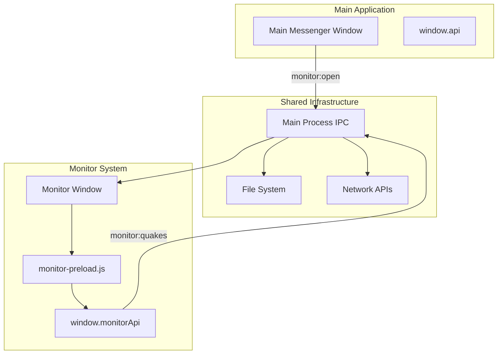
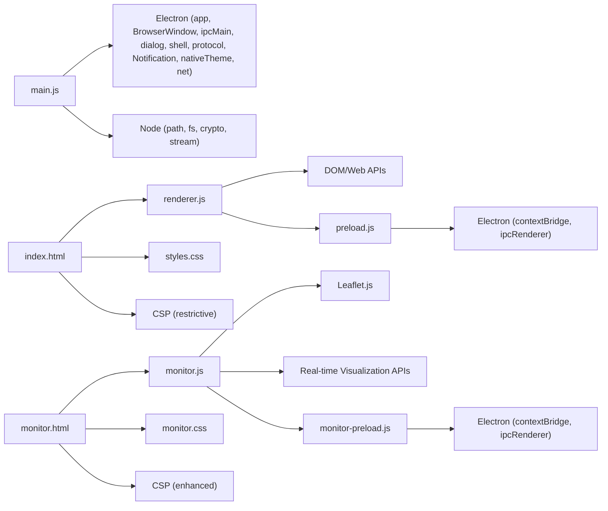

# Architecture Overview

<cite>
**Referenced Files in This Document**
- [main.js](file://main.js)
- [preload.js](file://preload.js)
- [monitor-preload.js](file://monitor-preload.js)
- [renderer.js](file://renderer.js)
- [monitor.js](file://monitor.js)
- [monitor.html](file://monitor.html)
- [monitor.css](file://monitor.css)
- [index.html](file://index.html)
- [package.json](file://package.json)
</cite>

## Update Summary
**Changes Made**
- Added comprehensive World Monitor window management system with dedicated monitor process
- Enhanced IPC communication patterns with new monitor-specific channels (monitor:open, monitor:close, monitor:quakes)
- Expanded preload script functionality with dual API surface for main app and monitor windows
- Integrated real-time earthquake data fetching through secure IPC handlers
- Added advanced monitoring dashboard with financial markets, geopolitical risk assessment, and global threat visualization
- Implemented separate security context for monitor window with specialized capabilities

## Table of Contents
1. [Introduction](#introduction)
2. [Project Structure](#project-structure)
3. [Core Components](#core-components)
4. [Architecture Overview](#architecture-overview)
5. [Detailed Component Analysis](#detailed-component-analysis)
6. [Security Model](#security-model)
7. [IPC Communication Patterns](#ipc-communication-patterns)
8. [API Surface Documentation](#api-surface-documentation)
9. [Monitor Window System](#monitor-window-system)
10. [Dependency Analysis](#dependency-analysis)
11. [Performance Considerations](#performance-considerations)
12. [Troubleshooting Guide](#troubleshooting-guide)
13. [Conclusion](#conclusion)

## Introduction
This document describes the architecture of the Messenger Electron application, focusing on the enhanced separation between the main process, preload security bridges, and renderer processes. The application implements a secure, modular design with improved IPC communication patterns, comprehensive API surface through dual `window.api` objects, and robust security measures including context isolation and Content Security Policy enforcement. It explains how UI interactions flow through well-defined IPC channels to persistent storage while maintaining strict security boundaries. The application now includes an advanced World Monitor system providing real-time global intelligence, financial market data, and geopolitical risk assessment capabilities.

## Project Structure
The application follows an enhanced Electron layout with clear separation of concerns across multiple processes:
- Main process (main.js): window lifecycle management, comprehensive IPC handlers, file system operations, native integrations, custom protocol registration, application state management, and multi-window coordination.
- Preload scripts (preload.js, monitor-preload.js): provide minimal, typed API surfaces via `contextBridge` through separate `window.api` and `window.monitorApi` objects, providing secure access to Electron capabilities for different contexts.
- Renderer processes (renderer.js, monitor.js): manage user-facing functionality with distinct responsibilities - messenger interface and world monitoring dashboard.
- HTML/CSS assets (index.html, monitor.html, styles.css, monitor.css): UI markup, styling, and Content Security Policy configuration for both applications.
- Package configuration (package.json): entry point, build scripts, and deployment metadata.

**Diagram sources**
- [main.js:1-192](file://main.js#L1-L192)
- [preload.js:1-23](file://preload.js#L1-L23)
- [monitor-preload.js:1-7](file://monitor-preload.js#L1-L7)
- [renderer.js:1-725](file://renderer.js#L1-L725)
- [monitor.js:1-965](file://monitor.js#L1-L965)
- [index.html:1-232](file://index.html#L1-L232)
- [monitor.html:1-195](file://monitor.html#L1-L195)

**Section sources**
- [package.json:1-56](file://package.json#L1-L56)

## Core Components

### Main Process (main.js)
The main process serves as the central coordinator for all privileged operations with enhanced multi-window support:
- Application lifecycle management with single-instance enforcement and monitor window coordination
- Comprehensive JSON persistence for messages and settings
- Secure file handling with path validation and MIME type detection
- Custom protocol implementation for safe local file serving
- Extensive IPC handler registry covering store, settings, file operations, voice recording, notifications, theme management, and monitor-specific functionality
- Native integration with system services (dialogs, shell, notifications, theme) and external network requests
- Multi-window management with dedicated monitor window lifecycle control

**Updated** Enhanced with comprehensive monitor window management, real-time earthquake data fetching, and expanded IPC handlers for cross-process communication.

### Preload Security Bridges (preload.js, monitor-preload.js)
The preload scripts provide secure bridges between renderers and main processes with context-specific APIs:
- Main app preload uses `contextBridge.exposeInMainWorld()` to expose the `window.api` object
- Monitor preload exposes the `window.monitorApi` object with specialized monitoring capabilities
- Both use `ipcRenderer.invoke()` and `ipcRenderer.send()` for async/sync communication
- Strict API surface limitation with only whitelisted methods per context
- Separate security contexts ensure proper isolation between messenger and monitor functionality

**Updated** Now provides dual API surface with 12 methods for main app (`window.api`) and 2 specialized methods for monitor (`window.monitorApi`).

### Renderer Processes (renderer.js, monitor.js)
The renderer processes manage distinct user-facing functionalities:
- **Messenger Renderer**: Initializes and manages UI state from persisted store and settings, handles complex user interactions including message composition, reactions, pinning, editing, deletion, search, and whiteboard drawing, manages media capture flows including voice recording and canvas drawing, renders attachments using the custom local-file URL scheme, persists state changes through the secure preload API.
- **Monitor Renderer**: Provides comprehensive world monitoring dashboard with real-time earthquake data visualization, financial market ticker, geopolitical risk assessment, route planning and chokepoint analysis, scenario simulation engine, live threat monitoring, system status tracking, and interactive map layers with Leaflet integration.

**Updated** Enhanced with new API usage patterns for settings management, voice recording, system notifications, theme switching, and comprehensive world monitoring capabilities.

**Section sources**
- [main.js:1-192](file://main.js#L1-L192)
- [preload.js:1-23](file://preload.js#L1-L23)
- [monitor-preload.js:1-7](file://monitor-preload.js#L1-L7)
- [renderer.js:1-725](file://renderer.js#L1-L725)
- [monitor.js:1-965](file://monitor.js#L1-L965)

## Architecture Overview
The application implements a strict separation of concerns with enhanced security measures and multi-window support:
- Main process owns all privileged operations (filesystem, dialogs, native theme, notifications, network requests, window management)
- Preload bridges expose only necessary methods through context-specific API objects (`window.api`, `window.monitorApi`)
- Renderer processes manage UI state and user interactions, calling into their respective preload APIs which forward requests over IPC
- Custom protocol ensures safe file access without direct filesystem exposure
- Dedicated monitor window provides isolated environment for intensive monitoring tasks

**Diagram sources**
- [renderer.js:595](file://renderer.js#L595)
- [preload.js:15](file://preload.js#L15)
- [main.js:127-152](file://main.js#L127-L152)
- [monitor-preload.js:3-6](file://monitor-preload.js#L3-L6)
- [monitor.js:232-235](file://monitor.js#L232-L235)
- [main.js:119-125](file://main.js#L119-L125)

## Detailed Component Analysis

### Enhanced Main Process Architecture
The main process implements a comprehensive IPC handler system with multi-window support:

**Application Lifecycle Management:**
- Single instance lock prevents multiple app instances
- Window creation with security-focused webPreferences configuration
- Automatic directory initialization for files and voice recordings
- Monitor window lifecycle management with focus handling and cleanup

**Data Persistence Layer:**
- JSON-based storage for messages and settings
- Synchronous read/write operations for reliability
- Error handling with fallback defaults

**Security Implementation:**
- Safe file path resolution with traversal attack prevention
- MIME type detection and categorization
- Custom protocol handler for secure file serving
- Network request handling for external APIs

**Enhanced IPC Handlers:**
- Store operations: load/save messages
- Settings management: load/save preferences
- File operations: pick, save canvas, open, reveal
- Voice recording: save audio data
- System integration: notifications, theme control
- **Monitor operations**: open/close monitor window, fetch earthquake data

**Diagram sources**
- [main.js:64-153](file://main.js#L64-L153)
- [main.js:40-52](file://main.js#L40-L52)

**Section sources**
- [main.js:1-192](file://main.js#L1-L192)

### Enhanced Preload Security Bridges
The preload scripts now provide comprehensive, context-specific API surfaces:

**Main App API Surface (`window.api`):**
- Exposes 12 methods for messenger functionality
- All methods use `ipcRenderer.invoke()` for async responses
- No direct access to Node/Electron APIs in renderer
- Strict method whitelisting for security

**Monitor API Surface (`window.monitorApi`):**
- Exposes 2 specialized methods for monitoring functionality
- Simplified API focused on data fetching and window control
- Separate security context prevents cross-contamination
- Optimized for real-time data operations

**Method Categories:**
- **Main App**: Data persistence, file operations, media handling, system integration, URL generation, monitor control
- **Monitor**: Earthquake data fetching, window closure

**Diagram sources**
- [preload.js:3-16](file://preload.js#L3-L16)
- [monitor-preload.js:3-6](file://monitor-preload.js#L3-L6)

**Section sources**
- [preload.js:1-23](file://preload.js#L1-L23)
- [monitor-preload.js:1-7](file://monitor-preload.js#L1-L7)

### Enhanced Renderer Processes
The renderer processes leverage their respective API surfaces:

**Messenger Renderer Enhancements:**
- State management with enhanced settings integration
- Complex UI state including messages, settings, and UI components
- Real-time updates and re-rendering with performance optimizations
- New API usage patterns for monitor window control

**Monitor Renderer Capabilities:**
- Comprehensive world monitoring dashboard with real-time data
- Interactive map visualization using Leaflet.js
- Financial market ticker with live price updates
- Geopolitical risk assessment with country scoring
- Route planning and chokepoint analysis
- Scenario simulation engine for crisis planning
- Live threat monitoring with automated alert generation
- System status tracking and network activity visualization
- Global time zone display and satellite tracking

**Diagram sources**
- [monitor.js:7-13](file://monitor.js#L7-L13)
- [monitor-preload.js:4](file://monitor-preload.js#L4)
- [main.js:119-125](file://main.js#L119-L125)

**Section sources**
- [renderer.js:1-725](file://renderer.js#L1-L725)
- [monitor.js:1-965](file://monitor.js#L1-L965)

### Custom Protocol Implementation
The custom `local-file://` protocol provides secure file access with enhanced monitoring capabilities:

**Security Features:**
- Path validation against traversal attacks
- MIME type enforcement for proper media handling
- Content-length headers for streaming
- Restricted to known directories only
- Support for both messenger files and voice recordings

**Implementation Details:**
- Extracts stored filename from URL
- Validates path against allowed roots
- Streams file content with appropriate headers
- Returns 404 for missing or invalid paths
- Supports both image/video/audio/file categories

**Diagram sources**
- [preload.js:16](file://preload.js#L16)
- [main.js:176-184](file://main.js#L176-L184)

**Section sources**
- [main.js:176-184](file://main.js#L176-L184)

## Security Model

### Context Isolation and Sandboxing
The application implements comprehensive security measures across multiple contexts:

**Context Isolation:**
- Enabled via `contextIsolation: true` in all BrowserWindow configurations
- Prevents direct access to Node.js APIs from renderers
- Isolates renderer contexts from main process environment
- Separate contexts for main app and monitor windows

**Node Integration Disabled:**
- `nodeIntegration: false` prevents renderers from accessing Node.js modules
- Eliminates potential security vulnerabilities from arbitrary code execution
- Forces all privileged operations through preload bridges

**Sandbox Configuration:**
- `sandbox: false` allows necessary functionality while maintaining security
- Combined with context isolation provides balanced security/usability
- Different sandbox policies for different window types

### Content Security Policy (CSP)
Both applications define restrictive CSP policies tailored to their needs:

**Messenger CSP Restrictions:**
- Default sources restricted to `'self'`
- Scripts limited to `'self'` source
- Styles allow `'unsafe-inline'` for theming functionality
- Images and media permit `'self'`, `data:`, `blob:`, and `local-file:` schemes
- MediaRecorder and blob: schemes enabled for audio/video capture

**Monitor CSP Enhancements:**
- Allows external HTTPS resources for mapping and data APIs
- Permits connections to earthquake.usgs.gov and CartoDB basemap servers
- Maintains `'unsafe-inline'` for dynamic styling and animations
- Enables external JavaScript libraries (Leaflet.js)

**Security Benefits:**
- Prevents loading unauthorized external resources
- Restricts inline script execution where possible
- Allows controlled access to local files through custom protocol
- Enables required third-party services while maintaining security boundaries

**Section sources**
- [main.js:162-167](file://main.js#L162-L167)
- [main.js:136-141](file://main.js#L136-L141)
- [index.html:6](file://index.html#L6)
- [monitor.html:5](file://monitor.html#L5)

## IPC Communication Patterns

### Enhanced Channel Organization
The application uses organized IPC channels by functional area with monitor-specific extensions:

**Store Channels:**
- `store:load` - Load messages from persistent storage
- `store:save` - Save messages to persistent storage

**Settings Channels:**
- `settings:load` - Load application preferences
- `settings:save` - Save application preferences

**File Operation Channels:**
- `file:pick` - Open file selection dialog
- `file:saveCanvas` - Save whiteboard drawings
- `file:open` - Open files with system default application
- `file:reveal` - Show files in system file explorer

**Media Channels:**
- `voice:save` - Save voice recordings

**System Integration Channels:**
- `notify:show` - Display system notifications
- `theme:set` - Change application theme

**Monitor Channels:**
- `monitor:open` - Open world monitor window
- `monitor:close` - Close world monitor window
- `monitor:quakes` - Fetch real-time earthquake data

### Communication Flow
All IPC communication follows consistent patterns with context-specific variations:

**Main App Flow:**
1. Renderer calls `window.api.methodName(params)`
2. Preload maps to `ipcRenderer.invoke('channel:name', params)`
3. Main process handles via `ipcMain.handle('channel:name', handler)`
4. Handler performs operation and returns result
5. Result propagates back through the chain

**Monitor Flow:**
1. Monitor renderer calls `window.monitorApi.methodName(params)`
2. Monitor preload maps to `ipcRenderer.invoke/send('monitor:channel', params)`
3. Main process handles via `ipcMain.handle/on('monitor:channel', handler)`
4. Handler performs operation (may include network requests)
5. Result propagates back to monitor renderer

**Section sources**
- [preload.js:3-16](file://preload.js#L3-L16)
- [monitor-preload.js:3-6](file://monitor-preload.js#L3-L6)
- [main.js:64-153](file://main.js#L64-L153)

## API Surface Documentation

### Window API Methods (`window.api`)
The main app `window.api` object provides a comprehensive interface:

**Data Persistence Methods:**
- `load()` - Load messages from storage
- `save(data)` - Save messages to storage
- `loadSettings()` - Load application settings
- `saveSettings(data)` - Save application settings

**File Operation Methods:**
- `pickFiles()` - Open file picker dialog
- `saveCanvas(dataUrl)` - Save canvas drawing as image
- `openFile(storedName)` - Open file with system application
- `revealFile(storedName)` - Show file in file explorer

**Media Handling Methods:**
- `saveVoice(base64Data)` - Save voice recording

**System Integration Methods:**
- `notify(options)` - Show system notification
- `setTheme(mode)` - Set application theme (dark/light)

**Utility Methods:**
- `fileUrl(storedName)` - Generate local-file URL for attachments
- `openMonitor()` - Open world monitor window

### Monitor API Methods (`window.monitorApi`)
The monitor `window.monitorApi` object provides specialized monitoring capabilities:

**Data Access Methods:**
- `fetchQuakes()` - Fetch real-time earthquake data from USGS API

**Window Control Methods:**
- `close()` - Close the monitor window

**Section sources**
- [preload.js:3-16](file://preload.js#L3-L16)
- [monitor-preload.js:3-6](file://monitor-preload.js#L3-L6)

## Monitor Window System

### Multi-Window Architecture
The application implements a sophisticated multi-window system with the World Monitor as a specialized secondary window:

**Monitor Window Management:**
- Dedicated BrowserWindow instance with fullscreen, frameless presentation
- Separate preload script (`monitor-preload.js`) with specialized API surface
- Independent security context with enhanced CSP for external resources
- Lifecycle management with automatic cleanup and focus handling
- Development tools integration for debugging

**Monitor Window Features:**
- Fullscreen immersive experience optimized for monitoring dashboards
- Dark theme with high-contrast colors for extended viewing
- Real-time data updates with animated visualizations
- Interactive map layers with multiple data overlays
- Financial market ticker with live price updates
- Geopolitical risk assessment with country scoring systems
- Route planning and chokepoint analysis tools
- Scenario simulation engine for crisis planning
- Live threat monitoring with automated alert generation

**Integration with Main App:**
- Triggered via `/world` command in messenger interface
- Seamless window management with focus restoration
- Shared IPC infrastructure for cross-window communication
- Independent data fetching and processing capabilities

**Diagram sources**
- [main.js:127-152](file://main.js#L127-L152)
- [monitor-preload.js:1-7](file://monitor-preload.js#L1-L7)
- [renderer.js:595](file://renderer.js#L595)

**Section sources**
- [main.js:127-152](file://main.js#L127-L152)
- [monitor.html:1-195](file://monitor.html#L1-L195)
- [monitor.js:1-965](file://monitor.js#L1-L965)

## Dependency Analysis
High-level dependencies follow a clear hierarchy with enhanced monitoring capabilities:

**Main Process Dependencies:**
- Electron modules: app, BrowserWindow, ipcMain, dialog, shell, protocol, Notification, nativeTheme, net
- Node.js modules: path, fs, crypto, Readable stream

**Preload Bridge Dependencies:**
- Electron modules: contextBridge, ipcRenderer (both main and monitor preloads)

**Renderer Process Dependencies:**
- **Messenger**: DOM APIs and Web APIs (MediaRecorder, FileReader, Canvas), exposed `window.api` interface
- **Monitor**: Leaflet.js mapping library, extensive DOM manipulation, real-time data visualization APIs, exposed `window.monitorApi` interface

**HTML Configuration:**
- **Messenger**: Content Security Policy definition, external resource loading
- **Monitor**: Enhanced CSP allowing external HTTPS resources, Leaflet.js CDN integration

**Diagram sources**
- [main.js:1-5](file://main.js#L1-L5)
- [preload.js:1](file://preload.js#L1)
- [monitor-preload.js:1](file://monitor-preload.js#L1)
- [renderer.js:1-10](file://renderer.js#L1-L10)
- [monitor.js:191-192](file://monitor.js#L191-L192)
- [index.html:6](file://index.html#L6)
- [monitor.html:5-8](file://monitor.html#L5-L8)

**Section sources**
- [package.json:1-56](file://package.json#L1-L56)

## Performance Considerations
The enhanced architecture includes several performance optimizations for both messenger and monitoring functionality:

**Streaming File Responses:**
- Uses `Readable.toWeb()` for efficient file streaming
- Reduces memory overhead when serving large media files
- Proper content-length headers enable browser caching

**Asynchronous Operations:**
- All IPC calls use `invoke()` for non-blocking operations
- Promise-based API surface enables proper error handling
- Background processing for file operations and network requests

**State Management:**
- Efficient state updates with selective re-rendering
- Debounced operations for typing indicators and search
- Optimized canvas operations for whiteboard functionality
- Real-time data updates with efficient DOM manipulation

**Memory Management:**
- Proper cleanup of media recorder streams
- Event listener management for performance
- Efficient string operations and DOM manipulation
- Monitor window lifecycle management with automatic cleanup

**Monitoring-Specific Optimizations:**
- Lazy loading of heavy map visualizations
- Efficient data polling with configurable intervals
- Optimized rendering for real-time chart updates
- Memory-efficient event handling for continuous data streams

## Troubleshooting Guide
Common issues and their resolutions with enhanced monitoring capabilities:

**Attachment Display Issues:**
- Verify `local-file://` protocol is registered in main process
- Check CSP allows `local-file:` for images/media sources
- Confirm stored filenames resolve within allowed directories
- Validate file existence and permissions

**Voice Recording Problems:**
- Ensure microphone permissions are granted
- Check MediaRecorder API support in browser context
- Verify base64 encoding/decoding works correctly
- Validate audio format compatibility

**Theme Not Applying:**
- Confirm `nativeTheme.themeSource` is set correctly
- Check `api.setTheme()` IPC handler is invoked
- Verify CSS classes are applied to document body
- Validate theme color definitions in styles

**Settings Persistence Issues:**
- Check file permissions for settings.json
- Verify JSON serialization/deserialization
- Confirm IPC handlers for settings channels are registered
- Validate default settings structure

**Monitor Window Issues:**
- Verify monitor window creation succeeds in main process
- Check monitor-preload.js loads correctly
- Ensure monitor.html CSP allows external resources
- Validate Leaflet.js CDN accessibility
- Confirm earthquake API endpoint availability

**Monitor Data Loading Problems:**
- Check network connectivity to earthquake.usgs.gov
- Verify CORS policy allows cross-origin requests
- Validate GeoJSON response parsing
- Monitor console logs for API errors

**Security-Related Errors:**
- Review context isolation configuration for both windows
- Check CSP policy restrictions for each context
- Verify preload scripts are properly loaded
- Validate API method availability in respective renderers

**Section sources**
- [main.js:176-184](file://main.js#L176-L184)
- [main.js:119-125](file://main.js#L119-L125)
- [index.html:6](file://index.html#L6)
- [monitor.html:5](file://monitor.html#L5)

## Conclusion
The Messenger Electron application demonstrates a modern, secure desktop application architecture with significant enhancements including a comprehensive World Monitor system:

**Security Excellence:**
- Comprehensive context isolation and CSP enforcement across multiple windows
- Minimal attack surface through strict API whitelisting per context
- Secure file access via custom protocol with path validation
- Separation of privileged and unprivileged code execution contexts
- Specialized security contexts for different application modes

**Architectural Clarity:**
- Well-defined separation between main, preload, and renderer processes
- Organized IPC channel structure by functional area with monitor extensions
- Clean API surface through context-specific `window.api` objects
- Clear data flow from user interactions to persistent storage
- Multi-window coordination with independent lifecycles

**Feature Completeness:**
- Rich messaging interface with reactions, pinning, and editing
- Advanced media handling including voice recording and file attachments
- Comprehensive settings management with theme customization
- System integration through notifications and native file operations
- **World Monitor**: Real-time earthquake visualization, financial market data, geopolitical risk assessment, route planning, scenario simulation, and live threat monitoring

**Developer Experience:**
- Promise-based API surface for modern JavaScript development
- Consistent error handling and response patterns
- Well-documented IPC channels and method signatures
- Modular architecture supporting future enhancements
- Separate contexts for different application modes

This architecture balances usability with security while providing powerful monitoring capabilities, making it suitable for both private note-taking and real-time global intelligence gathering while maintaining a solid foundation for future feature additions and security improvements.