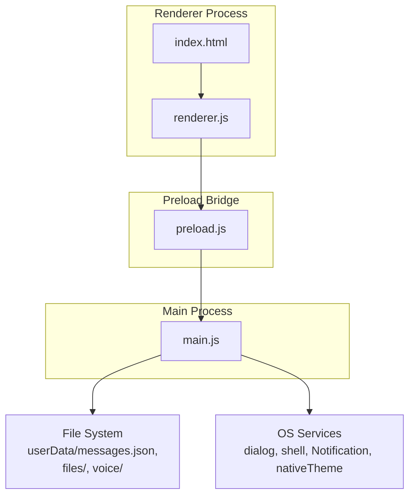
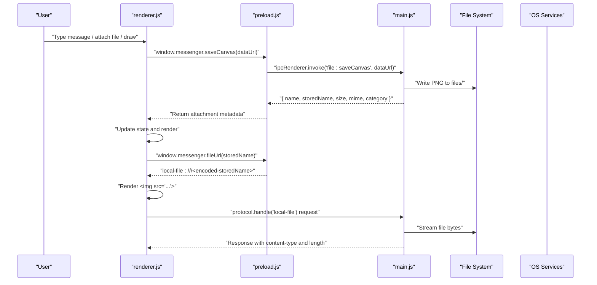
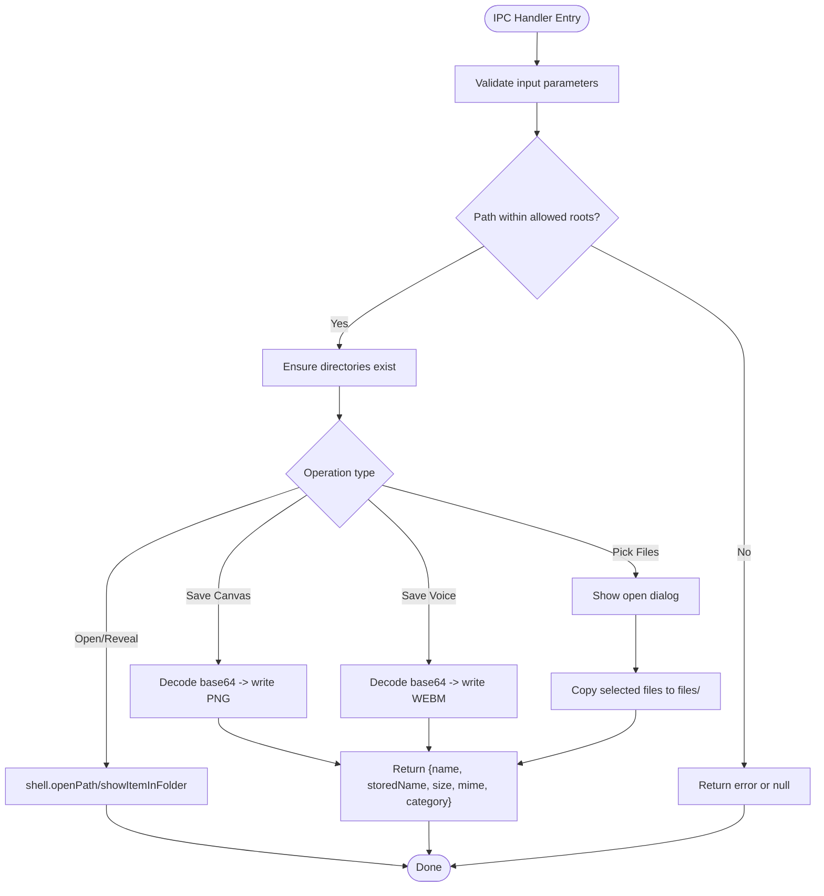
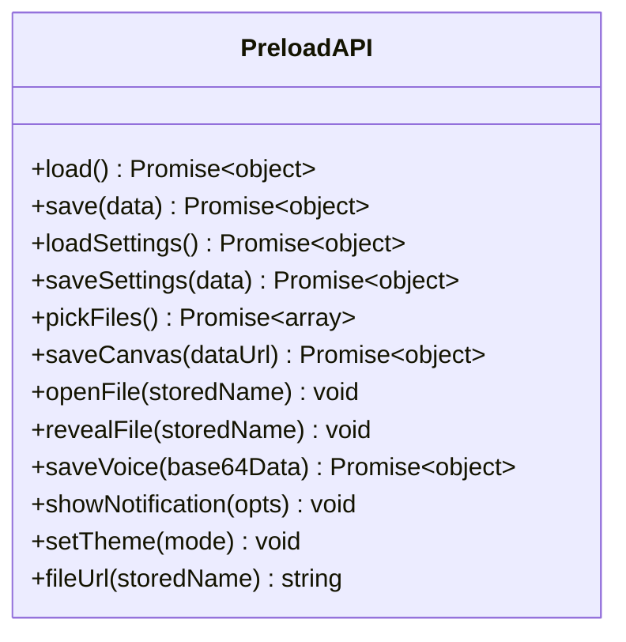
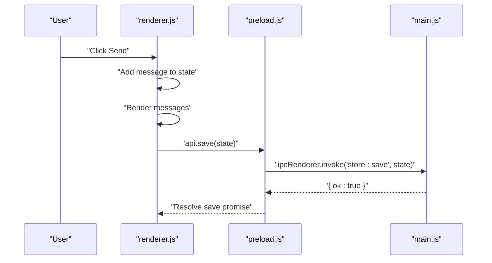
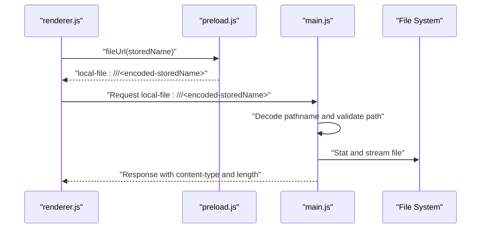
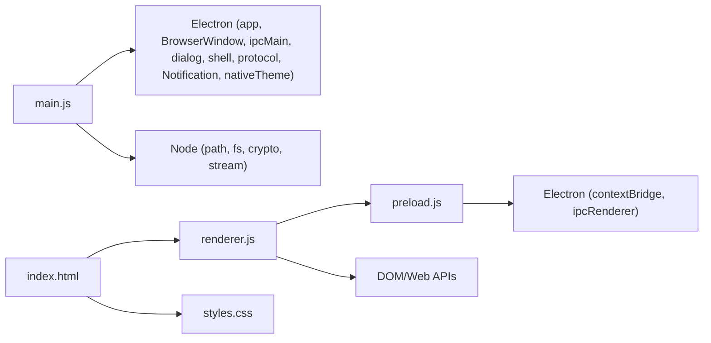

# Architecture Overview

<cite>
**Referenced Files in This Document**
- [main.js](file://main.js)
- [preload.js](file://preload.js)
- [renderer.js](file://renderer.js)
- [index.html](file://index.html)
- [package.json](file://package.json)
- [README.md](file://README.md)
</cite>

## Table of Contents
1. [Introduction](#introduction)
2. [Project Structure](#project-structure)
3. [Core Components](#core-components)
4. [Architecture Overview](#architecture-overview)
5. [Detailed Component Analysis](#detailed-component-analysis)
6. [Dependency Analysis](#dependency-analysis)
7. [Performance Considerations](#performance-considerations)
8. [Troubleshooting Guide](#troubleshooting-guide)
9. [Conclusion](#conclusion)

## Introduction
This document describes the architecture of the Messenger Electron application, focusing on the separation between the main process, preload security bridge, and renderer process. It explains IPC communication patterns, context isolation, custom protocol usage for safe file access, and how UI interactions flow through IPC handlers to persistent storage. The goal is to provide both a high-level overview and code-level insights for developers and reviewers.

## Project Structure
The application follows a standard Electron layout:
- Main process (main.js): window lifecycle, IPC handlers, file system operations, native integrations, and custom protocol registration.
- Preload script (preload.js): exposes a minimal, typed API surface to the renderer via contextBridge.
- Renderer process (renderer.js): UI state management, user interactions, rendering, and IPC calls through the exposed API.
- HTML/CSS assets (index.html, styles.css): UI markup and styling.
- Package configuration (package.json): entry point, scripts, and build metadata.

**Diagram sources**
- [main.js:103-121](file://main.js#L103-L121)
- [preload.js:3-16](file://preload.js#L3-L16)
- [renderer.js:7-15](file://renderer.js#L7-L15)
- [index.html:257-258](file://index.html#L257-L258)

**Section sources**
- [package.json:1-11](file://package.json#L1-L11)
- [README.md:59-79](file://README.md#L59-L79)

## Core Components
- Main process (main.js)
  - Registers a single-instance lock and ensures required directories exist.
  - Provides JSON persistence for messages and settings.
  - Implements secure file handling with path validation and MIME mapping.
  - Exposes IPC handlers for store, settings, file pick/save/open/reveal, voice recording, notifications, and theme control.
  - Registers a custom local-file protocol to serve stored files safely.
- Preload bridge (preload.js)
  - Uses contextBridge to expose a small, explicit API surface to the renderer.
  - Maps renderer calls to IPC channels without exposing Node/Electron internals.
- Renderer process (renderer.js)
  - Initializes UI state from persisted store and settings.
  - Manages message composition, reactions, pinning, editing, deletion, search, and whiteboard drawing.
  - Handles drag-and-drop and media capture flows, delegating file I/O to the main process via the preload API.
  - Renders attachments using the custom local-file URL scheme.

**Section sources**
- [main.js:1-176](file://main.js#L1-L176)
- [preload.js:1-28](file://preload.js#L1-L28)
- [renderer.js:1-656](file://renderer.js#L1-L656)

## Architecture Overview
The app uses a strict separation of concerns:
- Main process owns all privileged operations (filesystem, dialogs, native theme, notifications).
- Preload exposes only necessary methods to the renderer.
- Renderer manages UI state and user interactions, calling into the preload API which forwards requests over IPC.

**Diagram sources**
- [renderer.js:633-637](file://renderer.js#L633-L637)
- [preload.js:9-16](file://preload.js#L9-L16)
- [main.js:133-141](file://main.js#L133-L141)
- [main.js:91-101](file://main.js#L91-L101)

## Detailed Component Analysis

### Main Process (main.js)
Responsibilities:
- Application lifecycle and single-instance enforcement.
- Directory initialization for files and voice recordings.
- JSON persistence for messages and settings.
- Secure file path resolution and MIME detection.
- Custom protocol handler for serving stored files.
- IPC handlers bridging renderer requests to OS and filesystem.

Key implementation highlights:
- Single instance lock prevents multiple app instances.
- Paths are resolved under userData; directories are created if missing.
- File names are validated against traversal attacks; only allowed roots are served.
- MIME types are inferred by extension; categories drive UI rendering.
- Protocol handler streams files back to the renderer with correct headers.
- IPC handlers encapsulate all side effects (dialogs, file writes, notifications, theme changes).

Security considerations:
- Context isolation enabled; nodeIntegration disabled.
- Safe path normalization and root checks prevent directory traversal.
- Custom protocol restricts access to known directories.

**Diagram sources**
- [main.js:53-62](file://main.js#L53-L62)
- [main.js:133-158](file://main.js#L133-L158)
- [main.js:127-132](file://main.js#L127-L132)

**Section sources**
- [main.js:1-176](file://main.js#L1-L176)

### Preload Security Bridge (preload.js)
Responsibilities:
- Expose a minimal, explicit API surface to the renderer via contextBridge.
- Map renderer method calls to IPC channels.
- Provide a helper to generate safe local-file URLs for attachments.

Design principles:
- No direct access to Node/Electron APIs in the renderer.
- Only whitelisted functions are exposed.
- All IPC calls use invoke for async responses.

**Diagram sources**
- [preload.js:3-16](file://preload.js#L3-L16)

**Section sources**
- [preload.js:1-28](file://preload.js#L1-L28)

### Renderer Process (renderer.js)
Responsibilities:
- Initialize and manage UI state (messages, settings).
- Handle user interactions: typing, sending messages, attaching files, emoji picker, reactions, pinning, editing, deleting, search, and whiteboard drawing.
- Render attachments using the custom local-file URL scheme.
- Persist state changes via the preload API.

Data flow examples:
- Sending a text message updates local state, re-renders, and persists via IPC.
- Attaching files triggers file selection, copies to storage, returns metadata, and renders inline previews.
- Whiteboard drawing converts canvas to PNG, saves via IPC, and posts as an image attachment.

**Diagram sources**
- [renderer.js:357-368](file://renderer.js#L357-L368)
- [preload.js:4-5](file://preload.js#L4-L5)
- [main.js:124-124](file://main.js#L124-L124)

**Section sources**
- [renderer.js:1-656](file://renderer.js#L1-L656)

### Custom Protocol Implementation (local-file://)
Purpose:
- Serve stored files to the renderer without exposing the filesystem directly.
- Enforce MIME types and content-length headers for proper media playback.

Behavior:
- Extracts stored filename from URL, validates it against allowed roots, and streams the file if present.
- Returns 404 for missing or invalid paths.

**Diagram sources**
- [preload.js:15-16](file://preload.js#L15-L16)
- [main.js:91-101](file://main.js#L91-L101)

**Section sources**
- [main.js:91-101](file://main.js#L91-L101)

### Content Security Policy (CSP)
The HTML defines a CSP that:
- Restricts default sources to self.
- Allows inline styles for theming.
- Permits images and media from self, local-file, data:, and blob: schemes.
- Enables MediaRecorder and blob: for audio/video capture.

This policy aligns with the custom protocol and avoids loading external resources.

**Section sources**
- [index.html:6](file://index.html#L6)

## Dependency Analysis
High-level dependencies:
- main.js depends on Electron modules (app, BrowserWindow, ipcMain, dialog, shell, protocol, Notification, nativeTheme), Node fs/path/crypto/stream.
- preload.js depends on contextBridge and ipcRenderer.
- renderer.js depends on DOM APIs, Web APIs (MediaRecorder, FileReader), and the exposed window.messenger API.
- index.html loads renderer.js and styles.css, and sets CSP.

**Diagram sources**
- [main.js:1-5](file://main.js#L1-L5)
- [preload.js:1](file://preload.js#L1)
- [renderer.js:1-10](file://renderer.js#L1-L10)
- [index.html:257-258](file://index.html#L257-L258)

**Section sources**
- [package.json:1-11](file://package.json#L1-L11)

## Performance Considerations
- Streaming file responses via Readable.toWeb reduces memory overhead when serving large media.
- Base64 decoding occurs in the main process for saved canvas and voice notes; ensure payloads are reasonable in size.
- Rendering large lists of messages may benefit from virtualization if the dataset grows significantly.
- Avoid excessive synchronous file operations in hot paths; current design uses sync reads/writes for small JSON files, which is acceptable for this scope.

[No sources needed since this section provides general guidance]

## Troubleshooting Guide
Common issues and resolutions:
- Attachments not visible:
  - Verify local-file protocol is registered and CSP allows local-file for images/media.
  - Confirm stored filenames resolve within allowed roots and files exist on disk.
- Microphone access denied:
  - Ensure browser permissions allow getUserMedia; check platform-specific prompts.
- Theme not applied:
  - Check nativeTheme setting and ensure setTheme IPC handler is invoked.
- Data loss after crash:
  - Messages/settings are written synchronously; verify disk permissions and available space.

**Section sources**
- [main.js:91-101](file://main.js#L91-L101)
- [main.js:159-166](file://main.js#L159-L166)
- [index.html:6](file://index.html#L6)

## Conclusion
The Messenger Electron application adheres to a secure, modular architecture:
- The main process centralizes privileged operations and enforces safety constraints.
- The preload bridge minimizes the attack surface by exposing only necessary methods.
- The renderer focuses on UI logic and user interactions, communicating through well-defined IPC channels.
- The custom local-file protocol enables safe inline media display while maintaining strict path validation and CSP policies.

This design balances usability with security, making it suitable for a private, offline-first desktop notebook experience.