# Core Features

<cite>
**Referenced Files in This Document**
- [README.md](file://README.md)
- [package.json](file://package.json)
- [main.js](file://main.js)
- [preload.js](file://preload.js)
- [index.html](file://index.html)
- [renderer.js](file://renderer.js)
- [app.js](file://app.js)
- [styles.css](file://styles.css)
</cite>

## Update Summary
**Changes Made**
- Added comprehensive context menu system with message actions (React, Reply, Copy, Pin, Edit, Delete)
- Implemented message reaction system with emoji picker and real-time updates
- Added message editing capabilities with modal interface and edit indicators
- Enhanced search functionality with in-conversation search, highlighting, and navigation
- Expanded rich media support with advanced inline previews and file management
- Integrated voice recording with MediaRecorder API and WebM format support
- Added full-screen whiteboard canvas with drawing tools and eraser functionality
- Implemented comprehensive emoji picker with 100+ emojis and search filtering
- Added toast notification system for user feedback
- Integrated typing indicators with animated dots
- Enhanced drag-and-drop file upload with visual dropzone overlay
- Expanded theme system with multiple color themes and dark mode support
- Added settings panel with appearance and data management options

## Table of Contents
1. [Introduction](#introduction)
2. [Project Structure](#project-structure)
3. [Core Components](#core-components)
4. [Architecture Overview](#architecture-overview)
5. [Detailed Component Analysis](#detailed-component-analysis)
6. [Dependency Analysis](#dependency-analysis)
7. [Performance Considerations](#performance-considerations)
8. [Troubleshooting Guide](#troubleshooting-guide)
9. [Conclusion](#conclusion)
10. [Appendices](#appendices)

## Introduction
This document explains the core features of the Messenger application: a sophisticated Electron desktop messaging platform styled like Facebook Messenger, designed as a private notebook and self-chat solution. The application provides comprehensive messaging capabilities including text composition, rich media attachments, real-time interactions, and extensive customization options. It covers advanced features such as context menus, message reactions, editing capabilities, global and in-conversation search, voice recording, whiteboard canvas, emoji picker, toast notifications, typing indicators, drag-and-drop file upload, and a comprehensive theme system. The architecture maintains security through context isolation while providing rich user experience through modern web APIs.

## Project Structure
The project is an Electron desktop app with clear separation between main process (system-level tasks), preload bridge (secure IPC exposure), renderer UI logic, markup, and styles. The enhanced architecture supports advanced features while maintaining security boundaries.

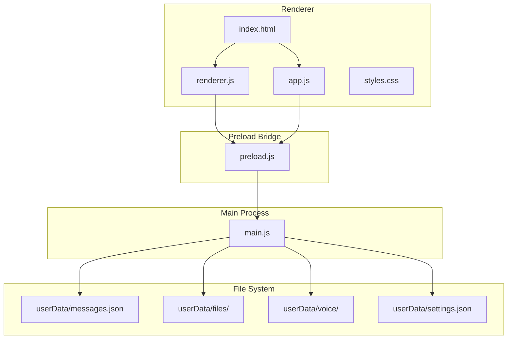

**Diagram sources**
- [main.js:1-155](file://main.js#L1-L155)
- [preload.js:1-17](file://preload.js#L1-L17)
- [renderer.js:1-723](file://renderer.js#L1-L723)
- [app.js:1-239](file://app.js#L1-L239)
- [index.html:1-232](file://index.html#L1-L232)
- [styles.css:1-293](file://styles.css#L1-L293)

**Section sources**
- [README.md:59-79](file://README.md#L59-L79)
- [package.json:1-56](file://package.json#L1-L56)

## Core Components
- **Main process (Electron)**: Window lifecycle management, single-instance lock, JSON store I/O, secure file serving via custom protocol, native notifications, theme control, and comprehensive IPC handlers for all new features.
- **Preload bridge**: Exposes safe API surface to renderer over IPC with expanded methods for canvas operations, voice recording, settings management, and theme control.
- **Renderer UI**: Stateful messaging UI with context menus, emoji picker, reaction system, pinned messages, advanced search, whiteboard canvas, voice notes, settings panel, toast notifications, and comprehensive theming.
- **Styles**: Responsive layout with dark mode support, 8 color themes, attachment cards, drop zone overlays, canvas toolbar, and modern UI components.

Key responsibilities:
- **Persistence**: Messages stored as JSON with metadata; files copied into local directories with UUID names; settings persisted separately.
- **Security**: Context isolation maintained, no Node integration in renderer, safe file URL scheme, input validation throughout.
- **UX**: Rich inline previews for images, audio, video; card view for other types; typing indicator; read receipts; pinned bar; search with highlighting; toast notifications; context menus; reaction system.

**Section sources**
- [main.js:1-155](file://main.js#L1-L155)
- [preload.js:1-17](file://preload.js#L1-L17)
- [renderer.js:1-723](file://renderer.js#L1-L723)
- [styles.css:1-293](file://styles.css#L1-L293)

## Architecture Overview
The app follows a secure IPC pattern with enhanced feature support:
- The renderer never accesses the filesystem directly.
- All disk operations are performed by the main process through IPC handlers.
- A custom protocol serves stored files back to the renderer safely.
- Settings and preferences managed through separate IPC channels.

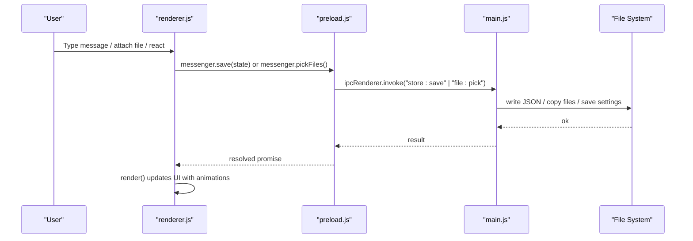

**Diagram sources**
- [renderer.js:221-232](file://renderer.js#L221-L232)
- [preload.js:3-16](file://preload.js#L3-L16)
- [main.js:64-67](file://main.js#L64-L67)
- [main.js:69-76](file://main.js#L69-L76)

## Detailed Component Analysis

### Messaging System: Composition, Persistence, Real-time Rendering
- **Composition**:
  - Text input with Enter to send; Shift+Enter preserves newlines.
  - Composer supports attaching files via paperclip button or image button.
  - Voice note recording integrated into composer with cancel and timer display.
  - Emoji picker accessible directly from composer.
- **Persistence**:
  - Messages pushed into in-memory state and persisted via IPC to JSON.
  - Each message includes id, text, files array, timestamp, read flag, reactions object, pinned status, edited flag.
  - Settings persisted separately in settings.json.
- **Real-time rendering**:
  - After mutation, UI re-renders immediately without reload.
  - Day dividers group messages by date; scroll-to-bottom on new messages.
  - Read receipts auto-marked when viewing; edit indicators shown for modified messages.

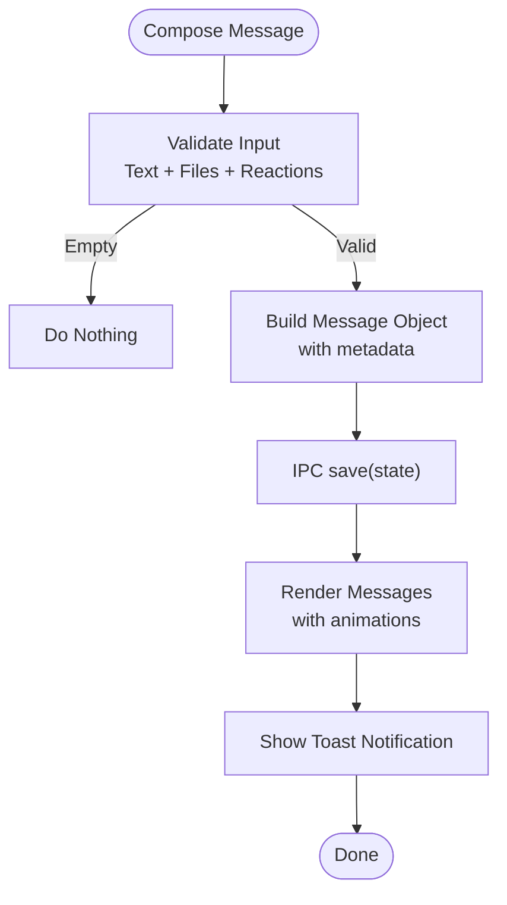

**Diagram sources**
- [renderer.js:221-232](file://renderer.js#L221-L232)
- [renderer.js:71-96](file://renderer.js#L71-L96)
- [renderer.js:98-173](file://renderer.js#L98-L173)
- [main.js:64-67](file://main.js#L64-L67)

**Section sources**
- [renderer.js:221-232](file://renderer.js#L221-L232)
- [renderer.js:71-96](file://renderer.js#L71-L96)
- [renderer.js:98-173](file://renderer.js#L98-L173)
- [main.js:64-67](file://main.js#L64-L67)

### Context Menu System: Advanced Message Actions
- **Context menu access**: Right-click any message or hover action buttons reveal contextual options.
- **Available actions**: React, Reply, Copy, Pin/Unpin, Edit, Delete with dynamic visibility based on message state.
- **Smart behavior**: Edit and Copy options hidden for deleted messages; Pin label toggles between Pin/Unpin.
- **Positioning**: Intelligent placement within viewport bounds to prevent overflow.

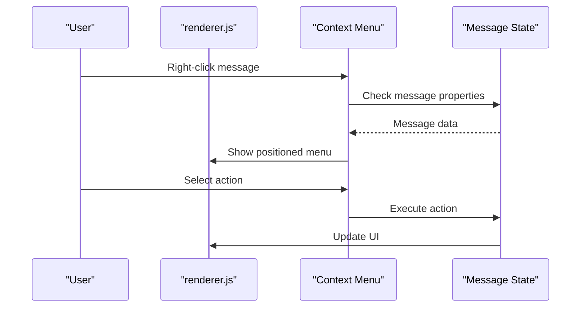

**Diagram sources**
- [renderer.js:242-274](file://renderer.js#L242-L274)
- [renderer.js:98-111](file://renderer.js#L98-L111)

**Section sources**
- [renderer.js:242-274](file://renderer.js#L242-L274)
- [renderer.js:98-111](file://renderer.js#L98-L111)

### Message Reactions: Emoji Feedback System
- **Reaction picker**: Quick-access emoji selection appears near messages with hover actions.
- **Real-time updates**: Reactions toggle instantly with count updates and visual feedback.
- **Persistent storage**: Reaction counts maintained in message object and saved to storage.
- **Visual indicators**: Reaction chips displayed below messages with clickable interaction.

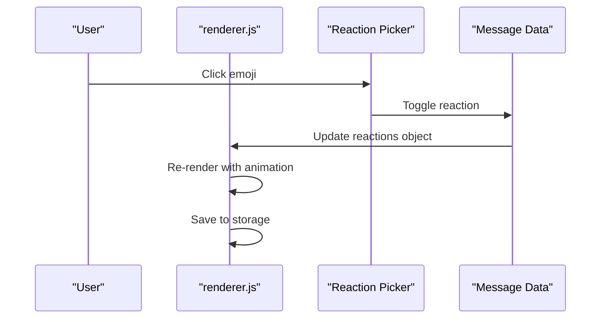

**Diagram sources**
- [renderer.js:276-303](file://renderer.js#L276-L303)
- [renderer.js:135-147](file://renderer.js#L135-L147)

**Section sources**
- [renderer.js:276-303](file://renderer.js#L276-L303)
- [renderer.js:135-147](file://renderer.js#L135-L147)

### Message Editing: Content Modification
- **Edit modal**: Dedicated modal interface for editing message content with textarea.
- **Edit indicators**: "edited" label shown next to modified messages with styling distinction.
- **State management**: Edit state tracked with editingId variable and modal visibility.
- **Validation**: Trimmed input prevents empty edits; original message preserved until save.

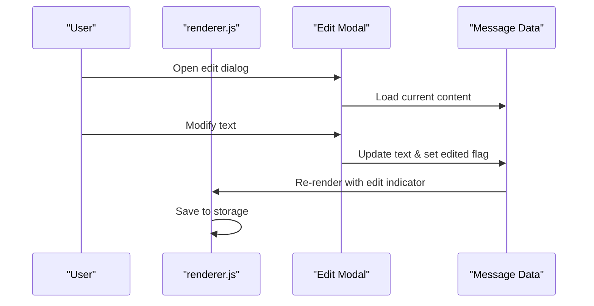

**Diagram sources**
- [renderer.js:305-328](file://renderer.js#L305-L328)
- [renderer.js:125-130](file://renderer.js#L125-L130)

**Section sources**
- [renderer.js:305-328](file://renderer.js#L305-L328)
- [renderer.js:125-130](file://renderer.js#L125-L130)

### File Attachments: Multi-format Support and Inline Previews
- **Supported categories**:
  - Images: Thumbnails shown inline; click opens system default app.
  - Video: Native player controls within bubble with max-width constraints.
  - Audio: Native player controls within bubble with width optimization.
  - Other files: Styled card with category icon, name, size; Open/Show actions.
- **Attachment entry points**:
  - Click paperclip or image button to open file picker.
  - Drag-and-drop onto chat area; shows dropzone overlay while dragging.
  - Whiteboard canvas exports as PNG attachment.
  - Voice recordings saved as WebM audio attachments.
- **Storage and serving**:
  - Files copied into userData/files with UUID names.
  - Custom protocol serves bytes back to renderer securely.
  - MIME type detection and categorization for proper preview handling.

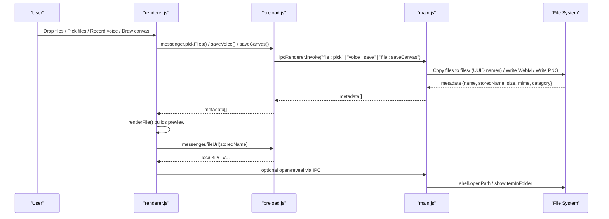

**Diagram sources**
- [renderer.js:175-219](file://renderer.js#L175-L219)
- [renderer.js:499-513](file://renderer.js#L499-L513)
- [renderer.js:517-557](file://renderer.js#L517-L557)
- [renderer.js:683-687](file://renderer.js#L683-L687)
- [preload.js:8-16](file://preload.js#L8-L16)
- [main.js:69-76](file://main.js#L69-L76)
- [main.js:78-88](file://main.js#L78-88)
- [main.js:99-109](file://main.js#L99-L109)

**Section sources**
- [renderer.js:175-219](file://renderer.js#L175-L219)
- [renderer.js:499-513](file://renderer.js#L499-L513)
- [renderer.js:517-557](file://renderer.js#L517-L557)
- [renderer.js:683-687](file://renderer.js#L683-L687)
- [main.js:69-76](file://main.js#L69-L76)
- [main.js:78-88](file://main.js#L78-88)
- [main.js:99-109](file://main.js#L99-L109)

### Search Functionality: Global and In-Conversation Search
- **In-conversation search**:
  - Toggle search bar with dedicated input field.
  - Real-time filtering of messages by text content.
  - Highlights matches with yellow background and navigates between hits with prev/next buttons.
  - Shows current hit count vs total results.
  - Auto-scrolls to highlighted match.
- **Sidebar search**:
  - Filters conversation list entries by query (currently renders single "You" chat).
- **Keyboard shortcuts**:
  - Ctrl/Cmd+F focuses in-conversation search.
  - Escape closes search bar and clears highlights.

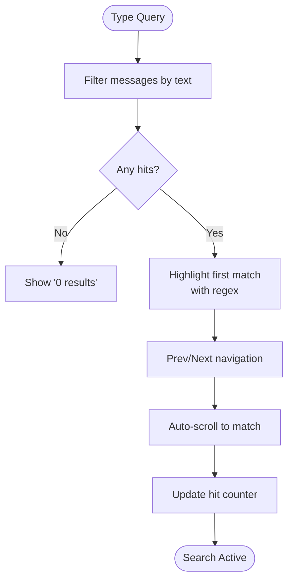

**Diagram sources**
- [renderer.js:349-402](file://renderer.js#L349-L402)
- [renderer.js:690-703](file://renderer.js#L690-L703)

**Section sources**
- [renderer.js:349-402](file://renderer.js#L349-L402)
- [renderer.js:690-703](file://renderer.js#L690-L703)

### Chat Management: Pinning, Renaming, Deletion
- **Pinning**:
  - Pin/unpin individual messages via context menu hover actions.
  - Pinned messages appear in a top bar with unpin action.
  - Visual pin badge shown on pinned messages.
- **Renaming**:
  - Current implementation shows static "You" chat; rename functionality not present in code.
- **Deletion**:
  - Delete a message marks it deleted and clears its content; attached files remain on disk unless explicitly removed elsewhere.
  - Clear all messages removes all entries from state and persists empty list.
  - Deleted messages show "Message deleted" placeholder.

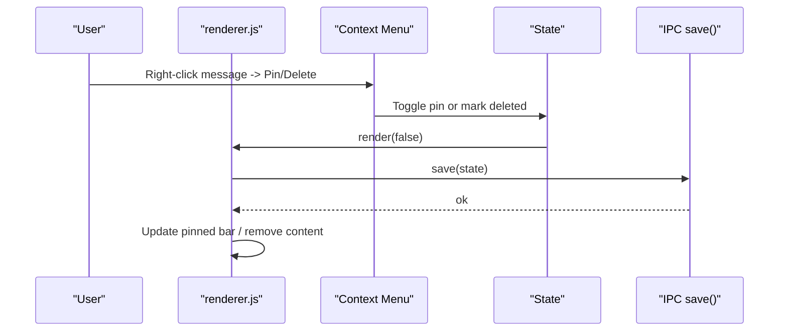

**Diagram sources**
- [renderer.js:242-274](file://renderer.js#L242-L274)
- [renderer.js:330-347](file://renderer.js#L330-L347)
- [renderer.js:475-482](file://renderer.js#L475-L482)

**Section sources**
- [renderer.js:242-274](file://renderer.js#L242-L274)
- [renderer.js:330-347](file://renderer.js#L330-L347)
- [renderer.js:475-482](file://renderer.js#L475-L482)

### Keyboard Shortcuts and Accessibility
- **Shortcuts**:
  - Enter sends message; Esc dismisses menus/modals/search panels; Ctrl/Cmd+F opens in-conversation search.
  - Escape closes all overlays including canvas, settings, and modals.
- **Accessibility considerations**:
  - Buttons have titles and SVG icons; inputs support focus states.
  - No explicit aria-* attributes found in markup; consider adding roles and labels for screen readers.
  - Color contrast adheres to theme variables; ensure sufficient contrast in custom themes.
  - Focus management for modal dialogs and dropdown menus.

**Section sources**
- [renderer.js:592-597](file://renderer.js#L592-L597)
- [renderer.js:690-703](file://renderer.js#L690-L703)
- [index.html:18-32](file://index.html#L18-L32)
- [README.md:24](file://README.md#L24)

### Whiteboard Canvas Integration: Drawing and Sketching
- **Full-screen canvas panel** with pen and eraser tools, color picker, stroke size slider, clear, cancel, and send.
- **Drawing tools**: Pen tool for freehand drawing, eraser tool for selective removal.
- **Customization**: Adjustable stroke width (1-36px), color picker with hex values, real-time stroke counter.
- **Canvas management**: Responsive resizing with device pixel ratio support, pointer capture for smooth drawing.
- **Export functionality**: Sending converts canvas to PNG and attaches as image with metadata.

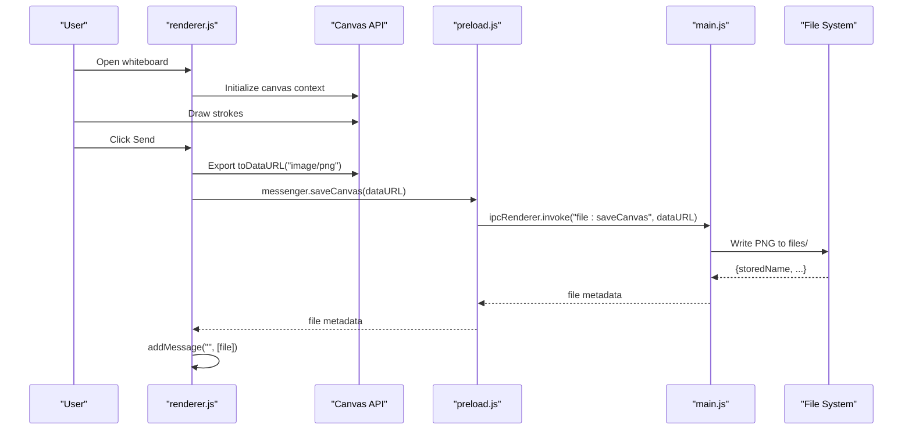

**Diagram sources**
- [renderer.js:605-688](file://renderer.js#L605-L688)
- [main.js:78-88](file://main.js#L78-88)

**Section sources**
- [renderer.js:605-688](file://renderer.js#L605-L688)
- [main.js:78-88](file://main.js#L78-88)

### Voice Notes: Audio Recording and Playback
- **Recording interface**: MediaRecorder API integration with minimum duration enforcement (1000ms).
- **Format support**: Saves as WebM audio format to userData/voice directory.
- **User feedback**: Recording timer display, cancel button, visual recording indicator.
- **Playback support**: Native audio element controls within message bubble.
- **Error handling**: Microphone access denied notifications, short recording rejection.

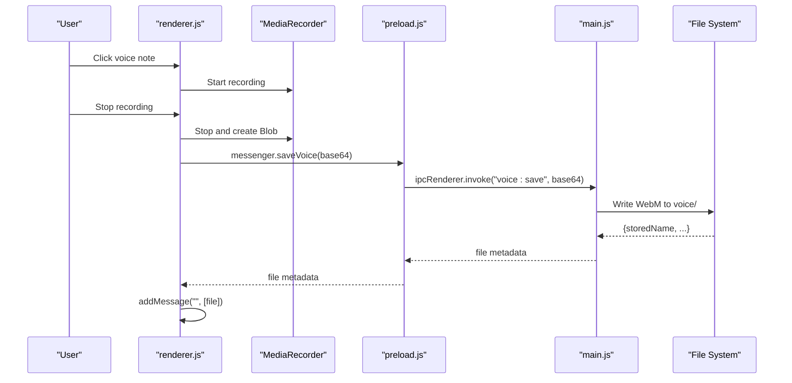

**Diagram sources**
- [renderer.js:517-557](file://renderer.js#L517-L557)
- [main.js:99-109](file://main.js#L99-L109)

**Section sources**
- [renderer.js:517-557](file://renderer.js#L517-L557)
- [main.js:99-109](file://main.js#L99-L109)

### Emoji Picker: Comprehensive Emoji Selection
- **Extensive collection**: 100+ emojis organized in grid layout with search filtering.
- **Categories supported**: Faces, emotions, gestures, hearts, nature, animals, objects, symbols.
- **Search functionality**: Real-time filtering as user types in search box.
- **Integration**: Direct insertion into message input at cursor position.
- **UI design**: Floating panel with backdrop, responsive grid layout, hover effects.

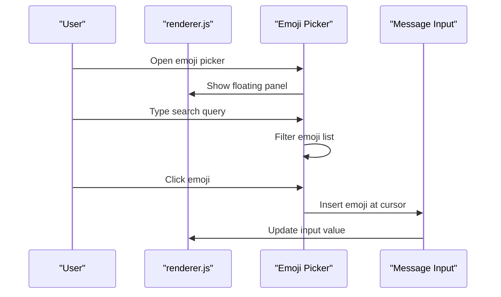

**Diagram sources**
- [renderer.js:404-433](file://renderer.js#L404-L433)

**Section sources**
- [renderer.js:404-433](file://renderer.js#L404-L433)

### Toast Notifications: User Feedback System
- **Non-intrusive feedback**: Bottom-center positioned notifications with automatic dismissal.
- **Animation support**: Smooth fade-in/out transitions with transform animations.
- **Use cases**: Success confirmations, error messages, action feedback.
- **Timing**: 2.5-second automatic dismissal with manual override capability.
- **Styling**: Theme-aware colors, rounded corners, shadow effects.

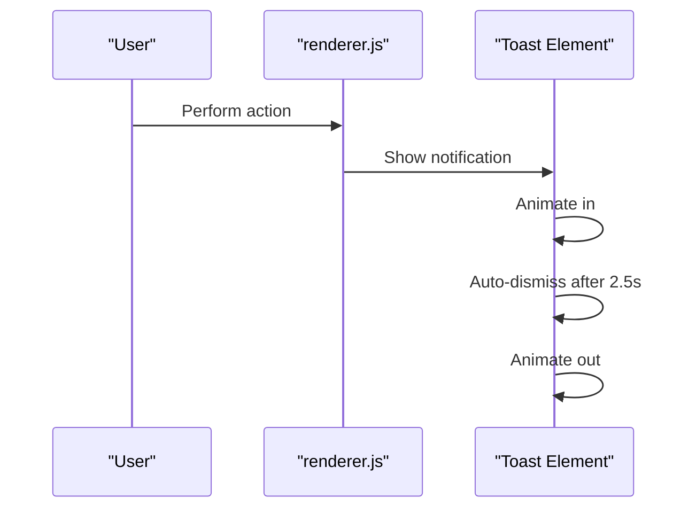

**Diagram sources**
- [renderer.js:40-47](file://renderer.js#L40-L47)

**Section sources**
- [renderer.js:40-47](file://renderer.js#L40-L47)

### Typing Indicators: Real-time Activity Display
- **Animated dots**: Three-dot typing indicator with staggered bounce animation.
- **Automatic display**: Shows when user starts typing, hides after 1.5 seconds of inactivity.
- **Visual feedback**: Provides immediate response to user input activity.
- **Styling**: Matches message bubble design with appropriate spacing.

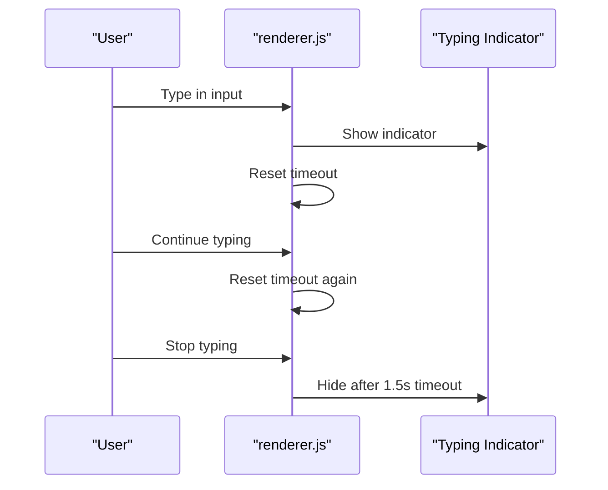

**Diagram sources**
- [renderer.js:484-491](file://renderer.js#L484-L491)

**Section sources**
- [renderer.js:484-491](file://renderer.js#L484-L491)

### Drag-and-Drop File Upload: Intuitive File Attachment
- **Visual feedback**: Full-screen dropzone overlay with dashed border and centered icon/text.
- **Multi-file support**: Handles multiple file drops simultaneously with individual processing.
- **Drag state management**: Counter-based system prevents premature hide during rapid drag events.
- **File processing**: Automatic MIME type detection and categorization for proper preview handling.
- **Integration**: Seamless addition to existing message flow with file metadata preservation.

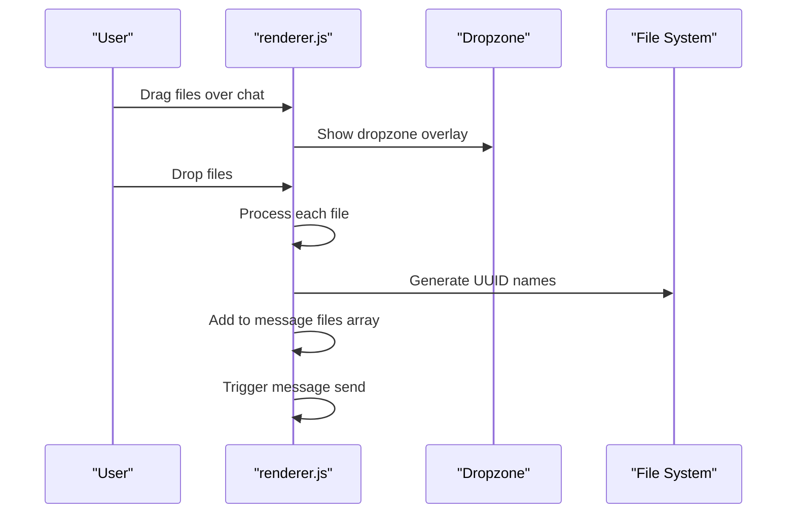

**Diagram sources**
- [renderer.js:493-514](file://renderer.js#L493-L514)

**Section sources**
- [renderer.js:493-514](file://renderer.js#L493-L514)

### Settings Panel: Application Configuration
- **Appearance settings**: Dark mode toggle with persistent preference storage.
- **Data management**: Clear all messages functionality with confirmation dialog.
- **Settings persistence**: Preferences saved to settings.json and loaded on startup.
- **UI design**: Slide-out panel with grouped sections and toggle switches.
- **Theme integration**: Settings panel respects current theme and dark mode.

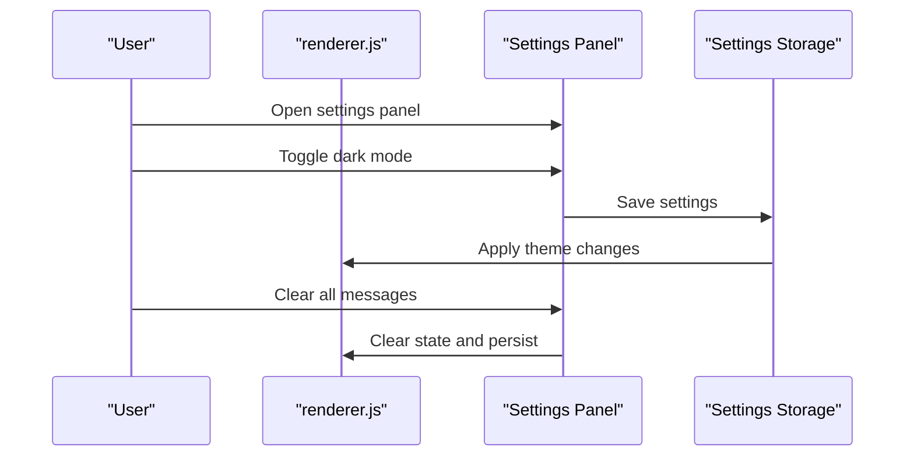

**Diagram sources**
- [renderer.js:470-482](file://renderer.js#L470-L482)
- [renderer.js:454-468](file://renderer.js#L454-L468)

**Section sources**
- [renderer.js:470-482](file://renderer.js#L470-L482)
- [renderer.js:454-468](file://renderer.js#L454-L468)

### Theme System: Comprehensive Appearance Customization
- **Multiple themes**: 8 color themes (blue, purple, pink, green, orange, red, teal, gradient) plus dark mode.
- **CSS variables**: Dynamic theme switching through CSS custom properties and body class manipulation.
- **Native integration**: Electron native theme source updated for system-wide consistency.
- **Persistent preferences**: Theme selection saved and restored across app sessions.
- **Visual feedback**: Active theme indicator with border highlight and toast confirmation.

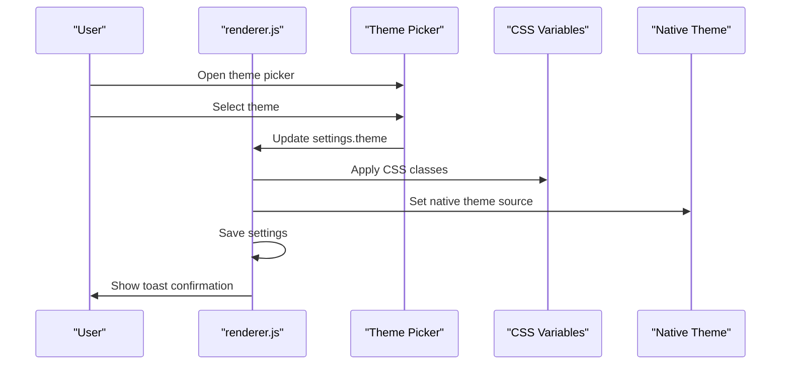

**Diagram sources**
- [renderer.js:60-68](file://renderer.js#L60-L68)
- [renderer.js:435-452](file://renderer.js#L435-L452)
- [main.js:115](file://main.js#L115)

**Section sources**
- [renderer.js:60-68](file://renderer.js#L60-L68)
- [renderer.js:435-452](file://renderer.js#L435-L452)
- [main.js:115](file://main.js#L115)

## Dependency Analysis
- **Main process dependencies**:
  - Electron APIs for window, IPC, dialog, shell, protocol, notifications, native theme.
  - Node fs/path/crypto streams for file handling and MIME mapping.
  - Stream utilities for efficient file serving.
- **Preload bridge**:
  - Exposes minimal API surface to renderer; prevents direct Node access.
  - Supports canvas operations, voice recording, settings management, and theme control.
- **Renderer**:
  - Pure DOM manipulation and event handling; uses crypto.randomUUID where available.
  - Integrates with MediaRecorder, Canvas, and Clipboard APIs.
  - Implements complex UI state management for multiple interactive features.
- **HTML/CSS**:
  - Defines layout, components, and responsive behavior with CSS custom properties.
  - Supports dark mode and multiple color themes through CSS classes.

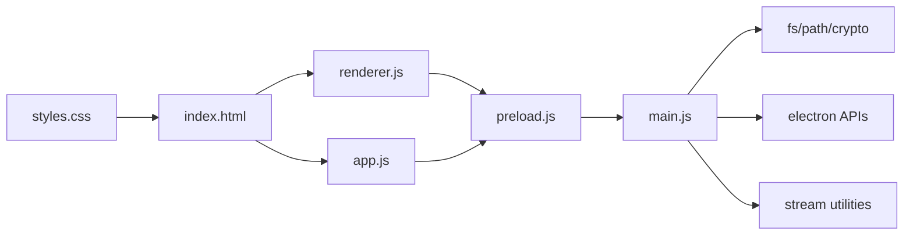

**Diagram sources**
- [main.js:1-6](file://main.js#L1-L6)
- [preload.js:1-2](file://preload.js#L1-L2)
- [renderer.js:1-10](file://renderer.js#L1-L10)
- [app.js:1-10](file://app.js#L1-L10)
- [index.html:1-10](file://index.html#L1-L10)
- [styles.css:1-10](file://styles.css#L1-L10)

**Section sources**
- [main.js:1-6](file://main.js#L1-L6)
- [preload.js:1-2](file://preload.js#L1-L2)
- [renderer.js:1-10](file://renderer.js#L1-L10)
- [app.js:1-10](file://app.js#L1-L10)
- [index.html:1-10](file://index.html#L1-L10)
- [styles.css:1-10](file://styles.css#L1-L10)

## Performance Considerations
- **Rendering**:
  - Re-rendering entire message list on each change; consider virtualization for large histories.
  - Efficient DOM manipulation with innerHTML replacement for bulk updates.
- **File handling**:
  - Files copied to disk with UUID names; avoid duplicate copies if same file added multiple times.
  - Stream-based file serving for efficient loading of large media files.
- **Memory management**:
  - Large images/videos may increase memory usage; consider lazy loading and thumbnail generation.
  - Canvas operations optimized with device pixel ratio handling.
- **Event handling**:
  - Debounced search input to prevent excessive re-rendering.
  - Efficient drag-and-drop state management with counter-based approach.

## Troubleshooting Guide
- **Files not opening**:
  - Ensure files exist under userData/files; verify safeStoredPath validation and MIME mapping.
- **Inline previews not showing**:
  - Confirm CSP allows local-file: for img/media; check that fileUrl returns correct encoded path.
- **Voice recordings too short**:
  - Minimum blob size enforced (1000ms); record longer clips.
- **Single instance issues**:
  - App enforces single instance; second launch focuses existing window.
- **Theme not applying**:
  - Check CSS class application and native theme source synchronization.
- **Canvas drawing issues**:
  - Verify pointer capture release and device pixel ratio calculations.
- **Emoji picker positioning**:
  - Ensure viewport boundary calculations prevent overflow.

**Section sources**
- [main.js:53-62](file://main.js#L53-L62)
- [main.js:91-101](file://main.js#L91-L101)
- [renderer.js:528-541](file://renderer.js#L528-L541)
- [main.js:11-12](file://main.js#L11-L12)
- [renderer.js:615-627](file://renderer.js#L615-L627)
- [renderer.js:249-251](file://renderer.js#L249-L251)

## Conclusion
The Messenger app delivers a robust, secure, and feature-rich messaging platform with comprehensive user interaction capabilities. Its architecture separates concerns cleanly: main handles storage and OS integrations, preload bridges safely, and renderer manages complex UI interactions. Users benefit from advanced features including context menus, reactions, editing, rich media support, voice notes, whiteboard drawings, emoji picker, toast notifications, typing indicators, and extensive theming options—all while maintaining local privacy with no network dependencies. The application demonstrates modern web development practices with proper security boundaries, performance optimizations, and user experience enhancements.

## Appendices

### Practical Workflows
- **Compose and send a text-only note**:
  - Type in input and press Enter.
- **Attach multiple files**:
  - Click paperclip or drag-and-drop; files saved and rendered inline.
- **React to a message**:
  - Hover message, click reaction button, select emoji.
- **Edit a message**:
  - Right-click message, select Edit, modify text, save changes.
- **Pin a useful message**:
  - Hover message, click more button, select Pin; manage from pinned bar.
- **Record and send a voice note**:
  - Click voice button, record, stop; plays inline.
- **Draw and send a sketch**:
  - Open whiteboard, draw with pen/eraser, adjust color/size, send; appears as image attachment.
- **Search for keywords**:
  - Open search bar, type query, navigate hits with prev/next buttons.
- **Change theme**:
  - Click theme button, select color swatch; applies immediately.
- **Toggle dark mode**:
  - Use rail button or settings panel toggle; persists across sessions.

### Feature Matrix
| Feature | Status | Implementation |
|---------|--------|----------------|
| Context Menus | ✅ Complete | Right-click and hover actions |
| Message Reactions | ✅ Complete | Emoji picker with real-time updates |
| Message Editing | ✅ Complete | Modal interface with edit indicators |
| Advanced Search | ✅ Complete | In-conversation with highlighting |
| Rich Media Support | ✅ Complete | Images, audio, video, documents |
| Voice Recording | ✅ Complete | MediaRecorder with WebM format |
| Whiteboard Canvas | ✅ Complete | Drawing tools with export |
| Emoji Picker | ✅ Complete | 100+ emojis with search |
| Toast Notifications | ✅ Complete | Non-intrusive user feedback |
| Typing Indicators | ✅ Complete | Animated dots with auto-hide |
| Drag-and-Drop | ✅ Complete | Visual dropzone overlay |
| Theme System | ✅ Complete | 8 themes + dark mode |
| Settings Panel | ✅ Complete | Appearance and data management |