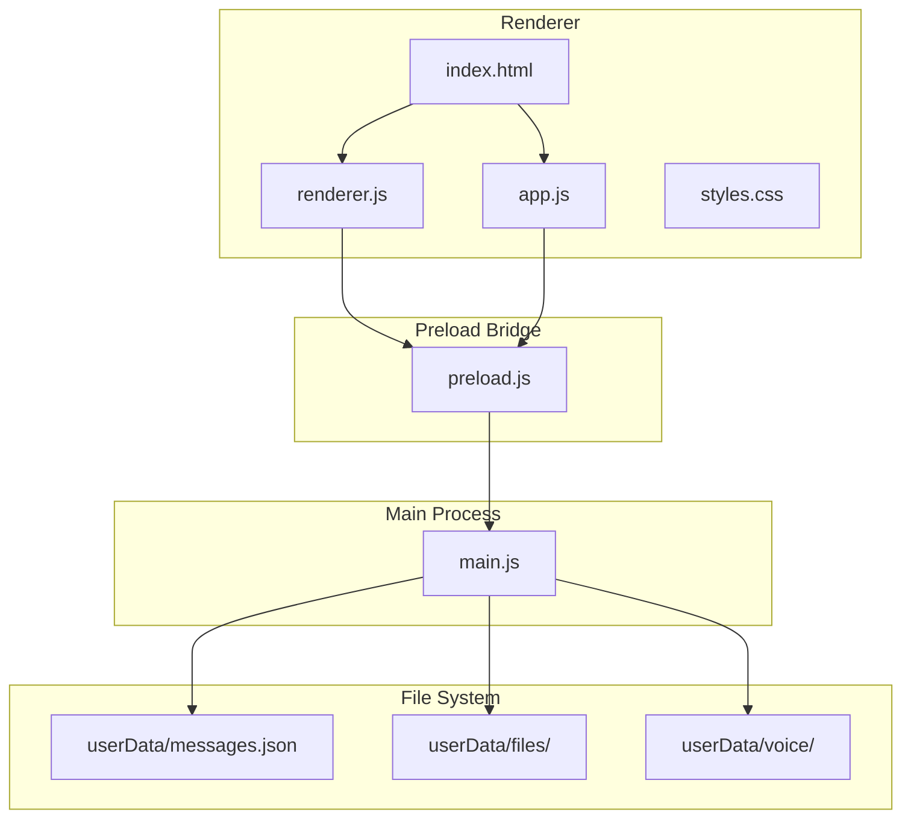
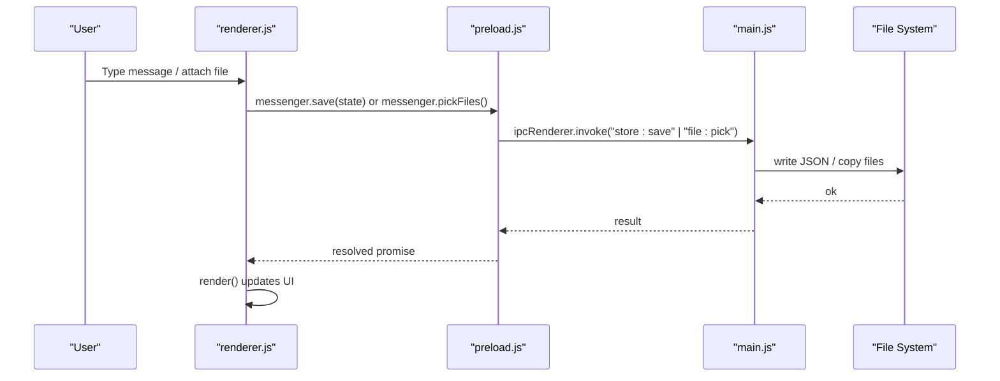
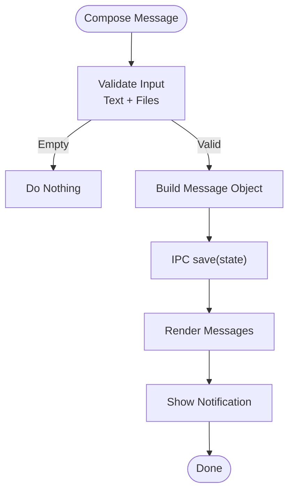
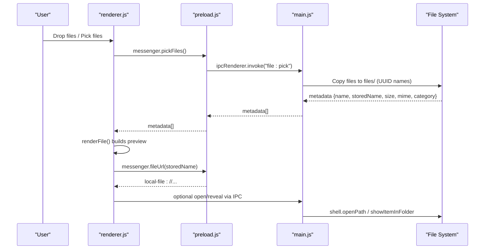
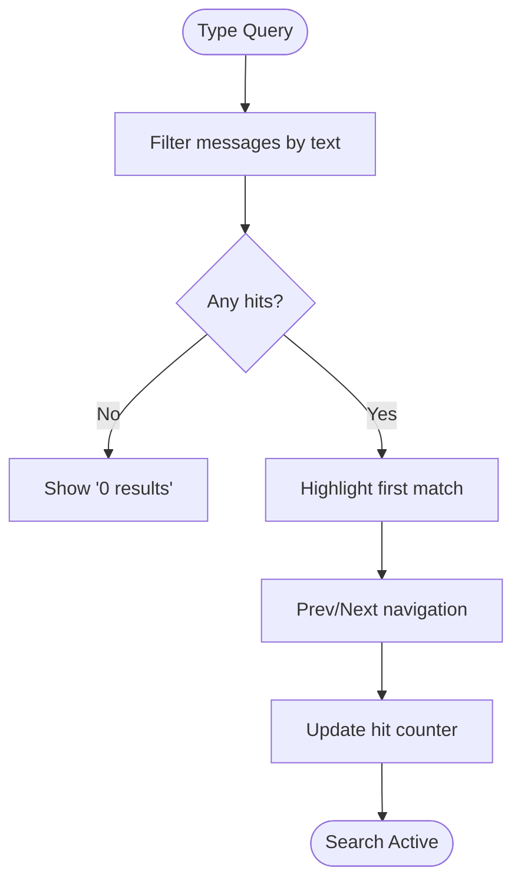
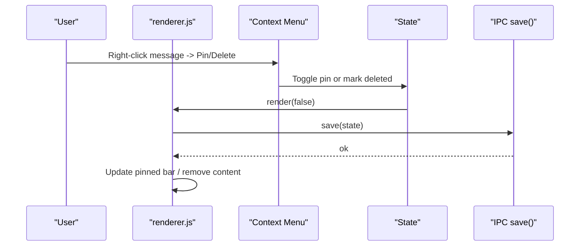
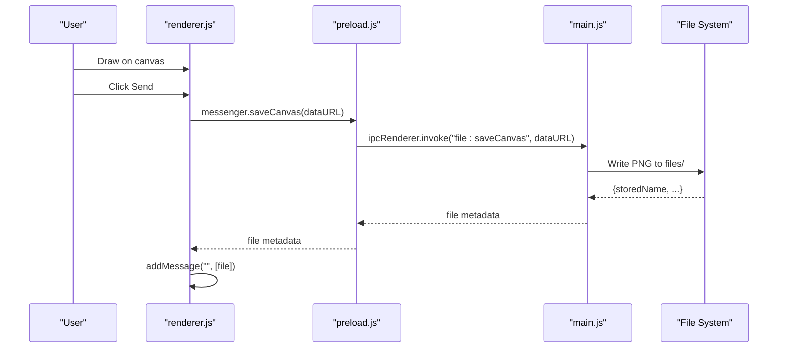
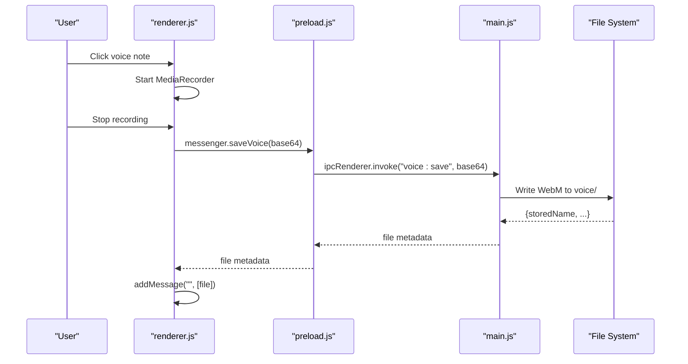
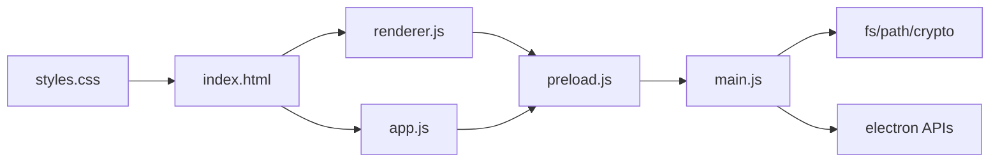

# Core Features

<cite>
**Referenced Files in This Document**
- [README.md](file://README.md)
- [package.json](file://package.json)
- [main.js](file://main.js)
- [preload.js](file://preload.js)
- [index.html](file://index.html)
- [renderer.js](file://renderer.js)
- [app.js](file://app.js)
- [styles.css](file://styles.css)
</cite>

## Table of Contents
1. [Introduction](#introduction)
2. [Project Structure](#project-structure)
3. [Core Components](#core-components)
4. [Architecture Overview](#architecture-overview)
5. [Detailed Component Analysis](#detailed-component-analysis)
6. [Dependency Analysis](#dependency-analysis)
7. [Performance Considerations](#performance-considerations)
8. [Troubleshooting Guide](#troubleshooting-guide)
9. [Conclusion](#conclusion)
10. [Appendices](#appendices)

## Introduction
This document explains the core features of the Messenger application: a self-chat, private notebook styled like a chat app. It covers message composition and persistence, real-time rendering, file attachments with inline previews, search across messages and chats, chat management (pinning, renaming, deletion), keyboard shortcuts, accessibility considerations, and practical workflows. It also maps user-facing behavior to the underlying architecture for both end users and developers.

## Project Structure
The project is an Electron desktop app with a clear separation between main process (system-level tasks), preload bridge (secure IPC exposure), renderer UI logic, markup, and styles.

**Diagram sources**
- [main.js:1-176](file://main.js#L1-L176)
- [preload.js:1-28](file://preload.js#L1-L28)
- [renderer.js:1-656](file://renderer.js#L1-L656)
- [app.js:1-239](file://app.js#L1-L239)
- [index.html:1-303](file://index.html#L1-L303)
- [styles.css:1-1250](file://styles.css#L1-L1250)

**Section sources**
- [README.md:59-79](file://README.md#L59-L79)
- [package.json:1-56](file://package.json#L1-L56)

## Core Components
- Main process (Electron): window lifecycle, single-instance lock, JSON store I/O, secure file serving via custom protocol, native notifications, theme control.
- Preload bridge: exposes a safe API surface to the renderer over IPC.
- Renderer UI: stateful messaging UI, drag-and-drop, emoji picker, reactions, pinned messages, search, whiteboard canvas, voice notes, settings panel, toast feedback.
- Styles: responsive layout, dark mode, themes, attachment cards, drop zone, canvas toolbar.

Key responsibilities:
- Persistence: messages stored as JSON; files copied into a local directory with UUID names.
- Security: context isolation, no Node integration in renderer, safe file URL scheme.
- UX: rich inline previews for images, audio, video; card view for other types; typing indicator; read receipts; pinned bar; search with highlighting.

**Section sources**
- [main.js:1-176](file://main.js#L1-L176)
- [preload.js:1-28](file://preload.js#L1-L28)
- [renderer.js:1-656](file://renderer.js#L1-L656)
- [styles.css:1-1250](file://styles.css#L1-L1250)

## Architecture Overview
The app follows a secure IPC pattern:
- The renderer never accesses the filesystem directly.
- All disk operations are performed by the main process through IPC handlers.
- A custom protocol serves stored files back to the renderer safely.

**Diagram sources**
- [renderer.js:357-368](file://renderer.js#L357-L368)
- [preload.js:3-16](file://preload.js#L3-L16)
- [main.js:123-132](file://main.js#L123-L132)
- [main.js:33-37](file://main.js#L33-L37)

## Detailed Component Analysis

### Messaging System: Composition, Persistence, Real-time Rendering
- Composition:
  - Text input with Enter to send; Shift+Enter preserves newlines.
  - Composer supports attaching files via paperclip or image button.
  - Voice note recording integrated into composer with cancel and timer.
- Persistence:
  - Messages pushed into in-memory state and persisted via IPC to JSON.
  - Each message includes id, text, files array, timestamp, read flag, reactions, pinned, edited flags.
- Real-time rendering:
  - After mutation, UI re-renders immediately without reload.
  - Day dividers group messages by date; scroll-to-bottom on new messages.
  - Read receipts auto-marked when viewing.

**Diagram sources**
- [renderer.js:529-536](file://renderer.js#L529-L536)
- [renderer.js:357-368](file://renderer.js#L357-L368)
- [renderer.js:208-231](file://renderer.js#L208-L231)
- [main.js:123-126](file://main.js#L123-L126)

**Section sources**
- [renderer.js:529-536](file://renderer.js#L529-L536)
- [renderer.js:357-368](file://renderer.js#L357-L368)
- [renderer.js:208-231](file://renderer.js#L208-L231)
- [main.js:123-126](file://main.js#L123-L126)

### File Attachments: Multi-format Support and Inline Previews
- Supported categories:
  - Images: thumbnails shown inline; click opens system default app.
  - Video: native player controls within bubble.
  - Audio: native player controls within bubble.
  - Other files: styled card with category icon, name, size; Open/Show actions.
- Attachment entry points:
  - Click paperclip or image button to open file picker.
  - Drag-and-drop onto chat area; shows dropzone overlay while dragging.
- Storage and serving:
  - Files copied into userData/files with UUID names.
  - Custom protocol serves bytes back to renderer securely.

**Diagram sources**
- [renderer.js:128-148](file://renderer.js#L128-L148)
- [renderer.js:312-354](file://renderer.js#L312-L354)
- [preload.js:8-16](file://preload.js#L8-L16)
- [main.js:127-132](file://main.js#L127-L132)
- [main.js:91-101](file://main.js#L91-L101)
- [main.js:142-149](file://main.js#L142-L149)

**Section sources**
- [renderer.js:128-148](file://renderer.js#L128-L148)
- [renderer.js:312-354](file://renderer.js#L312-L354)
- [main.js:91-101](file://main.js#L91-L101)
- [main.js:127-132](file://main.js#L127-L132)
- [main.js:142-149](file://main.js#L142-L149)

### Search Functionality: Messages and Chats
- In-conversation search:
  - Toggle search bar; type to filter messages by text content.
  - Highlights matches and navigates between hits with prev/next buttons.
  - Shows current hit count vs total.
- Sidebar search:
  - Filters conversation list entries by query (currently renders a single “You” chat).
- Keyboard shortcut:
  - Ctrl/Cmd+F focuses in-conversation search.

**Diagram sources**
- [renderer.js:463-502](file://renderer.js#L463-L502)
- [renderer.js:504-526](file://renderer.js#L504-L526)
- [renderer.js:642-651](file://renderer.js#L642-L651)

**Section sources**
- [renderer.js:463-502](file://renderer.js#L463-L502)
- [renderer.js:504-526](file://renderer.js#L504-L526)
- [renderer.js:642-651](file://renderer.js#L642-L651)

### Chat Management: Pinning, Renaming, Deletion
- Pinning:
  - Pin/unpin individual messages via context menu hover actions.
  - Pinned messages appear in a top bar with unpin action.
- Renaming:
  - Current implementation shows a static “You” chat; rename functionality is not present in code.
- Deletion:
  - Delete a message marks it deleted and clears its content; attached files remain on disk unless explicitly removed elsewhere.
  - Clear all messages removes all entries from state and persists empty list.

**Diagram sources**
- [renderer.js:373-402](file://renderer.js#L373-L402)
- [renderer.js:447-460](file://renderer.js#L447-L460)
- [renderer.js:552-555](file://renderer.js#L552-L555)

**Section sources**
- [renderer.js:373-402](file://renderer.js#L373-L402)
- [renderer.js:447-460](file://renderer.js#L447-L460)
- [renderer.js:552-555](file://renderer.js#L552-L555)

### Keyboard Shortcuts and Accessibility
- Shortcuts:
  - Enter sends message; Esc dismisses menus/modals/search panels; Ctrl/Cmd+F opens in-conversation search; / focuses input (documented in README).
- Accessibility considerations:
  - Buttons have titles and SVG icons; inputs support focus states.
  - No explicit aria-* attributes found in markup; consider adding roles and labels for screen readers.
  - Color contrast adheres to theme variables; ensure sufficient contrast in custom themes.

**Section sources**
- [renderer.js:537-539](file://renderer.js#L537-L539)
- [renderer.js:642-651](file://renderer.js#L642-L651)
- [index.html:18-32](file://index.html#L18-L32)
- [README.md:24](file://README.md#L24)

### Whiteboard Canvas Integration
- Full-screen canvas panel with pen and eraser tools, color picker, stroke size slider, clear, cancel, and send.
- Drawing strokes tracked; sending converts canvas to PNG and attaches as image.

**Diagram sources**
- [renderer.js:557-637](file://renderer.js#L557-L637)
- [main.js:133-141](file://main.js#L133-L141)

**Section sources**
- [renderer.js:557-637](file://renderer.js#L557-L637)
- [main.js:133-141](file://main.js#L133-L141)

### Voice Notes
- Record audio using MediaRecorder; minimum duration enforced; saves as WebM to userData/voice.
- Playback supported inline via audio element.

**Diagram sources**
- [renderer.js:150-194](file://renderer.js#L150-L194)
- [main.js:150-158](file://main.js#L150-L158)

**Section sources**
- [renderer.js:150-194](file://renderer.js#L150-L194)
- [main.js:150-158](file://main.js#L150-L158)

### Settings, Themes, and Dark Mode
- Toggle dark mode; choose accent theme swatches; persist preferences.
- Native theme source updated via IPC.

**Section sources**
- [renderer.js:67-89](file://renderer.js#L67-L89)
- [main.js:164-166](file://main.js#L164-L166)

## Dependency Analysis
- Main process dependencies:
  - Electron APIs for window, IPC, dialog, shell, protocol, notifications, native theme.
  - Node fs/path/crypto streams for file handling and MIME mapping.
- Preload bridge:
  - Exposes a minimal API surface to renderer; prevents direct Node access.
- Renderer:
  - Pure DOM manipulation and event handling; uses crypto.randomUUID where available.
  - Integrates with MediaRecorder and Canvas APIs.
- HTML/CSS:
  - Defines layout, components, and responsive behavior.

**Diagram sources**
- [main.js:1-6](file://main.js#L1-L6)
- [preload.js:1-2](file://preload.js#L1-L2)
- [renderer.js:1-10](file://renderer.js#L1-L10)
- [app.js:1-10](file://app.js#L1-L10)
- [index.html:1-10](file://index.html#L1-L10)
- [styles.css:1-10](file://styles.css#L1-L10)

**Section sources**
- [main.js:1-6](file://main.js#L1-L6)
- [preload.js:1-2](file://preload.js#L1-L2)
- [renderer.js:1-10](file://renderer.js#L1-L10)
- [app.js:1-10](file://app.js#L1-L10)
- [index.html:1-10](file://index.html#L1-L10)
- [styles.css:1-10](file://styles.css#L1-L10)

## Performance Considerations
- Rendering:
  - Re-rendering entire message list on each change; consider virtualization for large histories.
- File handling:
  - Files copied to disk with UUID names; avoid duplicate copies if same file added multiple times.
- Protocol streaming:
  - Custom protocol streams file bytes; ensures efficient loading for large media.
- Memory:
  - Large images/videos may increase memory usage; consider lazy loading and thumbnail generation.

[No sources needed since this section provides general guidance]

## Troubleshooting Guide
- Files not opening:
  - Ensure files exist under userData/files; verify safeStoredPath validation and MIME mapping.
- Inline previews not showing:
  - Confirm CSP allows local-file: for img/media; check that fileUrl returns correct encoded path.
- Voice recordings too short:
  - Minimum blob size enforced; record longer clips.
- Single instance issues:
  - App enforces single instance; second launch focuses existing window.

**Section sources**
- [main.js:53-62](file://main.js#L53-L62)
- [main.js:91-101](file://main.js#L91-L101)
- [renderer.js:160-176](file://renderer.js#L160-L176)
- [main.js:11-12](file://main.js#L11-L12)

## Conclusion
The Messenger app delivers a robust, secure, and user-friendly self-chat experience with rich media support, search, and customization. Its architecture separates concerns cleanly: main handles storage and OS integrations, preload bridges safely, and renderer manages UI interactions. Users benefit from inline previews, voice notes, whiteboard drawings, and persistent local storage without network dependencies.

[No sources needed since this section summarizes without analyzing specific files]

## Appendices

### Practical Workflows
- Compose and send a text-only note:
  - Type in input and press Enter.
- Attach multiple files:
  - Click paperclip or drag-and-drop; files saved and rendered inline.
- Search for a keyword:
  - Open search bar, type query, navigate hits with prev/next.
- Pin a useful message:
  - Hover message, open context menu, select Pin; manage from pinned bar.
- Record and send a voice note:
  - Click voice button, record, stop; plays inline.
- Draw and send a sketch:
  - Open whiteboard, draw, send; appears as image attachment.

[No sources needed since this section provides general guidance]