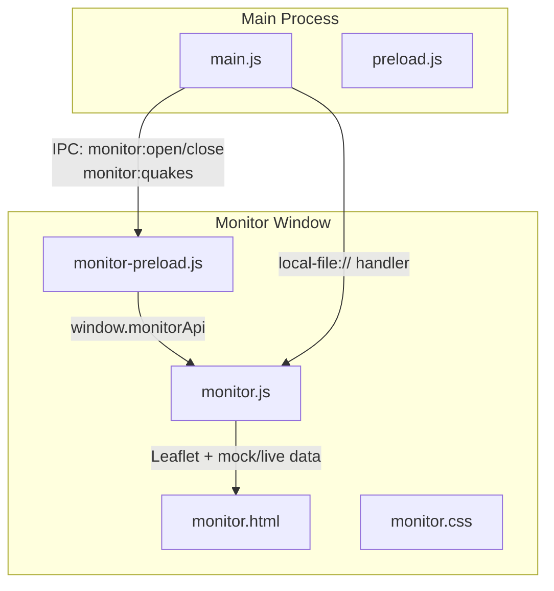
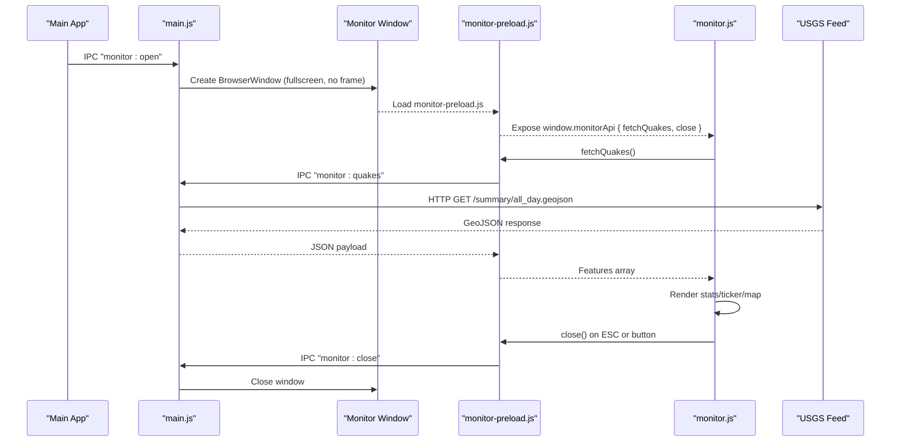
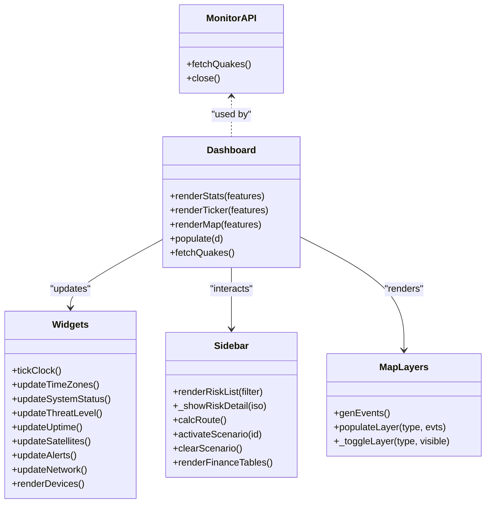
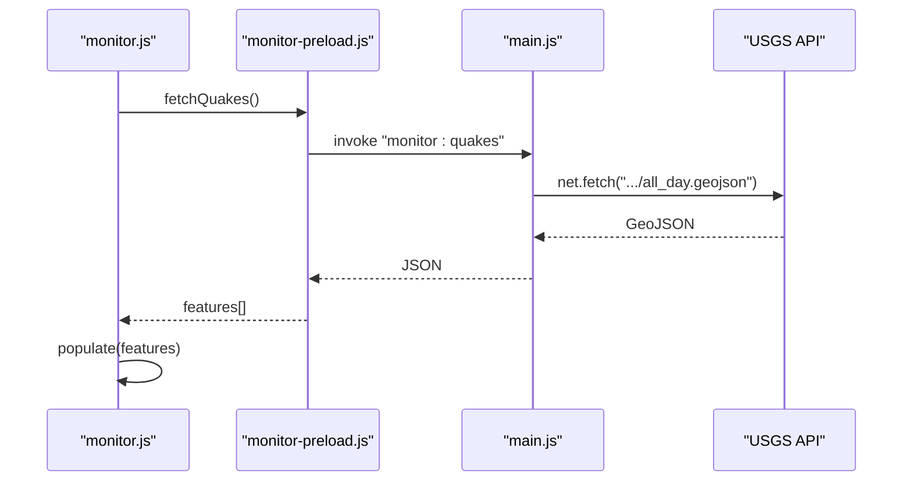
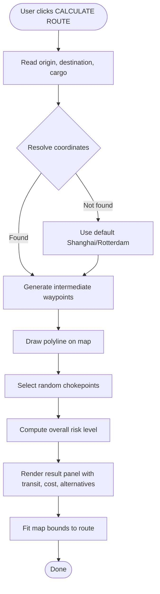
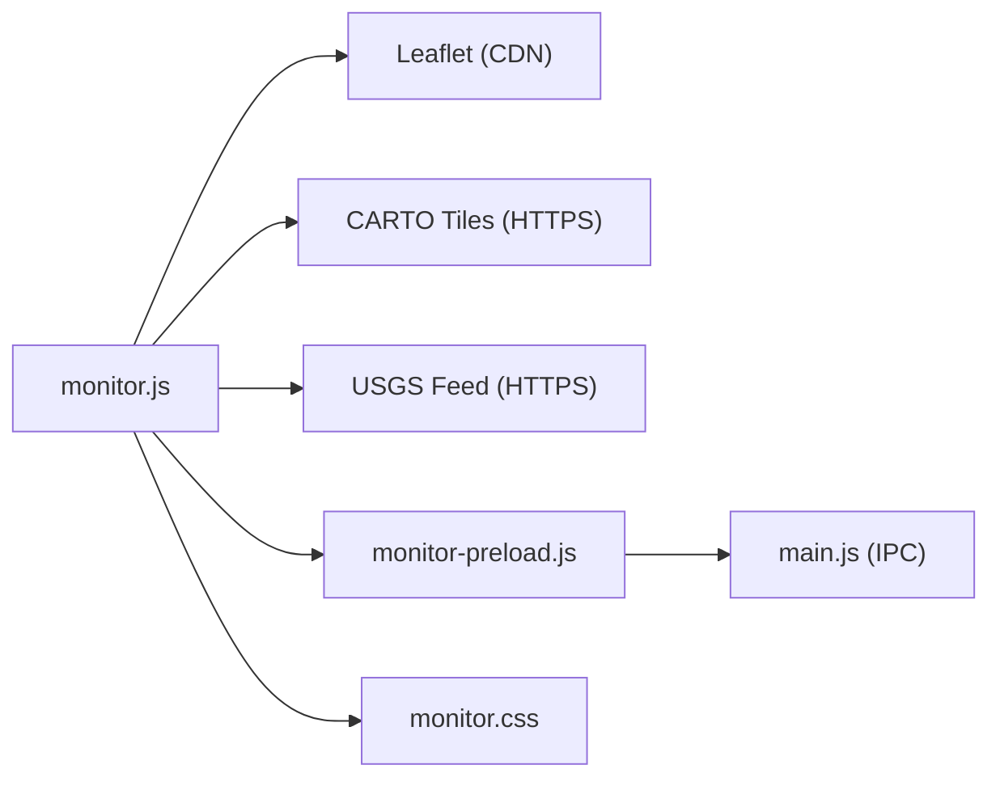

# World Monitor

<cite>
**Referenced Files in This Document**
- [main.js](file://main.js)
- [monitor-preload.js](file://monitor-preload.js)
- [preload.js](file://preload.js)
- [monitor.html](file://monitor.html)
- [monitor.css](file://monitor.css)
- [monitor.js](file://monitor.js)
- [package.json](file://package.json)
- [README.md](file://README.md)
</cite>

## Table of Contents
1. [Introduction](#introduction)
2. [Project Structure](#project-structure)
3. [Core Components](#core-components)
4. [Architecture Overview](#architecture-overview)
5. [Detailed Component Analysis](#detailed-component-analysis)
6. [Dependency Analysis](#dependency-analysis)
7. [Performance Considerations](#performance-considerations)
8. [Troubleshooting Guide](#troubleshooting-guide)
9. [Conclusion](#conclusion)

## Introduction
World Monitor is a full-screen, dark-themed dashboard embedded within an Electron desktop application. It provides a real-time global situational awareness view with:
- A Leaflet-based map layering earthquakes, military/naval activity, wildfires, cyber threats, disease outbreaks, and satellites
- Live earthquake data from the USGS feed (via IPC to main process)
- Financial tickers and tables (mocked)
- Route explorer for shipping corridors with chokepoint analysis
- Scenario overlays for geopolitical or disaster scenarios
- System status, threat level, uptime, alerts, network I/O graph, connected devices, news ticker, and time zones

It runs as a separate BrowserWindow launched from the main app and communicates via IPC using a dedicated preload script.

## Project Structure
The World Monitor feature consists of:
- Main process window creation and IPC handlers
- Preload bridge exposing safe APIs to the monitor renderer
- HTML/CSS/JS for the dashboard UI and logic
- Integration points with the main app’s preload for launching/closing the monitor

**Diagram sources**
- [main.js:118-153](file://main.js#L118-L153)
- [monitor-preload.js:1-7](file://monitor-preload.js#L1-L7)
- [monitor.html:1-219](file://monitor.html#L1-L219)
- [monitor.css:1-265](file://monitor.css#L1-L265)
- [monitor.js:876-965](file://monitor.js#L876-L965)

**Section sources**
- [main.js:118-153](file://main.js#L118-L153)
- [monitor-preload.js:1-7](file://monitor-preload.js#L1-L7)
- [monitor.html:1-219](file://monitor.html#L1-L219)
- [monitor.css:1-265](file://monitor.css#L1-L265)
- [monitor.js:876-965](file://monitor.js#L876-L965)

## Core Components
- Main process window manager: creates and controls the monitor window, registers IPC handlers, and serves local files via a custom protocol.
- Preload bridges:
  - monitor-preload.js exposes fetchQuakes() and close() to the monitor renderer.
  - preload.js also re-exposes monitorApi for convenience from the main app context.
- Monitor UI:
  - monitor.html defines widgets, sidebar tabs, modals, and map container.
  - monitor.css styles the dark theme, widgets, sidebars, and map popups.
  - monitor.js implements all dashboard logic: live data fetching, rendering, timers, scenario engine, route explorer, and map layers.

Key responsibilities:
- Data acquisition: USGS earthquakes via IPC; mocked financial and system metrics.
- Rendering: Leaflet map, widget panels, tickers, tables, and modal details.
- Interaction: Sidebar tabs, search, route calculation, scenario activation, layer toggles.
- Lifecycle: Open/close monitor window, periodic refreshes, keyboard shortcuts.

**Section sources**
- [main.js:118-153](file://main.js#L118-L153)
- [monitor-preload.js:1-7](file://monitor-preload.js#L1-L7)
- [preload.js:19-22](file://preload.js#L19-L22)
- [monitor.html:1-219](file://monitor.html#L1-L219)
- [monitor.css:1-265](file://monitor.css#L1-L265)
- [monitor.js:1-965](file://monitor.js#L1-L965)

## Architecture Overview
The monitor runs in its own BrowserWindow with strict security defaults. The main process handles IPC and file serving. The monitor renderer uses a minimal API surface exposed by its preload.

**Diagram sources**
- [main.js:118-153](file://main.js#L118-L153)
- [monitor-preload.js:1-7](file://monitor-preload.js#L1-L7)
- [monitor.js:950-965](file://monitor.js#L950-L965)

## Detailed Component Analysis

### Main Process: Monitor Window and IPC
- Registers a custom scheme for secure local file access used by the messenger app (not directly required by monitor).
- Handles monitor lifecycle:
  - monitor:open: Creates a fullscreen, frameless BrowserWindow with a dedicated preload and devtools attached.
  - monitor:close: Closes the monitor window if open.
- Provides monitor:quakes: Fetches USGS daily earthquake GeoJSON and returns it to the renderer.

Implementation highlights:
- Single-instance lock ensures only one instance runs.
- Paths for user data directories are centralized.
- Safe file path validation utilities exist for other features.

**Section sources**
- [main.js:11-18](file://main.js#L11-L18)
- [main.js:118-153](file://main.js#L118-L153)
- [main.js:172-187](file://main.js#L172-L187)

### Preload Bridges
- monitor-preload.js:
  - Exposes window.monitorApi with:
    - fetchQuakes(): invokes IPC "monitor:quakes"
    - close(): sends IPC "monitor:close"
- preload.js:
  - Also exposes window.monitorApi for consistency across contexts.

Security posture:
- Uses contextBridge to expose only necessary methods.
- Renderer has nodeIntegration disabled and contextIsolation enabled.

**Section sources**
- [monitor-preload.js:1-7](file://monitor-preload.js#L1-L7)
- [preload.js:19-22](file://preload.js#L19-L22)

### Monitor UI: HTML and CSS
- monitor.html:
  - Defines the map container and multiple widgets: financial ticker, seismic stats, layer bar, time zones, system status, threat level, uptime, satellites, alerts, network I/O, connected devices, threat log, breaking news, and earthquake ticker.
  - Includes a left sidebar with tabs: Risk, Route, Scenario, Finance.
  - Loads Leaflet CSS/JS and monitor.css.
- monitor.css:
  - Dark theme, fixed-position widgets, backdrop blur, animations for live indicators and scrolling tickers.
  - Styles for sidebar, modals, finance tables, route form, and Leaflet overrides.

CSP allows external tile provider and USGS endpoints.

**Section sources**
- [monitor.html:1-219](file://monitor.html#L1-L219)
- [monitor.css:1-265](file://monitor.css#L1-L265)

### Monitor Logic: JavaScript
- Initialization and API check:
  - Ensures window.monitorApi exists before proceeding.
- Mock datasets:
  - MOCK earthquakes, NEWS headlines, THREATS templates, COUNTRIES risk data, financial tables, FIN_TICKER, SCENARIOS, and event generators for map layers.
- Widgets and timers:
  - Clock, breaking news ticker, threat log generator, global time zones, system status bars, threat level badge, uptime counter, satellite count, alert counter, network I/O graph, connected devices list.
- Sidebar and interactions:
  - Tab switching, risk list with search, risk detail modal, route calculator with simulated waypoints and chokepoint analysis, scenario engine drawing circles and popups, finance tables lazy-rendered.
- Map and layers:
  - Initializes Leaflet with dark basemap tiles.
  - Layer groups for quakes, military, naval, wildfire, cyber, disease, satellites.
  - Quake markers sized by magnitude and colored by depth; popups include place, depth, time, tsunami flag.
  - Country click triggers risk detail modal.
- Live data:
  - Attempts to fetch live earthquakes via api.fetchQuakes(); falls back to MOCK on failure.
  - Periodic refresh every 60 seconds.

Complexity notes:
- Rendering functions iterate over arrays to build DOM strings; typical O(n) per render.
- Timers update UI at various intervals (1s–60s), balancing responsiveness and performance.

Error handling:
- Graceful fallbacks when Leaflet is unavailable or fetch fails.
- try/catch around map initialization and rendering.

Keyboard support:
- Escape closes the monitor window.

**Section sources**
- [monitor.js:1-14](file://monitor.js#L1-L14)
- [monitor.js:15-182](file://monitor.js#L15-L182)
- [monitor.js:231-290](file://monitor.js#L231-L290)
- [monitor.js:291-446](file://monitor.js#L291-L446)
- [monitor.js:448-556](file://monitor.js#L448-L556)
- [monitor.js:557-741](file://monitor.js#L557-L741)
- [monitor.js:742-835](file://monitor.js#L742-L835)
- [monitor.js:837-965](file://monitor.js#L837-L965)

#### Class-like structure overview
While not formal classes, monitor.js organizes functionality into logical modules:

**Diagram sources**
- [monitor-preload.js:1-7](file://monitor-preload.js#L1-L7)
- [monitor.js:837-965](file://monitor.js#L837-L965)
- [monitor.js:291-446](file://monitor.js#L291-L446)
- [monitor.js:500-741](file://monitor.js#L500-L741)
- [monitor.js:772-835](file://monitor.js#L772-L835)

#### Sequence: Earthquake data flow

**Diagram sources**
- [monitor.js:950-965](file://monitor.js#L950-L965)
- [monitor-preload.js:1-7](file://monitor-preload.js#L1-L7)
- [main.js:118-125](file://main.js#L118-L125)

#### Flowchart: Route Explorer

**Diagram sources**
- [monitor.js:557-659](file://monitor.js#L557-L659)

## Dependency Analysis
External dependencies:
- Leaflet 1.9.4 (CSS and JS loaded from CDN)
- CARTO basemap tiles (HTTPS)
- USGS Earthquake Feed (HTTPS)

Internal dependencies:
- Electron main process for window management and IPC
- Preload scripts for safe API exposure
- CSS for styling and animations

**Diagram sources**
- [monitor.html:1-219](file://monitor.html#L1-L219)
- [monitor.js:876-965](file://monitor.js#L876-L965)
- [monitor-preload.js:1-7](file://monitor-preload.js#L1-L7)
- [main.js:118-153](file://main.js#L118-L153)

**Section sources**
- [monitor.html:1-219](file://monitor.html#L1-L219)
- [monitor.js:876-965](file://monitor.js#L876-L965)
- [monitor-preload.js:1-7](file://monitor-preload.js#L1-L7)
- [main.js:118-153](file://main.js#L118-L153)

## Performance Considerations
- Rendering frequency:
  - Threat log and system status update frequently; consider throttling or batching updates if CPU usage increases.
- Map markers:
  - Quake markers scale with magnitude; large datasets may benefit from clustering or decimation.
- Network polling:
  - Earthquake fetch interval is 60 seconds; can be adjusted based on bandwidth constraints.
- DOM operations:
  - Rebuilding innerHTML for lists is simple but can be optimized with virtualization for very long lists.

[No sources needed since this section provides general guidance]

## Troubleshooting Guide
Common issues and resolutions:
- monitorApi missing:
  - Symptom: Alert shown and title set to error.
  - Cause: Preload did not expose window.monitorApi.
  - Fix: Ensure monitor-preload.js is correctly referenced and executed in the monitor window.
- Map not initializing:
  - Symptom: Console warning about Leaflet not available.
  - Cause: Leaflet failed to load or CSP blocked CDN.
  - Fix: Verify CSP allows https: and basemaps domain; ensure internet connectivity.
- Earthquake data not updating:
  - Symptom: Fallback to mock data.
  - Cause: IPC handler or network request failed.
  - Fix: Check main process logs for errors; verify USGS endpoint accessibility.
- Window does not close:
  - Symptom: ESC or close button has no effect.
  - Cause: IPC send not handled or window reference lost.
  - Fix: Confirm monitor:close handler exists and monitorWin state is correct.

**Section sources**
- [monitor.js:1-14](file://monitor.js#L1-L14)
- [monitor.js:876-909](file://monitor.js#L876-L909)
- [monitor.js:950-965](file://monitor.js#L950-L965)
- [main.js:118-153](file://main.js#L118-L153)

## Conclusion
World Monitor integrates seamlessly into the Electron app as a dedicated monitoring window. It combines live earthquake data with rich visualizations and interactive tools for risk assessment, route planning, and scenario modeling. Its architecture emphasizes security through IPC and preloads, while providing a flexible, extensible dashboard layout.

[No sources needed since this section summarizes without analyzing specific files]