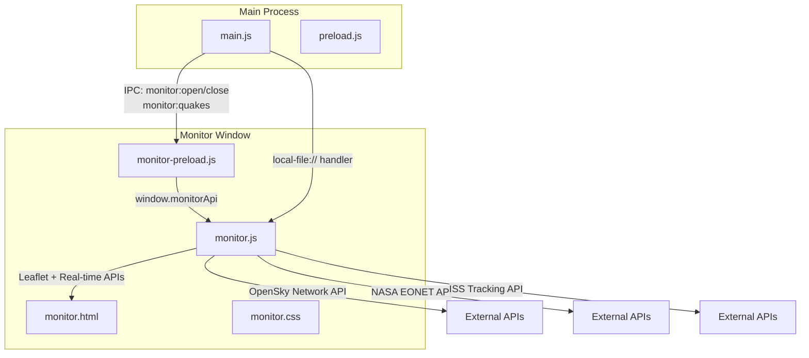
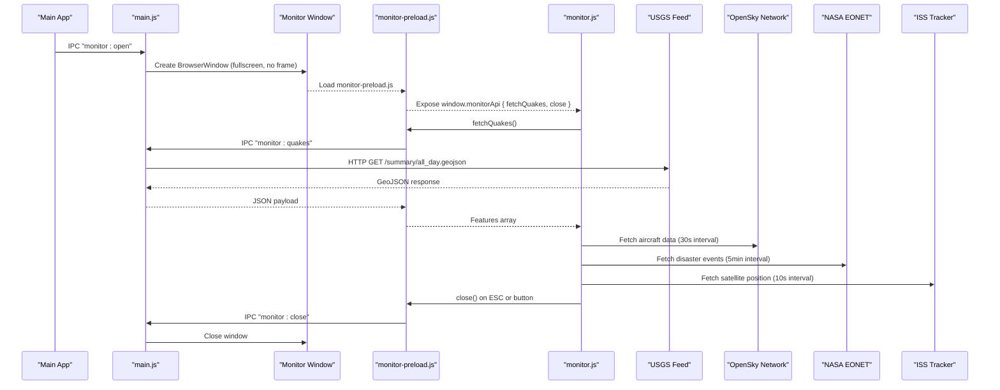
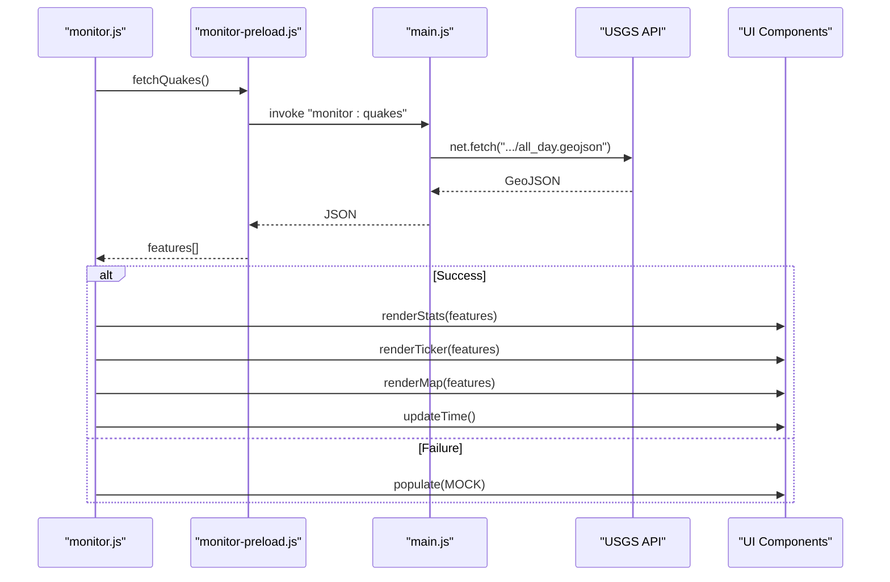
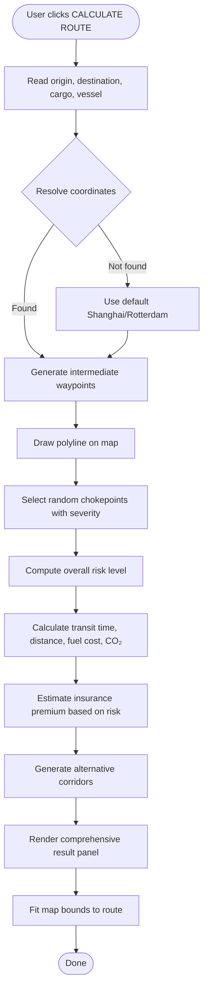
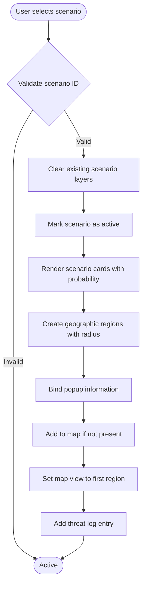
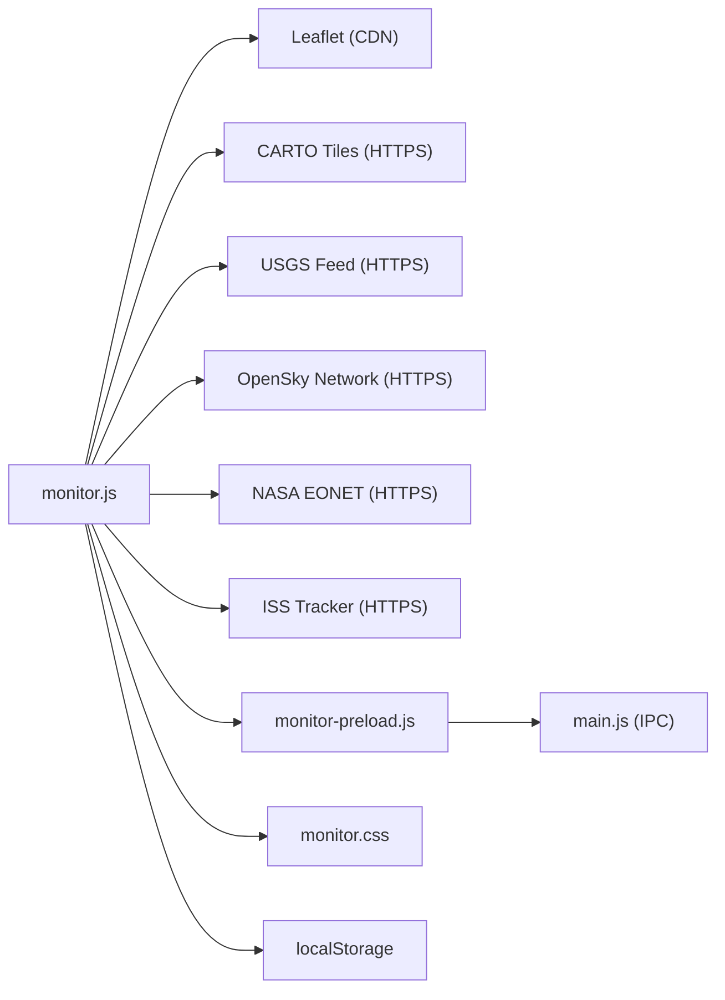

# World Monitor

<cite>
**Referenced Files in This Document**
- [main.js](file://main.js)
- [monitor-preload.js](file://monitor-preload.js)
- [preload.js](file://preload.js)
- [monitor.html](file://monitor.html)
- [monitor.css](file://monitor.css)
- [monitor.js](file://monitor.js)
- [package.json](file://package.json)
- [README.md](file://README.md)
</cite>

## Update Summary
**Changes Made**
- Complete overhaul from basic seismic monitoring to sophisticated multi-widget geopolitical and financial intelligence dashboard
- Added comprehensive widget system with 13 distinct widgets including financial ticker, seismic stats, global time zones, system status, threat level, uptime counter, satellites, alert counter, threat log, network I/O graph, connected nodes, map layers, breaking news, and earthquake ticker
- Integrated real-time financial intelligence with live market indicators, cryptocurrency tracking, commodities data, currency exchange rates, central bank rates, fear & greed index, yield curves, prediction markets, and GDP/inflation metrics
- Implemented geopolitical risk assessment system covering 40+ nations with instability indices, resilience scores, sanctions levels, travel advisories, and domain-specific risk factors
- Added scenario planning engine for modeling geopolitical events including Taiwan Strait Crisis, Red Sea Blockade, Ukraine-Russia Sanctions, Hormuz Closure, US-China Tariff Shock, Malacca Piracy Surge, Panama Canal Drought, Pandemic Resurgence, Global Cyber Attack, and Solar Storm/EMP scenarios
- Enhanced Leaflet-based map with multiple data layers including military aircraft, naval vessels, wildfires, cyber threats, disease outbreaks, satellites, undersea cables, and port congestion
- Built infrastructure monitoring dashboard with undersea cable status, port congestion metrics, energy storage levels, and critical pipeline monitoring
- Developed route analysis tool with chokepoint severity assessment, transit cost estimation, insurance premium calculation, and alternative corridor recommendations
- Integrated real-time API connections to OpenSky Network (aircraft), NASA EONET (natural disasters), and ISS satellite tracking
- Redesigned dark theme UI with advanced widget management system, collapsible panels, and responsive layout
- Enhanced security features with context isolation, IPC communication, and secure file handling

## Table of Contents
1. [Introduction](#introduction)
2. [Project Structure](#project-structure)
3. [Core Components](#core-components)
4. [Architecture Overview](#architecture-overview)
5. [Detailed Component Analysis](#detailed-component-analysis)
6. [Dependency Analysis](#dependency-analysis)
7. [Performance Considerations](#performance-considerations)
8. [Troubleshooting Guide](#troubleshooting-guide)
9. [Conclusion](#conclusion)

## Introduction
World Monitor is a sophisticated full-screen, dark-themed geopolitical and financial intelligence dashboard embedded within an Electron desktop application. It provides comprehensive real-time situational awareness with:

- **13 Interactive Widgets**: Financial ticker, seismic statistics, global time zones, system status monitoring, threat level assessment, uptime tracking, satellite monitoring, alert counters, threat logging, network I/O visualization, connected node management, map layer controls, breaking news feed, and earthquake ticker
- **Real-Time Data Integration**: Live earthquake data from USGS, military aircraft tracking via OpenSky Network, natural disaster monitoring through NASA EONET, and ISS satellite positioning
- **Financial Intelligence Dashboard**: Comprehensive market indicators including cryptocurrencies, commodities, currencies, central bank rates, fear & greed index, yield curves, prediction markets, and economic indicators
- **Geopolitical Risk Assessment**: Detailed analysis of 40+ nations with instability indices, resilience scores, OFAC sanctions levels, travel advisories, and multi-domain risk factors
- **Scenario Planning Engine**: Advanced modeling of geopolitical events including conflicts, trade disruptions, natural disasters, cyber attacks, and systemic risks
- **Enhanced Map System**: Multi-layered Leaflet integration with military/naval activity, wildfire tracking, cyber threat mapping, disease outbreak monitoring, satellite positioning, undersea cable routes, and port congestion visualization
- **Infrastructure Monitoring**: Real-time tracking of undersea cables, port congestion metrics, energy storage levels, and critical pipeline status
- **Route Analysis Tool**: Intelligent shipping corridor optimization with chokepoint assessment, cost estimation, insurance calculations, and alternative routing recommendations

The system runs as a separate BrowserWindow launched from the main app with strict security protocols and communicates via IPC using dedicated preload scripts.

## Project Structure
The World Monitor feature consists of:
- **Main Process Management**: Window creation, IPC handlers, and secure local file serving
- **Preload Bridge Architecture**: Safe API exposure with context isolation for monitor renderer
- **Comprehensive UI Framework**: HTML/CSS/JS implementation with 13 interactive widgets and advanced styling
- **Integration Layer**: Seamless connection with main app's preload system for launch/closure operations



**Diagram sources**
- [main.js:118-153](file://main.js#L118-L153)
- [monitor-preload.js:1-7](file://monitor-preload.js#L1-L7)
- [monitor.html:1-263](file://monitor.html#L1-L263)
- [monitor.css:1-374](file://monitor.css#L1-L374)
- [monitor.js:1-1704](file://monitor.js#L1-L1704)

**Section sources**
- [main.js:118-153](file://main.js#L118-L153)
- [monitor-preload.js:1-7](file://monitor-preload.js#L1-L7)
- [monitor.html:1-263](file://monitor.html#L1-L263)
- [monitor.css:1-374](file://monitor.css#L1-L374)
- [monitor.js:1-1704](file://monitor.js#L1-L1704)

## Core Components
- **Main Process Window Manager**: Creates and controls the monitor window, registers comprehensive IPC handlers, and serves local files via custom protocol with enhanced security
- **Preload Bridges**: 
  - monitor-preload.js exposes fetchQuakes() and close() to the monitor renderer
  - preload.js re-exposes monitorApi for convenience across contexts with additional security measures
- **Advanced Widget System**: 
  - 13 distinct widgets with individual toggle controls and persistent state management
  - Collapsible interface with localStorage persistence and dynamic layout adjustment
  - Responsive design that adapts to sidebar expansion/collapse
- **Real-Time Data Integration**: 
  - Live earthquake data from USGS via IPC
  - Military aircraft tracking from OpenSky Network
  - Natural disaster monitoring via NASA EONET
  - ISS satellite positioning and orbital mechanics
- **Financial Intelligence Engine**: 
  - Cryptocurrency market tracking with dominance metrics
  - Commodities pricing and trend analysis
  - Currency exchange rate monitoring
  - Central bank interest rate tracking
  - Fear & Greed Index visualization
  - Yield curve spread analysis
  - Prediction market probability assessment
  - GDP growth and inflation monitoring
- **Geopolitical Risk Assessment**: 
  - 40+ country database with instability and resilience indices
  - OFAC sanctions level tracking
  - Travel advisory integration
  - Multi-domain risk factor analysis (Political, Governance, Economic, Social, Security, Environment)
- **Scenario Planning Engine**: 
  - 10 detailed geopolitical scenarios with probability assessments
  - Economic impact modeling and sector-specific disruption analysis
  - Geographic region mapping with radius-based impact zones
  - Chokepoint identification and severity assessment
- **Enhanced Map System**: 
  - Multi-layered Leaflet integration with dark basemap tiles
  - Dynamic layer groups for quakes, military, naval, wildfire, cyber, disease, satellites, cables, and ports
  - Real-time marker updates with magnitude-based sizing and depth-based coloring
  - Country click interaction for detailed risk assessment
- **Infrastructure Monitoring Dashboard**: 
  - Undersea cable status monitoring with fault detection
  - Port congestion metrics with visual progress indicators
  - Energy storage levels with gauge visualization
  - Critical pipeline operational status tracking
- **Route Analysis Tool**: 
  - Origin/destination input with coordinate resolution
  - Waypoint generation and polyline rendering
  - Chokepoint severity assessment with color-coded risk levels
  - Transit time and distance estimation
  - Fuel cost and CO₂ emission calculations
  - Insurance premium estimation based on route risk
  - Alternative corridor recommendations with comparative analysis

Key responsibilities:
- **Data Acquisition**: Multi-source real-time data collection via IPC and external APIs; comprehensive mock datasets for offline functionality
- **Rendering**: Advanced Leaflet map integration, dynamic widget panels, animated tickers, interactive tables, and modal detail views
- **Interaction**: Sidebar tab navigation, search filtering, route calculation, scenario activation, layer toggles, and keyboard shortcuts
- **Lifecycle**: Window management, periodic refresh cycles, state persistence, and graceful error handling

**Section sources**
- [main.js:118-153](file://main.js#L118-L153)
- [monitor-preload.js:1-7](file://monitor-preload.js#L1-L7)
- [preload.js:19-22](file://preload.js#L19-L22)
- [monitor.html:1-263](file://monitor.html#L1-L263)
- [monitor.css:1-374](file://monitor.css#L1-L374)
- [monitor.js:1-1704](file://monitor.js#L1-L1704)

## Architecture Overview
The monitor operates in its own BrowserWindow with strict security defaults and comprehensive IPC communication. The main process handles all sensitive operations while the monitor renderer focuses on visualization and user interaction.



**Diagram sources**
- [main.js:118-153](file://main.js#L118-L153)
- [monitor-preload.js:1-7](file://monitor-preload.js#L1-L7)
- [monitor.js:1691-1700](file://monitor.js#L1691-L1700)
- [monitor.js:474-675](file://monitor.js#L474-L675)

## Detailed Component Analysis

### Main Process: Enhanced Monitor Window and IPC
- **Custom Protocol Registration**: Secure local file access scheme for messenger app integration
- **Single Instance Lock**: Ensures only one instance runs with proper focus management
- **Enhanced Monitor Lifecycle**:
  - `monitor:open`: Creates fullscreen, frameless BrowserWindow with dedicated preload and detached devtools
  - `monitor:close`: Graceful window closure with state cleanup
  - `monitor:quakes`: Enhanced USGS daily earthquake GeoJSON fetching with error handling
- **Security Enhancements**: Context isolation enabled, nodeIntegration disabled, sandbox mode active

Implementation highlights:
- Centralized path management for user data directories
- Safe file path validation utilities for secure file operations
- MIME type detection and category classification for file handling
- Native notification support with platform-specific formatting

**Section sources**
- [main.js:7-9](file://main.js#L7-L9)
- [main.js:11-12](file://main.js#L11-L12)
- [main.js:118-153](file://main.js#L118-L153)
- [main.js:172-187](file://main.js#L172-L187)

### Preload Bridges: Enhanced Security Architecture
- **monitor-preload.js**: 
  - Exposes window.monitorApi with:
    - fetchQuakes(): Secure IPC invocation for earthquake data
    - close(): Controlled window closure mechanism
- **preload.js**: 
  - Comprehensive API surface for main app functionality
  - Re-exposes monitorApi for cross-context consistency
  - File URL generation with safe protocol encoding

Security posture:
- Strict contextBridge usage with minimal API surface exposure
- Renderer has nodeIntegration disabled and contextIsolation enabled
- Sandbox mode prevents direct Node.js access
- Custom protocol handler validates file paths before serving

**Section sources**
- [monitor-preload.js:1-7](file://monitor-preload.js#L1-L7)
- [preload.js:1-23](file://preload.js#L1-L23)

### Monitor UI: Advanced Interface Design
- **monitor.html**: 
  - Comprehensive widget framework with 13 distinct components
  - Left sidebar with 5 tabs: Risk, Route, Scenario, Finance, Infrastructure
  - Modal overlay system for detailed country risk assessment
  - Layer control bar with 10 map layer toggles
  - CSP configuration allowing external tile providers and API endpoints
- **monitor.css**: 
  - Sophisticated dark theme with backdrop blur effects
  - Advanced widget animations and transition effects
  - Responsive layout system adapting to sidebar state
  - Custom scrollbar styling and overflow handling
  - Color-coded status indicators and severity levels

CSP allows external tile provider, USGS endpoints, OpenSky Network, NASA EONET, and ISS tracking services.

**Section sources**
- [monitor.html:1-263](file://monitor.html#L1-L263)
- [monitor.css:1-374](file://monitor.css#L1-L374)

### Monitor Logic: Comprehensive JavaScript Implementation
- **Widget Management System**: 
  - 13 configurable widgets with individual visibility controls
  - localStorage persistence for widget preferences
  - Dynamic menu generation with check/uncheck states
  - Event delegation for efficient click handling
- **Real-Time Data Integration**: 
  - OpenSky Network API for military/civilian aircraft tracking
  - NASA EONET API for natural disaster event monitoring
  - ISS tracking API for satellite positioning
  - Fallback mechanisms with comprehensive mock datasets
- **Financial Intelligence Engine**: 
  - Cryptocurrency market data with dominance percentages
  - Commodities pricing with change indicators
  - Currency exchange rate monitoring
  - Central bank interest rate tracking
  - Fear & Greed Index with visual gauge
  - Yield curve spread analysis
  - Prediction market probability assessment
  - GDP growth and inflation metrics
- **Geopolitical Risk Assessment**: 
  - 40+ country database with comprehensive risk metrics
  - Instability Index (II) and Resilience Index (RI) scoring
  - OFAC sanctions level categorization
  - Travel advisory integration with severity levels
  - Multi-domain risk factor analysis
  - Sortable, filterable, and pinable country list
- **Scenario Planning Engine**: 
  - 10 detailed geopolitical scenarios with probability assessments
  - Geographic region mapping with radius-based impact zones
  - Sector-specific disruption analysis
  - Economic impact quantification
  - Chokepoint identification and severity assessment
- **Infrastructure Monitoring**: 
  - Undersea cable status with fault detection
  - Port congestion metrics with visual indicators
  - Energy storage levels with gauge visualization
  - Critical pipeline operational status tracking
- **Route Analysis Tool**: 
  - Coordinate resolution with fallback defaults
  - Waypoint generation and polyline rendering
  - Chokepoint severity assessment with color coding
  - Transit time and distance estimation
  - Fuel cost and CO₂ emission calculations
  - Insurance premium estimation
  - Alternative corridor recommendations
- **Map Layer Management**: 
  - Dynamic layer group creation and management
  - Real-time marker updates with size/color coding
  - Popup information display with formatted details
  - Click interaction for country risk assessment
- **Live Data Streams**: 
  - Aircraft tracking with military/civilian classification
  - Wildfire and hazard event monitoring
  - Satellite positioning with orbital mechanics
  - Naval vessel simulation with movement patterns
  - Cyber threat visualization with target counts

Complexity notes:
- Rendering functions use efficient DOM manipulation with innerHTML for performance
- Timers update UI at various intervals (1s–5min) balancing responsiveness and resource usage
- Mock datasets provide comprehensive offline functionality
- Error handling ensures graceful degradation when APIs are unavailable

Error handling:
- Comprehensive try/catch blocks around map initialization and rendering
- Fallback mechanisms for failed API calls
- Console warnings for debugging and monitoring
- Graceful UI updates even when data sources fail

Keyboard support:
- Escape key closes monitor window
- Enter key triggers route calculation
- Tab navigation for accessibility

**Section sources**
- [monitor.js:1-14](file://monitor.js#L1-L14)
- [monitor.js:15-145](file://monitor.js#L15-L145)
- [monitor.js:147-473](file://monitor.js#L147-L473)
- [monitor.js:474-675](file://monitor.js#L474-L675)
- [monitor.js:677-938](file://monitor.js#L677-L938)
- [monitor.js:939-1145](file://monitor.js#L939-L1145)
- [monitor.js:1146-1494](file://monitor.js#L1146-L1494)
- [monitor.js:1495-1704](file://monitor.js#L1495-L1704)

#### Class-like structure overview
While not formal classes, monitor.js organizes functionality into logical modules:

```mermaid
classDiagram
class MonitorAPI {
+fetchQuakes()
+close()
}
class WidgetSystem {
+WIDGETS[]
+toggleWidget(id)
+buildWidgetMenu()
+updateTickerLayout()
}
class FinancialEngine {
+FIN_COMMODITIES[]
+FIN_CURRENCIES[]
+FIN_RATES[]
+FIN_PREDICTION[]
+FIN_TICKER[]
+renderFinanceTables()
}
class GeopoliticalAssessment {
+COUNTRIES[]
+SANCTIONS{}
+TRAVEL{}
+renderRiskList(filter)
+_showRiskDetail(iso)
}
class ScenarioEngine {
+SCENARIOS{}
+activateScenario(id)
+clearScenario()
+renderScenarioCards()
}
class InfrastructureMonitor {
+INFRA_CABLES[]
+INFRA_PORTS[]
+INFRA_ENERGY[]
+INFRA_PIPES[]
+renderInfraTab()
}
class RouteAnalyzer {
+calcRoute()
+waypoints[]
+chokepoints[]
}
class MapLayers {
+layerGroups{}
+genEvents()
+populateLayer(type, evts)
+_toggleLayer(type, visible)
}
class LiveDataStreams {
+liveAircraft
+liveEONET
+liveISS
+startAllLiveData()
+renderAircraftLayer()
+renderEONETLayers()
+renderSatelliteLayer()
}
MonitorAPI <.. WidgetSystem : "used by"
WidgetSystem --> FinancialEngine : "updates"
WidgetSystem --> GeopoliticalAssessment : "interacts"
WidgetSystem --> ScenarioEngine : "controls"
WidgetSystem --> InfrastructureMonitor : "displays"
WidgetSystem --> RouteAnalyzer : "calculates"
WidgetSystem --> MapLayers : "renders"
WidgetSystem --> LiveDataStreams : "integrates"
```

**Diagram sources**
- [monitor-preload.js:1-7](file://monitor-preload.js#L1-L7)
- [monitor.js:15-145](file://monitor.js#L15-L145)
- [monitor.js:243-438](file://monitor.js#L243-L438)
- [monitor.js:194-242](file://monitor.js#L194-L242)
- [monitor.js:1296-1494](file://monitor.js#L1296-L1494)
- [monitor.js:1428-1494](file://monitor.js#L1428-L1494)
- [monitor.js:1191-1295](file://monitor.js#L1191-L1295)
- [monitor.js:1495-1593](file://monitor.js#L1495-L1593)
- [monitor.js:474-675](file://monitor.js#L474-L675)

#### Sequence: Enhanced Earthquake data flow


**Diagram sources**
- [monitor.js:1691-1700](file://monitor.js#L1691-L1700)
- [monitor-preload.js:1-7](file://monitor-preload.js#L1-L7)
- [main.js:118-125](file://main.js#L118-L125)
- [monitor.js:1594-1631](file://monitor.js#L1594-L1631)

#### Flowchart: Enhanced Route Explorer


**Diagram sources**
- [monitor.js:1191-1295](file://monitor.js#L1191-L1295)

#### Flowchart: Scenario Planning Engine


**Diagram sources**
- [monitor.js:1296-1359](file://monitor.js#L1296-L1359)

## Dependency Analysis
External dependencies:
- **Leaflet 1.9.4**: Interactive map library loaded from CDN
- **CARTO Basemap Tiles**: Dark-themed map tiles via HTTPS
- **USGS Earthquake Feed**: Real-time seismic data via HTTPS
- **OpenSky Network API**: Live aircraft tracking data
- **NASA EONET API**: Natural disaster event monitoring
- **ISS Tracking API**: International Space Station positioning

Internal dependencies:
- **Electron Main Process**: Window management and IPC communication
- **Preload Scripts**: Secure API exposure with context isolation
- **CSS Framework**: Advanced styling with animations and responsive design
- **localStorage**: Widget preference persistence



**Diagram sources**
- [monitor.html:1-263](file://monitor.html#L1-L263)
- [monitor.js:474-675](file://monitor.js#L474-L675)
- [monitor-preload.js:1-7](file://monitor-preload.js#L1-L7)
- [main.js:118-153](file://main.js#L118-L153)

**Section sources**
- [monitor.html:1-263](file://monitor.html#L1-L263)
- [monitor.js:474-675](file://monitor.js#L474-L675)
- [monitor-preload.js:1-7](file://monitor-preload.js#L1-L7)
- [main.js:118-153](file://main.js#L118-L153)

## Performance Considerations
- **Rendering Frequency Optimization**: 
  - Threat log and system status update frequently (1-3 seconds); consider throttling if CPU usage increases
  - Financial ticker updates every 2 seconds with price volatility simulation
  - Map markers scale with magnitude; large datasets may benefit from clustering or decimation
- **Network Polling Strategy**: 
  - Earthquake fetch interval set to 60 seconds for balance between freshness and bandwidth
  - Aircraft tracking every 30 seconds, ISS tracking every 10 seconds
  - Disaster event monitoring every 5 minutes to reduce API load
- **DOM Operations Efficiency**: 
  - Rebuilding innerHTML for lists is simple but can be optimized with virtualization for very long lists
  - Event delegation used for widget toggles to avoid memory leaks
  - LocalStorage persistence reduces repeated calculations
- **Memory Management**: 
  - Layer groups cleared before repopulating to prevent memory accumulation
  - Timer cleanup on window close
  - Efficient mock dataset structures for offline functionality

## Troubleshooting Guide
Common issues and resolutions:
- **monitorApi missing**: 
  - Symptom: Alert shown and title set to error
  - Cause: Preload did not expose window.monitorApi
  - Fix: Ensure monitor-preload.js is correctly referenced and executed in the monitor window
- **Map not initializing**: 
  - Symptom: Console warning about Leaflet not available
  - Cause: Leaflet failed to load or CSP blocked CDN
  - Fix: Verify CSP allows https: and basemaps domain; ensure internet connectivity
- **Earthquake data not updating**: 
  - Symptom: Fallback to mock data
  - Cause: IPC handler or network request failed
  - Fix: Check main process logs for errors; verify USGS endpoint accessibility
- **Window does not close**: 
  - Symptom: ESC or close button has no effect
  - Cause: IPC send not handled or window reference lost
  - Fix: Confirm monitor:close handler exists and monitorWin state is correct
- **Widget toggle not working**: 
  - Symptom: Widget visibility doesn't persist or toggle buttons unresponsive
  - Cause: Event delegation failure or localStorage corruption
  - Fix: Check browser console for errors; clear localStorage and reload
- **Financial data not displaying**: 
  - Symptom: Empty finance tables or static values
  - Cause: Finance tab not rendered or data structure mismatch
  - Fix: Ensure finance tab click handler executes; verify data array structures
- **Scenario not activating**: 
  - Symptom: Scenario cards don't highlight or map doesn't show regions
  - Cause: Scenario layer not added to map or invalid scenario ID
  - Fix: Check scenarioLayer initialization; validate scenario ID format
- **Route calculation fails**: 
  - Symptom: No route displayed or error in console
  - Cause: Missing map instance or invalid coordinates
  - Fix: Ensure map is initialized before route calculation; verify coordinate resolution

**Section sources**
- [monitor.js:1-14](file://monitor.js#L1-L14)
- [monitor.js:876-909](file://monitor.js#L876-L909)
- [monitor.js:1691-1700](file://monitor.js#L1691-L1700)
- [main.js:118-153](file://main.js#L118-L153)
- [monitor.js:1360-1426](file://monitor.js#L1360-L1426)
- [monitor.js:1296-1359](file://monitor.js#L1296-L1359)
- [monitor.js:1191-1295](file://monitor.js#L1191-L1295)

## Conclusion
World Monitor represents a comprehensive transformation from basic seismic monitoring to a sophisticated geopolitical and financial intelligence dashboard. The system integrates real-time data from multiple authoritative sources, provides advanced analytical tools for risk assessment and scenario planning, and delivers this information through an intuitive, responsive interface with 13 customizable widgets.

The architecture emphasizes security through strict IPC communication and context isolation, while providing extensive functionality for monitoring global events, analyzing financial markets, assessing geopolitical risks, and planning strategic responses. The modular design allows for easy extension with additional data sources, widgets, and analytical capabilities.

Key strengths include:
- **Comprehensive Data Integration**: Real-time feeds from USGS, OpenSky Network, NASA EONET, and ISS tracking
- **Advanced Analytical Tools**: Financial intelligence, geopolitical risk assessment, scenario planning, and route optimization
- **Flexible Widget System**: 13 customizable components with persistent state management
- **Robust Security Model**: Context isolation, secure IPC, and minimal API surface exposure
- **Responsive User Interface**: Dark theme design with smooth animations and adaptive layouts

This system serves as a powerful foundation for global situational awareness and strategic decision-making in complex geopolitical and economic environments.