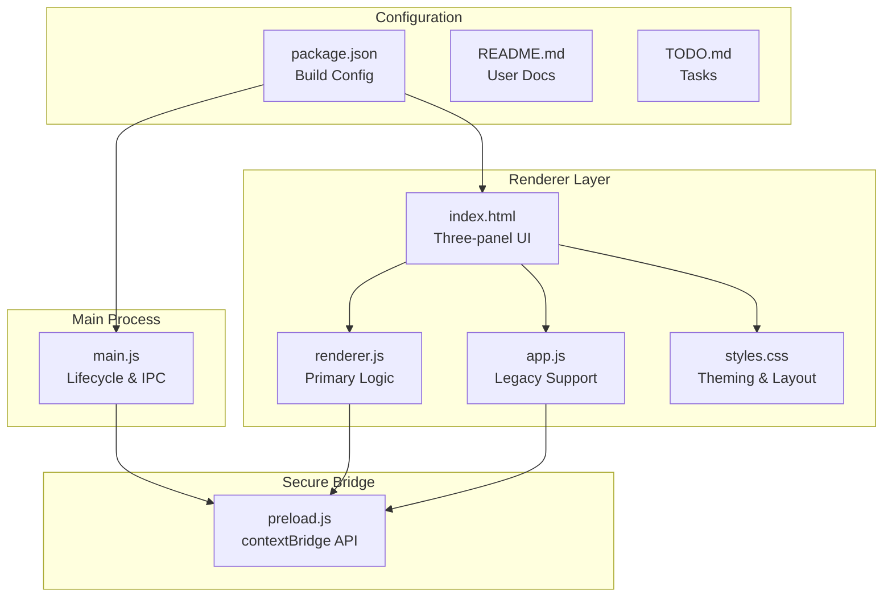
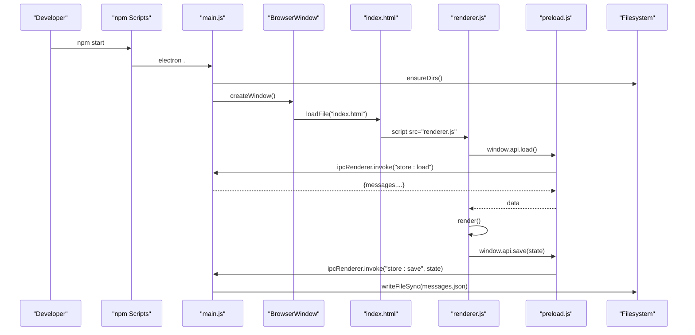

# Development Guide

<cite>
**Referenced Files in This Document**
- [package.json](file://package.json)
- [README.md](file://README.md)
- [main.js](file://main.js)
- [preload.js](file://preload.js)
- [index.html](file://index.html)
- [renderer.js](file://renderer.js)
- [app.js](file://app.js)
- [styles.css](file://styles.css)
- [TODO.md](file://TODO.md)
</cite>

## Update Summary
**Changes Made**
- Updated project structure documentation to reflect the new three-panel architecture
- Enhanced security practices section with improved context isolation patterns
- Added centralized path management documentation
- Updated build configuration details for enhanced electron-builder setup
- Revised development workflow with new architectural patterns
- Added comprehensive debugging techniques for the enhanced architecture
- Updated coding conventions for the new API surface

## Table of Contents
1. [Introduction](#introduction)
2. [Project Structure](#project-structure)
3. [Core Components](#core-components)
4. [Architecture Overview](#architecture-overview)
5. [Detailed Component Analysis](#detailed-component-analysis)
6. [Security Architecture](#security-architecture)
7. [Development Workflow](#development-workflow)
8. [Build and Distribution](#build-and-distribution)
9. [Testing Approaches](#testing-approaches)
10. [Coding Conventions](#coding-conventions)
11. [Troubleshooting Guide](#troubleshooting-guide)
12. [Conclusion](#conclusion)
13. [Appendices](#appendices)

## Introduction
This guide provides comprehensive development documentation for contributing to the Messenger project, an Electron desktop application featuring a private self-chat notebook with rich file attachments, whiteboard functionality, and a modern three-panel interface. The application emphasizes security through strict context isolation, secure IPC communication, and centralized path management. It explains the enhanced project structure, development workflow, build processes, testing approaches, and architectural patterns established in this major redesign.

## Project Structure
The repository follows a refined Electron architecture with clear separation between main process, secure preload bridge, renderer UI components, and comprehensive styling:

### Main Process Layer
- **main.js**: Application lifecycle management, secure window creation, IPC handler registration, custom protocol implementation, centralized path management, and single-instance locking

### Secure Bridge Layer  
- **preload.js**: Minimal API surface exposed via contextBridge, providing secure access to main process capabilities

### Renderer Layer
- **index.html**: Three-panel UI markup with CSP configuration, canvas overlay system, and responsive design elements
- **renderer.js**: Primary UI logic implementing message management, file attachments, reactions, search, voice notes, canvas/whiteboard, theme system, and settings
- **app.js**: Legacy renderer implementation providing simplified chat and canvas flow for backward compatibility

### Styling and Assets
- **styles.css**: Comprehensive CSS architecture with CSS variables for theming, dark mode support, responsive breakpoints, and component-specific styles

### Configuration and Documentation
- **package.json**: Enhanced build configuration with electron-builder targets, platform-specific options, and development scripts
- **README.md**: User-facing documentation covering features, installation, and usage
- **TODO.md**: Feature development tracking and verification tasks



**Diagram sources**
- [package.json:1-56](file://package.json#L1-L56)
- [main.js:1-155](file://main.js#L1-L155)
- [preload.js:1-17](file://preload.js#L1-L17)
- [index.html:1-232](file://index.html#L1-L232)
- [renderer.js:1-723](file://renderer.js#L1-L723)
- [app.js:1-239](file://app.js#L1-L239)
- [styles.css:1-293](file://styles.css#L1-L293)

**Section sources**
- [package.json:1-56](file://package.json#L1-L56)
- [README.md:1-79](file://README.md#L1-L79)

## Core Components

### Main Process (main.js)
The main process serves as the application's core controller with enhanced security and path management:

**Key Responsibilities:**
- Custom protocol registration for secure local file serving (`local-file://`)
- Centralized path management using helper functions for consistent directory access
- JSON persistence for messages and settings with graceful error handling
- Comprehensive IPC handler registration for all renderer-to-main communication
- Single-instance lock implementation to prevent multiple app instances
- BrowserWindow creation with strict security preferences

**Security Enhancements:**
- Context isolation enabled with nodeIntegration disabled
- Safe path validation preventing directory traversal attacks
- Custom protocol restricting access to allowed directories only
- Stream-based file serving to prevent memory issues with large files

### Preload Bridge (preload.js)
The secure bridge exposes a minimal, typed API surface to the renderer:

**Exposed API Methods:**
- Data management: `load()`, `save()`, `loadSettings()`, `saveSettings()`
- File operations: `pickFiles()`, `saveCanvas()`, `openFile()`, `revealFile()`
- Media handling: `saveVoice()` for audio recordings
- System integration: `showNotification()`, `setTheme()`
- URL generation: `fileUrl(storedName)` returns safe local-file URLs

**Security Design:**
- Enforces least privilege principle by exposing only necessary methods
- Centralizes all IPC calls through a single entry point
- Prevents direct Node.js access from renderer context

### Renderer (renderer.js)
The primary renderer implements the complete three-panel interface with advanced features:

**State Management:**
- Centralized state object for messages and settings
- Automatic persistence after mutations
- Theme and appearance state management

**UI Features:**
- Three-panel layout (navigation rail, conversation sidebar, chat panel)
- Message rendering with day dividers, reactions, and read receipts
- File attachment previews for images, videos, audio, and documents
- Advanced search with highlighting and navigation
- Voice recording with real-time feedback
- Canvas/whiteboard with drawing tools and eraser functionality
- Emoji picker with search capabilities
- Settings panel with dark mode and theme customization

**Interaction Patterns:**
- Event-driven DOM manipulation with helper utilities
- Drag-and-drop file support with visual feedback
- Context menus for message actions
- Keyboard shortcuts for common operations

### Secondary Renderer (app.js)
Provides a simplified chat and canvas flow for legacy compatibility:
- Basic message persistence and rendering
- Simplified file attachment handling
- Canvas drawing functionality
- Uses the same secure API surface as the main renderer

### Styles (styles.css)
Comprehensive styling system supporting the three-panel architecture:
- CSS custom properties for theming and dark mode
- Responsive design with mobile-first approach
- Component-specific styles for bubbles, attachments, modals
- Animation definitions for smooth transitions
- Dark mode color schemes and theme variations

**Section sources**
- [main.js:1-155](file://main.js#L1-L155)
- [preload.js:1-17](file://preload.js#L1-L17)
- [renderer.js:1-723](file://renderer.js#L1-L723)
- [app.js:1-239](file://app.js#L1-L239)
- [styles.css:1-293](file://styles.css#L1-L293)

## Architecture Overview
The application follows a secure Electron architecture with strict boundaries between processes:



**Diagram sources**
- [package.json:6-11](file://package.json#L6-L11)
- [main.js:135-150](file://main.js#L135-L150)
- [preload.js:3-16](file://preload.js#L3-L16)
- [index.html:229](file://index.html#L229)
- [renderer.js:705-718](file://renderer.js#L705-L718)

## Detailed Component Analysis

### Main Process Architecture
The main process implements a robust foundation with enhanced security and path management:

**Path Management Functions:**
- `DATA()`: Returns path to messages.json in userData directory
- `SETTINGS()`: Returns path to settings.json configuration
- `FDIR()`: Returns path to files storage directory
- `VDIR()`: Returns path to voice recordings directory

**Security Implementation:**
- Custom protocol registration with strict privileges
- Safe file path validation preventing directory traversal
- MIME type mapping for proper content handling
- Category classification for media types

**IPC Handler Organization:**
- Store operations: load/save messages with error handling
- Settings management: persistent user preferences
- File operations: secure file picking and saving
- Voice recording: WebM format with base64 encoding
- System integration: notifications and theme control


**Diagram sources**
- [main.js:135-150](file://main.js#L135-L150)
- [main.js:63-116](file://main.js#L63-L116)

**Section sources**
- [main.js:1-155](file://main.js#L1-155)

### Preload Bridge Security Model
The preload bridge enforces a secure communication pattern:

**API Surface Design:**
- Minimal method exposure following least privilege principle
- Type-safe IPC communication through invoke handlers
- Centralized error handling and response formatting
- Safe URL generation for local file access

**Security Boundaries:**
- Context isolation prevents direct Node.js access
- No global variable pollution
- Strict input validation on all IPC calls
- Secure file path construction and validation

**Section sources**
- [preload.js:1-17](file://preload.js#L1-L17)

### Renderer State Management
The renderer implements comprehensive state management for the three-panel interface:

**State Structure:**
- Messages array with metadata (timestamps, reactions, pinning)
- Settings object for appearance and preferences
- UI state for modals, menus, and interaction modes
- Drawing state for canvas functionality

**Rendering Pipeline:**
- Efficient DOM updates with selective re-rendering
- Search highlighting with regex-based text matching
- Attachment preview generation based on MIME types
- Real-time updates for voice recording and typing indicators

**Event Handling:**
- Delegated event listeners for dynamic content
- Pointer capture for smooth canvas drawing
- Keyboard shortcuts for accessibility
- Drag-and-drop with visual feedback

**Section sources**
- [renderer.js:1-723](file://renderer.js#L1-723)

### Three-Panel UI Architecture
The interface follows a modern three-panel layout pattern:

**Navigation Rail (Left):**
- Compact icon-based navigation
- Dark theme background
- Quick access to settings and theme controls

**Conversation Sidebar (Middle):**
- Searchable conversation list
- Preview text and timestamps
- Active conversation highlighting

**Chat Panel (Right):**
- Message display with day dividers
- Rich attachment previews
- Composer with multiple input methods
- Floating overlays for tools and menus

**Section sources**
- [index.html:11-232](file://index.html#L11-L232)
- [styles.css:31-293](file://styles.css#L31-L293)

## Security Architecture
The application implements multiple layers of security to protect user data and system integrity:

### Context Isolation
- `contextIsolation: true` prevents renderer access to Node.js APIs
- `nodeIntegration: false` disables direct Node.js execution in renderer
- `sandbox: false` allows necessary browser APIs while maintaining security

### Secure IPC Communication
- All renderer-to-main communication goes through preloaded bridge
- Input validation on all IPC handler parameters
- Error handling prevents information leakage
- Response sanitization before returning to renderer

### File System Security
- Custom `local-file://` protocol restricts file access
- Path normalization prevents directory traversal attacks
- MIME type validation for proper content handling
- UUID-based file naming prevents filename conflicts

### Content Security Policy
- Restricts script sources to `'self'` only
- Allows inline styles for theming but blocks inline scripts
- Permits `local-file:` scheme for secure file access
- Blocks external resources and fonts

**Section sources**
- [main.js:7-9](file://main.js#L7-L9)
- [main.js:125-131](file://main.js#L125-L131)
- [index.html:6](file://index.html#L6)

## Development Workflow

### Environment Setup
1. **Prerequisites:**
   - Node.js version 18 or higher
   - npm package manager
   - Git for version control

2. **Installation:**
   ```bash
   cd 
   npm install
   ```

3. **Development Mode:**
   ```bash
   npm start
   # or
   npm dev
   ```

### Debugging Techniques
- **Electron DevTools:** Enable developer tools during development for inspecting both main and renderer processes
- **Console Logging:** Use console statements in main process IPC handlers to trace data flow
- **Network Inspection:** Monitor local-file protocol requests and responses
- **State Inspection:** Add breakpoints in renderer.js to examine application state

### Adding New Features
1. **Extend Preload API:** Add new methods to `preload.js` if needed
2. **Implement IPC Handlers:** Add corresponding handlers in `main.js`
3. **Update Renderer:** Call new API methods from `renderer.js`
4. **Add Styling:** Include CSS rules in `styles.css` using existing variables
5. **Test Thoroughly:** Verify functionality across different scenarios

### Code Organization Patterns
- Separate concerns: main (system), preload (bridge), renderer (UI), styles (presentation)
- Use small, focused functions with clear responsibilities
- Centralize persistence and file handling in main process
- Maintain backward compatibility for existing data formats

**Section sources**
- [package.json:6-11](file://package.json#L6-L11)
- [README.md:28-37](file://README.md#L28-L37)

## Build and Distribution

### Build Configuration
The application uses electron-builder for cross-platform distribution:

**Package Configuration:**
- App ID: `com.messenger.selfchat`
- Product Name: `Messenger Self-Chat`
- Target platforms: Windows NSIS installer and portable versions

**Build Artifacts:**
- Included files: main.js, preload.js, index.html, app.js, styles.css, node_modules
- Build resources directory: assets
- Platform-specific configurations for Windows NSIS installer

### Distribution Options
- **NSIS Installer:** Full installation with desktop and start menu shortcuts
- **Portable Version:** Standalone executable without installation
- **Custom Shortcuts:** Configurable shortcut names and locations

### Build Commands
```bash
# Development build
npm run build

# Distribution build
npm run dist
```

**Section sources**
- [package.json:12-38](file://package.json#L12-L38)
- [package.json:48-54](file://package.json#L48-L54)

## Testing Approaches

### Manual Testing
- **Cross-platform verification:** Test on Windows, macOS, and Linux
- **File operation testing:** Verify attachment upload, download, and deletion
- **UI responsiveness:** Check performance with large message histories
- **Security validation:** Ensure sandbox restrictions work correctly

### Automated Testing Considerations
- **Unit tests:** IPC handlers and utility functions in main.js
- **Integration tests:** End-to-end workflows using automated UI testing frameworks
- **Performance tests:** Memory usage and rendering performance benchmarks

### Testing Checklist
- Message persistence across app restarts
- File attachment handling for various formats
- Theme switching and dark mode functionality
- Canvas drawing and image export
- Voice recording and playback
- Search functionality with highlighting

**Section sources**
- [TODO.md:1-18](file://TODO.md#L1-L18)

## Coding Conventions

### JavaScript Patterns
- Use strict mode (`"use strict"`) at module level
- Implement arrow functions for concise callbacks
- Use async/await for asynchronous operations
- Follow functional programming patterns where appropriate

### Security Best Practices
- Never expose Node.js APIs directly to renderer
- Validate all user inputs in main process
- Use parameterized queries for any database operations
- Implement proper error handling without leaking sensitive information

### CSS Organization
- Use CSS custom properties for theming
- Follow BEM-like naming conventions for classes
- Organize styles by component sections
- Maintain responsive design with mobile-first approach

### Documentation Standards
- Comment complex logic and security considerations
- Maintain README updates for new features
- Keep TODO.md current with development tasks
- Document API surfaces and interfaces

**Section sources**
- [renderer.js:1-10](file://renderer.js#L1-L10)
- [styles.css:8-28](file://styles.css#L8-L28)

## Troubleshooting Guide

### Common Issues and Solutions

**Application Launch Problems:**
- **Node version mismatch:** Ensure Node.js 18+ is installed
- **Permission errors:** Check userData directory permissions
- **Port conflicts:** Close other Electron applications

**File Operation Issues:**
- **Files not visible:** Verify custom protocol registration and CSP settings
- **Permission denied:** Check filesystem access permissions
- **Corrupted files:** Validate file integrity and cleanup procedures

**Performance Problems:**
- **Slow rendering:** Optimize DOM updates and use virtual scrolling for large lists
- **Memory leaks:** Check for event listener cleanup and interval timers
- **High CPU usage:** Debounce frequent operations like search and typing indicators

**Build and Distribution Issues:**
- **Build failures:** Clean node_modules and reinstall dependencies
- **Platform-specific errors:** Check platform-specific configurations
- **Signing issues:** Configure proper certificates for distribution

### Debugging Strategies
- **Process isolation:** Use separate DevTools windows for main and renderer processes
- **Network monitoring:** Inspect local-file protocol requests
- **State inspection:** Log application state changes and IPC communications
- **Performance profiling:** Use browser performance tools to identify bottlenecks

**Section sources**
- [main.js:7-9](file://main.js#L7-L9)
- [main.js:125-131](file://main.js#L125-L131)
- [index.html:6](file://index.html#L6)

## Conclusion
This guide outlines the enhanced architecture, development workflow, build processes, and best practices for contributing to the Messenger project. The redesigned application emphasizes security through strict context isolation, secure IPC communication, and centralized path management. By following the established patterns—secure API exposure, three-panel UI architecture, robust file handling, and comprehensive theming—you can confidently add features, maintain backward compatibility, and deliver cross-platform packages.

The modular architecture supports future enhancements while maintaining code quality and security standards. The comprehensive testing approach ensures reliability across different platforms and usage scenarios.

## Appendices

### API Reference

#### Preload API Surface
| Method | Parameters | Returns | Description |
|--------|------------|---------|-------------|
| `load()` | None | Promise\<Object\> | Load messages and settings |
| `save(data)` | Object | Promise\<Object\> | Persist application state |
| `loadSettings()` | None | Promise\<Object\> | Load user preferences |
| `saveSettings(settings)` | Object | Promise\<Object\> | Save user preferences |
| `pickFiles()` | None | Promise\<Array\> | Open file picker dialog |
| `saveCanvas(dataUrl)` | String | Promise\<Object\|null\> | Save canvas as PNG image |
| `openFile(name)` | String | void | Open file in system default app |
| `revealFile(name)` | String | void | Show file in system explorer |
| `saveVoice(base64Data)` | String | Promise\<Object\|null\> | Save voice recording as WebM |
| `notify(options)` | Object | void | Show system notification |
| `setTheme(mode)` | String | void | Set application theme (dark/light) |
| `fileUrl(storedName)` | String | String | Generate safe local-file URL |

### Directory Structure
```
userData/
├── messages.json          # Application messages and state
├── settings.json          # User preferences and theme settings
├── files/                 # Attached file contents (UUID-named)
└── voice/                 # Voice recordings (WebM format)
```

### Keyboard Shortcuts
- `Enter`: Send message
- `Escape`: Close modals and menus
- `Ctrl+F` / `Cmd+F`: Focus search bar
- Various tool-specific shortcuts in canvas interface

### File Formats
- **Messages:** JSON with structured message objects
- **Images:** PNG format for canvas exports
- **Audio:** WebM format for voice recordings
- **Settings:** JSON with appearance and preference data

**Section sources**
- [preload.js:3-16](file://preload.js#L3-L16)
- [main.js:15-18](file://main.js#L15-L18)
- [renderer.js:690-703](file://renderer.js#L690-L703)