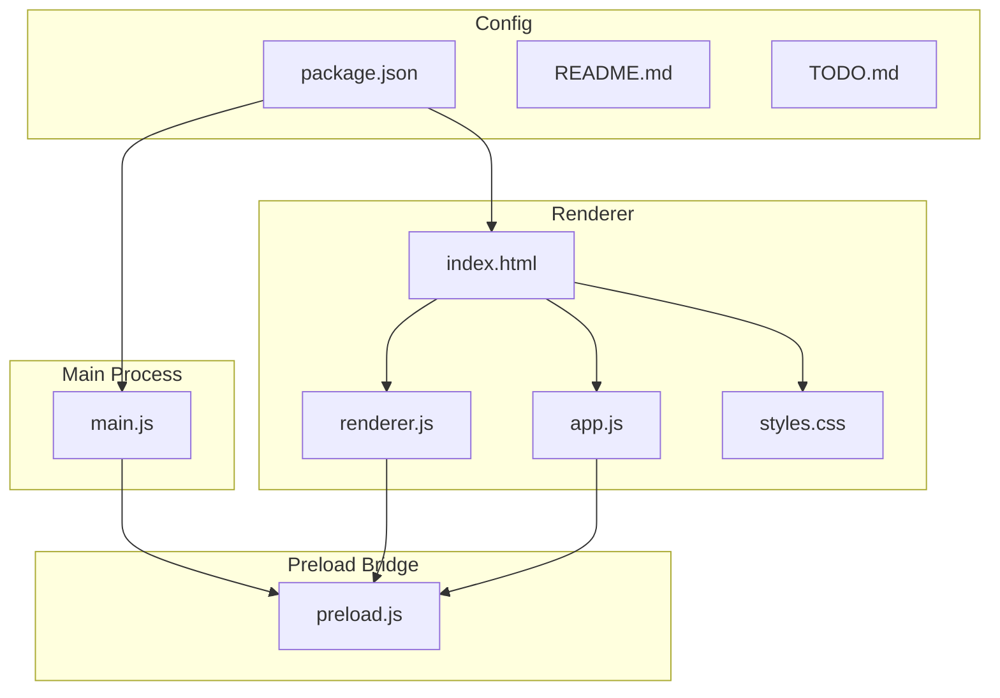
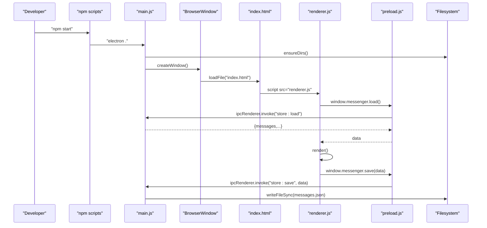
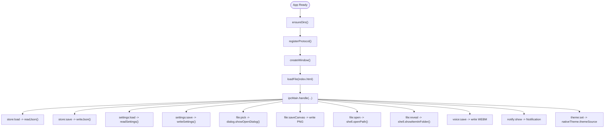
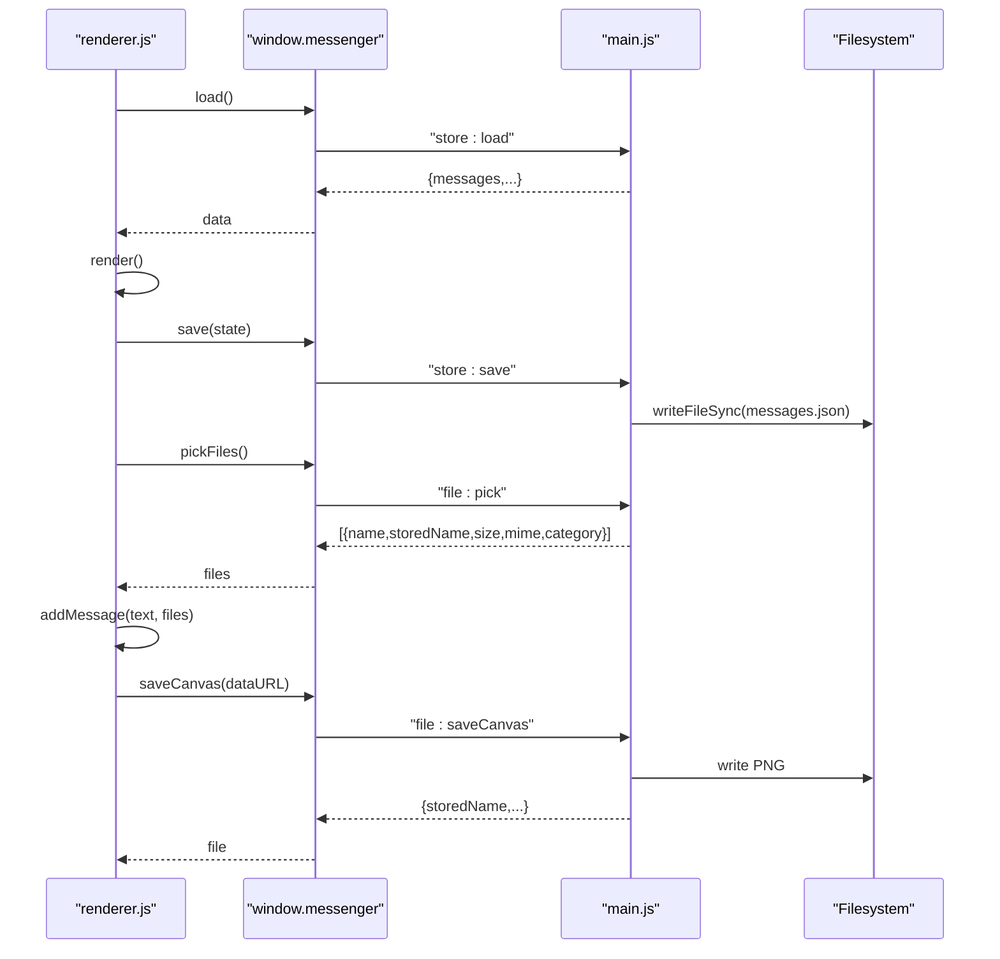
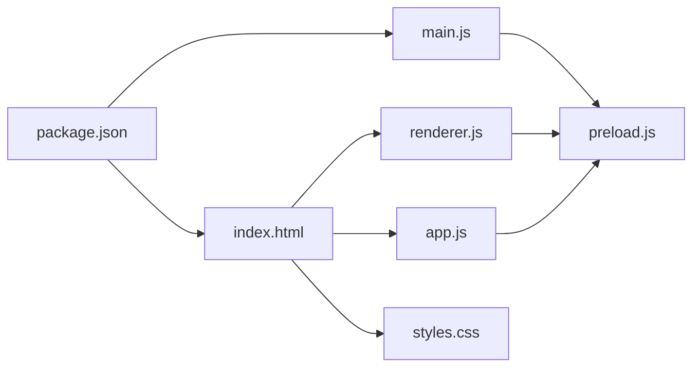

# Development Guide

<cite>
**Referenced Files in This Document**
- [package.json](file://package.json)
- [README.md](file://README.md)
- [main.js](file://main.js)
- [preload.js](file://preload.js)
- [index.html](file://index.html)
- [renderer.js](file://renderer.js)
- [app.js](file://app.js)
- [styles.css](file://styles.css)
- [TODO.md](file://TODO.md)
</cite>

## Table of Contents
1. [Introduction](#introduction)
2. [Project Structure](#project-structure)
3. [Core Components](#core-components)
4. [Architecture Overview](#architecture-overview)
5. [Detailed Component Analysis](#detailed-component-analysis)
6. [Dependency Analysis](#dependency-analysis)
7. [Performance Considerations](#performance-considerations)
8. [Troubleshooting Guide](#troubleshooting-guide)
9. [Conclusion](#conclusion)
10. [Appendices](#appendices)

## Introduction
This guide provides comprehensive development documentation for contributing to the Messenger project, an Electron desktop application that offers a private, self-chat notebook with rich file attachments and a whiteboard feature. It explains the project structure, development workflow (setup, run, debug), build and distribution using electron-builder, testing approaches, code organization patterns, guidelines for adding features, coding conventions, backward compatibility considerations, deployment across platforms, and troubleshooting steps.

## Project Structure
The repository is organized as a flat Electron app with clear separation between main process, preload bridge, renderer UI, and assets:

- Main process:
  - main.js: Application lifecycle, window creation, IPC handlers, secure file serving via custom protocol, settings persistence, single-instance lock.
- Preload bridge:
  - preload.js: Exposes a safe API surface to the renderer via contextBridge.
- Renderer:
  - index.html: UI markup and CSP configuration.
  - renderer.js: Primary UI logic for chat, attachments, reactions, search, voice notes, canvas/whiteboard, theme/dark mode, and settings.
  - app.js: A secondary or legacy renderer implementation containing a simpler chat + canvas flow.
  - styles.css: Comprehensive styling including themes, dark mode, responsive layout, and component styles.
- Configuration and metadata:
  - package.json: App metadata, scripts, electron-builder configuration, dev dependencies, engines.
  - README.md: User-facing overview and quick start.
  - TODO.md: Feature cleanup and verification tasks.

**Diagram sources**
- [package.json:1-56](file://package.json#L1-L56)
- [main.js:1-176](file://main.js#L1-L176)
- [preload.js:1-17](file://preload.js#L1-L17)
- [index.html:1-303](file://index.html#L1-L303)
- [renderer.js:1-895](file://renderer.js#L1-L895)
- [app.js:1-239](file://app.js#L1-L239)
- [styles.css:1-800](file://styles.css#L1-L800)
- [README.md:1-79](file://README.md#L1-L79)
- [TODO.md:1-18](file://TODO.md#L1-L18)

**Section sources**
- [package.json:1-56](file://package.json#L1-L56)
- [README.md:1-79](file://README.md#L1-L79)

## Core Components
- Main process (main.js):
  - Registers a secure custom protocol for local files.
  - Ensures directories exist for files and voice recordings.
  - Persists messages and settings to JSON files under userData.
  - Handles IPC for store load/save, settings load/save, file pick/save/open/reveal, voice save, notifications, and theme changes.
  - Creates the BrowserWindow with strict security preferences (contextIsolation true, nodeIntegration false).
- Preload bridge (preload.js):
  - Exposes a minimal, typed API to the renderer: load/save data, load/save settings, pick files, save canvas image, open/reveal files, save voice note, show notification, set theme, and generate safe file URLs.
- Renderer (renderer.js):
  - Implements the full UI state machine: message list rendering, attachment previews, reactions, pinning, editing, search, emoji picker, theme/dark mode toggles, settings panel, voice recording, drag-and-drop, and canvas/whiteboard integration.
  - Uses the exposed API to persist data and interact with the OS safely.
- Secondary renderer (app.js):
  - Provides a simplified chat and canvas flow; may be used for alternate views or legacy support.
- Styles (styles.css):
  - Defines CSS variables for theming, dark mode, layout, components, animations, and responsive breakpoints.
- Configuration (package.json):
  - Defines npm scripts for development and building, electron-builder targets, and platform-specific packaging options.

**Section sources**
- [main.js:1-176](file://main.js#L1-L176)
- [preload.js:1-17](file://preload.js#L1-L17)
- [renderer.js:1-895](file://renderer.js#L1-L895)
- [app.js:1-239](file://app.js#L1-L239)
- [styles.css:1-800](file://styles.css#L1-L800)
- [package.json:1-56](file://package.json#L1-L56)

## Architecture Overview
The app follows a standard Electron architecture with strict security boundaries:

- The main process owns filesystem access and native APIs.
- The renderer runs in isolation without Node integration and communicates through a preloaded bridge.
- A custom protocol serves stored files securely to the renderer.

**Diagram sources**
- [package.json:6-11](file://package.json#L6-L11)
- [main.js:103-121](file://main.js#L103-L121)
- [main.js:123-126](file://main.js#L123-L126)
- [preload.js:3-16](file://preload.js#L3-L16)
- [index.html:257-258](file://index.html#L257-L258)
- [renderer.js:7-15](file://renderer.js#L7-L15)

## Detailed Component Analysis

### Main Process (main.js)
Responsibilities:
- Single-instance lock and app lifecycle events.
- Custom protocol registration for secure file serving.
- Directory initialization for files and voice recordings.
- JSON persistence for messages and settings.
- IPC handlers for store, settings, file operations, voice, notifications, and theme.

Key flows:
- Store I/O: readJson/writeJson handle messages.json with graceful fallbacks.
- Settings I/O: readSettings/writeSettings manage user preferences like dark mode and theme.
- File handling: safeStoredPath validates paths; mimeFor maps extensions to MIME types; categoryFor classifies media.
- Protocol handler: local-file scheme streams files back to the renderer with correct headers.

Security:
- contextIsolation enabled, nodeIntegration disabled.
- Safe path validation prevents directory traversal.
- Custom protocol restricts access to allowed directories.

**Diagram sources**
- [main.js:11-23](file://main.js#L11-L23)
- [main.js:25-51](file://main.js#L25-L51)
- [main.js:53-89](file://main.js#L53-L89)
- [main.js:91-101](file://main.js#L91-L101)
- [main.js:103-121](file://main.js#L103-L121)
- [main.js:123-166](file://main.js#L123-L166)

**Section sources**
- [main.js:1-176](file://main.js#L1-L176)

### Preload Bridge (preload.js)
Exposes a minimal API surface to the renderer:
- Data: load, save, loadSettings, saveSettings
- Files: pickFiles, saveCanvas, openFile, revealFile
- Media: saveVoice
- System: showNotification, setTheme
- URL builder: fileUrl(storedName) returns a safe local-file URL

This design enforces least privilege and centralizes IPC calls.

**Section sources**
- [preload.js:1-17](file://preload.js#L1-L17)

### Renderer (renderer.js)
Primary responsibilities:
- State management: loads messages and settings on startup.
- Rendering: builds message rows, day dividers, attachment previews, reactions, pinned bar, read receipts, edit modal, search highlights.
- Interactions: composer submit, attach files, drag-and-drop, emoji picker, theme picker, settings panel, voice recording, canvas/whiteboard.
- Persistence: saves state after mutations.
- Notifications: shows system notifications on send.

Notable patterns:
- Event-driven DOM manipulation with helper functions for escaping text and formatting time/size.
- Centralized save() wrapper around api.save(state).
- Search indexing and highlighting within rendered messages.
- Canvas drawing with pointer capture and DPR-aware resizing.

**Diagram sources**
- [renderer.js:7-15](file://renderer.js#L7-L15)
- [renderer.js:357-368](file://renderer.js#L357-L368)
- [renderer.js:542-549](file://renderer.js#L542-L549)
- [renderer.js:633-637](file://renderer.js#L633-L637)
- [preload.js:3-16](file://preload.js#L3-L16)
- [main.js:123-141](file://main.js#L123-L141)

**Section sources**
- [renderer.js:1-895](file://renderer.js#L1-L895)

### Secondary Renderer (app.js)
Provides a simpler chat and canvas flow:
- Loads/saves messages.
- Renders messages and file attachments.
- Opens/closes a canvas overlay for drawing and sending images.
- Uses the same preload API for persistence and file saving.

Use this module if you need a minimal view or are refactoring toward a unified renderer.

**Section sources**
- [app.js:1-239](file://app.js#L1-L239)

### Styles (styles.css)
Defines:
- CSS variables for light/dark themes and color accents.
- Layout for rail, sidebar, chat panel, composer, and overlays.
- Component styles for bubbles, attachments, reactions, modals, and canvas tools.
- Responsive rules for mobile and tablet widths.

When adding new UI elements, follow existing variable usage and class naming conventions to maintain consistency.

**Section sources**
- [styles.css:1-800](file://styles.css#L1-L800)

### Configuration (package.json)
Scripts:
- start/dev: Launches Electron.
- build/dist: Runs electron-builder.

Build configuration:
- appId, productName, files inclusion, directories.buildResources.
- Windows NSIS installer options (oneClick=false, allowToChangeInstallationDirectory=true, shortcuts).
- Targets include nsis and portable.

Dev dependencies:
- electron and electron-builder.

Engines:
- Requires Node >= 18.

**Section sources**
- [package.json:1-56](file://package.json#L1-L56)

## Dependency Analysis
High-level dependency relationships:
- package.json orchestrates scripts and build tooling.
- main.js depends on Electron modules and Node fs/path/crypto/stream.
- preload.js bridges IPC between renderer and main.
- renderer.js and app.js depend on the exposed window.messenger API.
- index.html includes renderer scripts and styles.

**Diagram sources**
- [package.json:1-56](file://package.json#L1-L56)
- [main.js:1-176](file://main.js#L1-L176)
- [preload.js:1-17](file://preload.js#L1-L17)
- [index.html:1-303](file://index.html#L1-L303)
- [renderer.js:1-895](file://renderer.js#L1-L895)
- [app.js:1-239](file://app.js#L1-L239)
- [styles.css:1-800](file://styles.css#L1-L800)

**Section sources**
- [package.json:1-56](file://package.json#L1-L56)
- [main.js:1-176](file://main.js#L1-L176)
- [preload.js:1-17](file://preload.js#L1-L17)
- [index.html:1-303](file://index.html#L1-L303)
- [renderer.js:1-895](file://renderer.js#L1-L895)
- [app.js:1-239](file://app.js#L1-L239)
- [styles.css:1-800](file://styles.css#L1-L800)

## Performance Considerations
- Avoid large synchronous operations in the renderer; delegate heavy work to the main process via IPC where possible.
- Use streaming for large file responses via the custom protocol to prevent memory spikes.
- Debounce frequent UI updates (e.g., typing indicator, search input) to reduce reflows.
- Limit DOM manipulations by batching updates and minimizing re-renders.
- For canvas operations, use requestAnimationFrame and DPR-aware sizing to keep interactions smooth.

[No sources needed since this section provides general guidance]

## Troubleshooting Guide
Common issues and resolutions:
- App does not launch:
  - Ensure Node version meets engine requirements.
  - Verify dependencies installed and no corrupted node_modules.
- Files not visible inline:
  - Confirm custom protocol registered and CSP allows local-file scheme.
  - Check safeStoredPath validation and file existence.
- Permission errors writing files:
  - Ensure userData directory exists and is writable.
  - Validate path normalization and traversal checks.
- Voice recording fails:
  - Check microphone permissions and browser/media device availability.
- Build failures:
  - Review electron-builder configuration and target platforms.
  - Clean artifacts and reinstall dependencies if necessary.

Debugging techniques:
- Use Electron’s built-in DevTools by enabling developer tools during development.
- Add console logs in main process IPC handlers to trace data flow.
- Inspect network requests for local-file protocol responses.

**Section sources**
- [main.js:7-9](file://main.js#L7-L9)
- [main.js:53-62](file://main.js#L53-L62)
- [main.js:91-101](file://main.js#L91-L101)
- [index.html:6](file://index.html#L6)
- [package.json:52-54](file://package.json#L52-L54)

## Conclusion
This guide outlined the architecture, development workflow, build and distribution processes, and best practices for contributing to the Messenger project. By following the established patterns—secure IPC via preload, strict renderer isolation, robust file handling, and consistent theming—you can confidently add features, maintain backward compatibility, and deliver cross-platform packages.

[No sources needed since this section summarizes without analyzing specific files]

## Appendices

### Development Workflow
Setup:
- Install dependencies: npm install
- Run in development: npm start or npm dev

Run in development mode:
- Launches Electron with the current source tree.
- Enables interactive debugging via DevTools.

Debugging:
- Open DevTools from the running app.
- Log IPC calls and file operations in main.js handlers.
- Inspect renderer state and DOM updates in renderer.js.

Adding new features:
- Extend the preload API only when necessary; prefer exposing focused methods.
- Implement IPC handlers in main.js with proper validation and error handling.
- Update renderer.js to call the new API and update UI accordingly.
- Add styles in styles.css using existing variables and class conventions.

Coding conventions:
- Keep renderer isolated; avoid direct Node access.
- Use contextBridge to expose minimal, well-named methods.
- Validate all inputs and paths in main process.
- Maintain backward-compatible JSON schemas for messages and settings.

Backward compatibility:
- Preserve existing fields in messages and settings objects.
- Provide default values when reading JSON to handle older formats.
- Avoid breaking changes to IPC method signatures.

Build and distribution:
- Build locally: npm run build or npm run dist
- Outputs configured by electron-builder per platform.
- Windows NSIS installer supports non-one-click installation and shortcuts.

Deployment:
- Configure additional platforms in package.json build section as needed.
- Sign binaries and configure notarization for macOS if distributing publicly.
- Test generated installers on target platforms before release.

Testing approaches:
- Manual testing across platforms for UI and file operations.
- Unit tests for IPC handlers and file utilities in main.js.
- Integration tests for renderer workflows using automated UI testing frameworks.

Code organization patterns:
- Separate concerns: main (system), preload (bridge), renderer (UI), styles (presentation).
- Use small, focused functions and modularize logic where feasible.
- Centralize persistence and file handling in main.js.

Known tasks:
- Refer to TODO.md for ongoing cleanup and verification tasks related to the canvas board feature.

**Section sources**
- [package.json:6-11](file://package.json#L6-L11)
- [package.json:12-38](file://package.json#L12-L38)
- [README.md:28-37](file://README.md#L28-L37)
- [TODO.md:1-18](file://TODO.md#L1-L18)