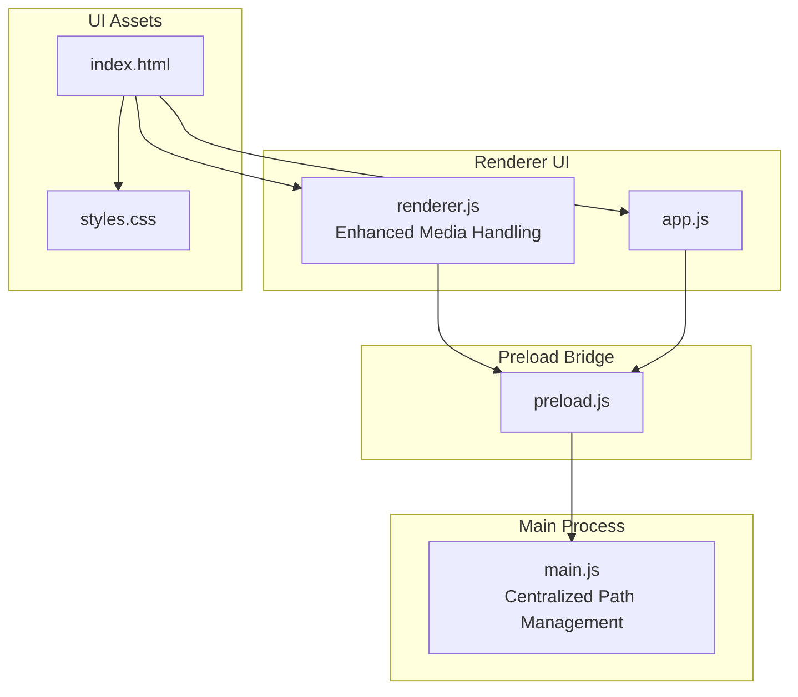
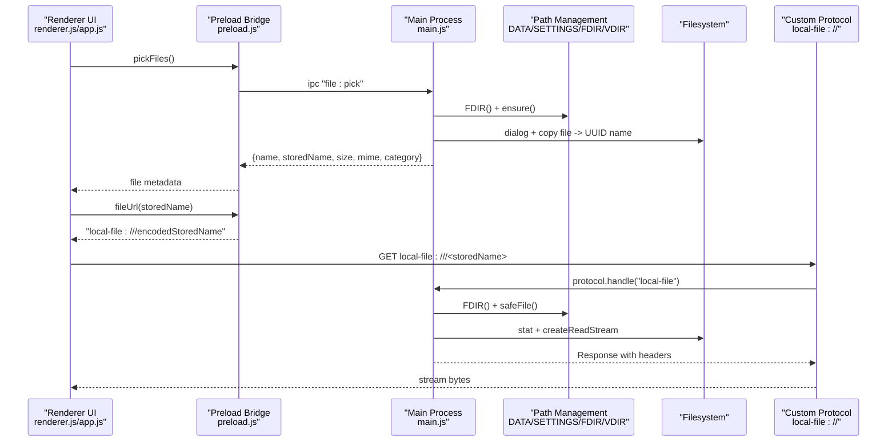
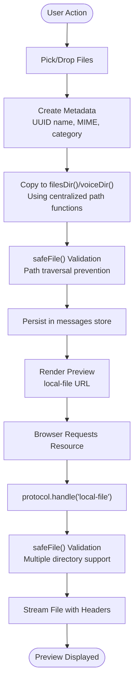
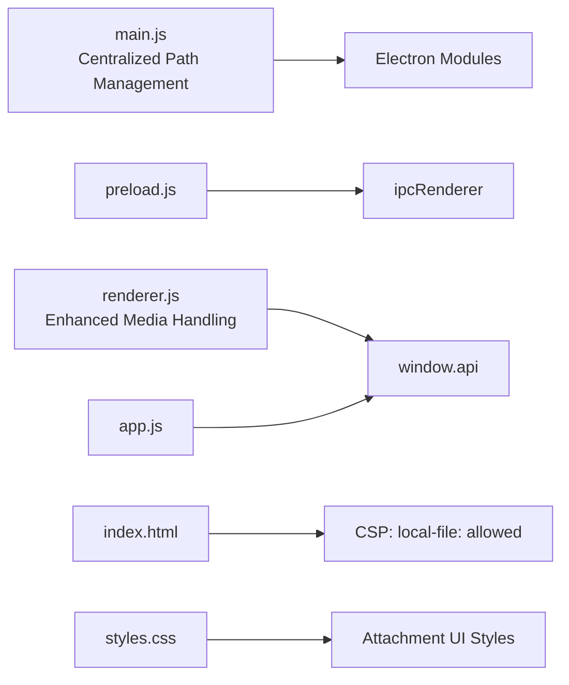

# File Management System

<cite>
**Referenced Files in This Document**
- [main.js](file://main.js)
- [preload.js](file://preload.js)
- [renderer.js](file://renderer.js)
- [app.js](file://app.js)
- [index.html](file://index.html)
- [styles.css](file://styles.css)
- [package.json](file://package.json)
</cite>

## Update Summary
**Changes Made**
- Updated centralized path management functions (DATA(), SETTINGS(), FDIR(), VDIR())
- Enhanced dedicated storage functions (storeFile(), safeFile()) with improved security
- Added comprehensive voice recording support with WebM format
- Improved category-based rendering and media handling
- Enhanced security with proper path validation and traversal prevention
- Better organization and code structure

## Table of Contents
1. [Introduction](#introduction)
2. [Project Structure](#project-structure)
3. [Core Components](#core-components)
4. [Architecture Overview](#architecture-overview)
5. [Detailed Component Analysis](#detailed-component-analysis)
6. [Dependency Analysis](#dependency-analysis)
7. [Performance Considerations](#performance-considerations)
8. [Troubleshooting Guide](#troubleshooting-guide)
9. [Conclusion](#conclusion)

## Introduction
This document explains the enhanced file management subsystem of the application, focusing on secure storage and retrieval of user files. The system uses UUID-based naming for stored files, MIME type detection, category-based organization (image, video, audio, pdf, file), and a custom protocol to serve files securely without exposing the underlying filesystem. It also covers supported file types, preview generation for images/audio/video, drag-and-drop functionality, voice recording with WebM format, and the complete lifecycle from upload through storage to retrieval. Security measures against path traversal are detailed, along with performance considerations for large files.

## Project Structure
The file management subsystem spans the main process, preload bridge, renderer UI, and HTML/CSS assets:
- Main process: secure file operations, custom protocol handler, IPC endpoints, centralized path management
- Preload bridge: exposes safe APIs to the renderer
- Renderer UI: file selection, drag-and-drop, previews, voice recording, and actions
- HTML/CSS: content security policy and attachment UI styles

**Diagram sources**
- [main.js:15-18](file://main.js#L15-L18)
- [preload.js:1-17](file://preload.js#L1-L17)
- [renderer.js:1-723](file://renderer.js#L1-L723)
- [app.js:1-239](file://app.js#L1-L239)
- [index.html:1-232](file://index.html#L1-L232)
- [styles.css:1-293](file://styles.css#L1-L293)

**Section sources**
- [main.js:15-18](file://main.js#L15-L18)
- [preload.js:1-17](file://preload.js#L1-L17)
- [renderer.js:1-723](file://renderer.js#L1-L723)
- [app.js:1-239](file://app.js#L1-L239)
- [index.html:1-232](file://index.html#L1-L232)
- [styles.css:1-293](file://styles.css#L1-L293)

## Core Components
- Centralized path management functions (DATA(), SETTINGS(), FDIR(), VDIR())
- Secure storage paths and directories
- UUID-based naming and metadata creation
- MIME type mapping and category classification
- Custom protocol handler for secure serving
- IPC endpoints for file operations
- Voice recording support with WebM format
- Renderer-side file handling and previews
- Drag-and-drop integration
- Content Security Policy configuration

Key responsibilities:
- main.js: centralized path management, directory setup, safe path resolution, MIME/category mapping, protocol handler, IPC handlers
- preload.js: expose safe API surface to renderer
- renderer.js/app.js: file pickers, drag-and-drop, preview rendering, voice recording, open/reveal actions
- index.html: CSP allowing local-file scheme for media and images
- styles.css: attachment UI styling

**Section sources**
- [main.js:15-18](file://main.js#L15-L18)
- [main.js:40-45](file://main.js#L40-L45)
- [main.js:54-61](file://main.js#L54-L61)
- [main.js:99-109](file://main.js#L99-L109)
- [preload.js:3-16](file://preload.js#L3-L16)
- [renderer.js:175-219](file://renderer.js#L175-L219)
- [renderer.js:516-557](file://renderer.js#L516-L557)
- [app.js:54-99](file://app.js#L54-L99)
- [index.html:6](file://index.html#L6)
- [styles.css:244-258](file://styles.css#L244-L258)

## Architecture Overview
The enhanced file subsystem follows a layered architecture with centralized path management:
- Renderer UI triggers file operations via window.api
- Preload bridge forwards calls to main process via IPC
- Main process performs secure operations using centralized path functions and serves files via a custom protocol
- Renderer constructs URLs using the custom protocol to render previews safely

**Diagram sources**
- [main.js:15-18](file://main.js#L15-L18)
- [main.js:40-45](file://main.js#L40-L45)
- [main.js:54-61](file://main.js#L54-L61)
- [main.js:139-147](file://main.js#L139-L147)
- [preload.js:8-15](file://preload.js#L8-L15)
- [renderer.js:175-219](file://renderer.js#L175-L219)

## Detailed Component Analysis

### Centralized Path Management Functions
**Updated** Enhanced with centralized path management for better organization and maintainability.

- DATA(): Returns path to messages.json in app userData directory
- SETTINGS(): Returns path to settings.json in app userData directory  
- FDIR(): Returns path to files directory in app userData directory
- VDIR(): Returns path to voice directory in app userData directory
- ensure(): Creates required directories recursively using FDIR() and VDIR()

Security implications:
- All paths are resolved within the app's userData directory
- Prevents access to arbitrary filesystem locations
- Centralized management ensures consistent path handling throughout the application

**Section sources**
- [main.js:15-18](file://main.js#L15-L18)
- [main.js:20-23](file://main.js#L20-L23)

### Enhanced Secure Storage and Path Resolution
**Updated** Improved security with dedicated safeFile() function and better path validation.

- safeFile(name, dirFn):
  - Validates input is a non-empty string
  - Rejects names containing slashes, backslashes, or ".." sequences
  - Normalizes paths and ensures resolved path is within allowed directory roots
  - Uses provided directory function (FDIR or VDIR) for path resolution
- Directory initialization:
  - ensure() creates both filesDir() and voiceDir() recursively

Security improvements:
- Comprehensive path traversal prevention by rejecting dangerous characters
- Root containment enforcement prevents accessing files outside allowed directories
- Separate validation for different directory types (files vs voice)

**Section sources**
- [main.js:40-45](file://main.js#L40-L45)
- [main.js:20-23](file://main.js#L20-L23)

### Enhanced UUID-Based Naming and Metadata Creation
**Updated** Streamlined storage functions with better error handling and metadata management.

- storeFile(fp):
  - Gets file statistics and extracts extension
  - Generates UUID filename with original extension preserved
  - Copies selected file into filesDir() using centralized path management
  - Returns comprehensive metadata: original name, storedName, size, mime, category
- saveCanvas(dataUrl):
  - Decodes base64 PNG data and writes to filesDir() with UUID name
  - Returns image metadata with timestamp-based naming
- saveVoice(base64Data):
  - **New** Decodes base64 WebM audio data and writes to voiceDir() with UUID name
  - Returns audio metadata with timestamp-based naming and WebM format

Complexity improvements:
- Centralized file copying logic reduces code duplication
- Better error handling with try-catch blocks
- Consistent metadata structure across all file types

**Section sources**
- [main.js:54-61](file://main.js#L54-L61)
- [main.js:78-88](file://main.js#L78-L88)
- [main.js:99-109](file://main.js#L99-L109)

### Enhanced MIME Type Detection and Category Classification
**Updated** Expanded MIME type support and improved category classification.

- mimeOf(n):
  - Maps file extensions to MIME types with comprehensive support
  - Defaults to application/octet-stream for unknown types
- catOf(m):
  - Classifies into image, video, audio, or generic file categories
  - Supports new WebM audio format for voice recordings

Supported MIME types include:
- Images: PNG, JPG, JPEG, GIF, WebP
- Videos: MP4, WebM, MOV
- Audio: MP3, WAV, OGG, WebM (voice recordings)
- Documents: PDF, TXT, JSON, ZIP

**Section sources**
- [main.js:47-52](file://main.js#L47-L52)

### Custom Protocol Handler: local-file://
**Updated** Enhanced with support for multiple directory types and improved error handling.

- registerProtocol():
  - Registers "local-file" scheme with privileges enabling standard, secure, streaming, and fetch API support
- protocol.handle("local-file"):
  - Decodes storedName from URL pathname
  - Resolves safe path via safeFile() with both FDIR and VDIR support
  - Returns 404 if file not found or path invalid
  - Streams file content with correct content-type and content-length

Security enhancements:
- All requests pass through safeFile() validation, preventing traversal attacks
- Support for both files and voice directories
- Streaming avoids loading entire files into memory

**Section sources**
- [main.js:7-9](file://main.js#L7-L9)
- [main.js:139-147](file://main.js#L139-L147)

### Enhanced IPC Endpoints for File Operations
**Updated** Improved error handling and expanded functionality.

- file:pick:
  - Opens native file picker, ensures directories exist, returns array of file metadata
- file:open:
  - Opens file with system shell after safeFile() validation for both FDIR and VDIR
- file:reveal:
  - Reveals file in folder via system shell after safeFile() validation for both FDIR and VDIR
- file:saveCanvas:
  - Saves canvas data as PNG with UUID name to filesDir()
- voice:save:
  - **New** Saves recorded audio as WebM with UUID name to voiceDir()
  - Includes minimum duration validation (rejects recordings < 1000 bytes)

Error handling improvements:
- Canceled dialogs return empty arrays
- Invalid base64 results in null responses
- File operation failures handled gracefully with fallback values

**Section sources**
- [main.js:63-116](file://main.js#L63-L116)

### Enhanced Renderer-Side File Handling and Previews
**Updated** Improved category-based rendering and comprehensive media support.

- buildFile(file):
  - Uses api.fileUrl(storedName) to build local-file URL
  - Renders img/video/audio elements based on category with appropriate styling
  - Provides Open and Show buttons invoking openFile/revealFile
  - Enhanced visual presentation with responsive design
- app.js renderFile:
  - Similar logic for legacy UI with category-based rendering

CSP alignment:
- index.html allows local-file: for img-src and media-src, enabling previews

**Section sources**
- [renderer.js:175-219](file://renderer.js#L175-L219)
- [app.js:54-99](file://app.js#L54-L99)
- [index.html:6](file://index.html#L6)

### Enhanced Drag-and-Drop Functionality
**Updated** Improved file handling and metadata creation.

- Chat panel listens for dragenter/dragleave/dragover/drop events
- dropzone overlay indicates active drag state with visual feedback
- On drop, iterates files and creates metadata with UUID names and proper categorization
- Supports multiple files with automatic MIME type detection

User experience improvements:
- Visual feedback via dashed border overlay
- Supports multiple files with batch processing
- Automatic category detection based on file.type

**Section sources**
- [renderer.js:493-514](file://renderer.js#L493-L514)
- [styles.css:172-174](file://styles.css#L172-L174)

### New Voice Recording Support
**New** Comprehensive voice recording functionality with WebM format support.

- Voice recording implementation:
  - Uses MediaRecorder API with audio/webm format
  - Real-time recording timer display
  - Cancel functionality during recording
  - Minimum duration validation (rejects recordings < 1 second)
- Recording interface:
  - Visual recording indicator with pulsing red dot
  - Live timer showing recording duration
  - Cancel button to abort recording
  - Auto-stop when microphone access denied

Storage and playback:
- Recorded audio saved to voiceDir() with UUID naming
- WebM format for optimal browser compatibility
- Audio player controls for playback
- Integration with existing message system

**Section sources**
- [renderer.js:516-557](file://renderer.js#L516-L557)
- [renderer.js:559-566](file://renderer.js#L559-L566)
- [main.js:99-109](file://main.js#L99-L109)

### Enhanced File Lifecycle
**Updated** Improved flow with centralized path management and enhanced security.

1. Upload/Pick:
   - User selects files via dialog or drags into chat
   - Renderer prepares metadata (UUID name, MIME, category)
2. Storage:
   - Main process copies file to filesDir() or voiceDir() using centralized path functions
   - Enhanced security validation with safeFile() function
   - Metadata persisted in messages store
3. Retrieval:
   - Renderer builds local-file URL via api.fileUrl
   - Browser requests resource; protocol handler streams file safely
4. Actions:
   - Open: launches external app via shell.openPath with path validation
   - Show: reveals file in OS file manager via shell.showItemInFolder with path validation

**Diagram sources**
- [main.js:54-61](file://main.js#L54-L61)
- [main.js:40-45](file://main.js#L40-L45)
- [main.js:139-147](file://main.js#L139-L147)
- [renderer.js:175-219](file://renderer.js#L175-L219)

## Dependency Analysis
- main.js depends on Electron modules: app, BrowserWindow, ipcMain, dialog, shell, protocol, Notification, nativeTheme, path, fs, crypto, Readable
- preload.js depends on contextBridge and ipcRenderer
- renderer.js/app.js depend on window.api exposed by preload.js
- index.html defines CSP allowing local-file: for images/media
- package.json configures Electron entry point and build settings

**Diagram sources**
- [main.js:1-5](file://main.js#L1-L5)
- [preload.js:1-2](file://preload.js#L1-L2)
- [index.html:6](file://index.html#L6)
- [package.json:5](file://package.json#L5)

**Section sources**
- [main.js:1-5](file://main.js#L1-L5)
- [preload.js:1-2](file://preload.js#L1-L2)
- [index.html:6](file://index.html#L6)
- [package.json:5](file://package.json#L5)

## Performance Considerations
- Large file copying:
  - copyFileSync loads entire file into memory; consider streaming copy for very large files
- Protocol streaming:
  - protocol.handle uses Readable.toWeb(fs.createReadStream(...)) to stream responses efficiently
- Base64 conversions:
  - Drag-and-drop path reads ArrayBuffer and encodes to base64; avoid unnecessary conversions when possible
- Voice recording:
  - WebM format provides good compression for audio recordings
  - Real-time recording uses efficient chunk-based data collection
- Rendering previews:
  - Use lazy loading for large images/videos; limit thumbnail sizes where applicable
- Memory usage:
  - Avoid storing large base64 strings in state; prefer references to stored files
- Centralized path management:
  - Reduces path calculation overhead by reusing common path functions

## Troubleshooting Guide
Common issues and strategies:
- Path traversal attempts:
  - Ensure storedName does not contain "../", "/", or "\"; safeFile() rejects such inputs
- Missing files:
  - protocol.handle returns 404 if file does not exist; verify safeFile() resolves correctly
- MIME mismatch:
  - mimeOf maps by extension; ensure storedName has correct extension
- CSP blocking resources:
  - index.html must allow local-file: for img-src and media-src
- Drag-and-drop failures:
  - Verify dropzone visibility and event handling; check that metadata creation produces valid data
- Voice recording issues:
  - Check microphone permissions and browser support for MediaRecorder API
  - Verify WebM format compatibility across target browsers
- Path resolution problems:
  - Ensure centralized path functions (DATA, SETTINGS, FDIR, VDIR) return valid paths
  - Verify ensure() creates required directories before file operations

**Section sources**
- [main.js:40-45](file://main.js#L40-L45)
- [main.js:139-147](file://main.js#L139-L147)
- [index.html:6](file://index.html#L6)
- [renderer.js:493-514](file://renderer.js#L493-L514)
- [renderer.js:516-557](file://renderer.js#L516-L557)
- [main.js:15-18](file://main.js#L15-L18)

## Conclusion
The enhanced file management subsystem implements a secure, category-aware approach to storing and serving user files with centralized path management. UUID-based naming prevents collisions and obfuscates original filenames, while MIME detection and category classification enable appropriate previews. The custom local-file:// protocol, combined with strict path validation through safeFile(), ensures safe file serving without exposing the filesystem. The addition of voice recording support with WebM format provides comprehensive media handling capabilities. Drag-and-drop and rich UI interactions provide a smooth user experience. The centralized path management functions (DATA, SETTINGS, FDIR, VDIR) improve code organization and maintainability. For improved scalability with large files, consider streaming copy operations and optimizing base64 handling.