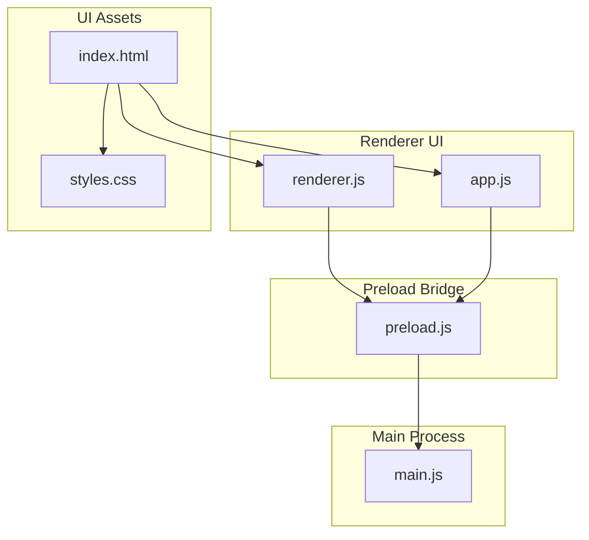
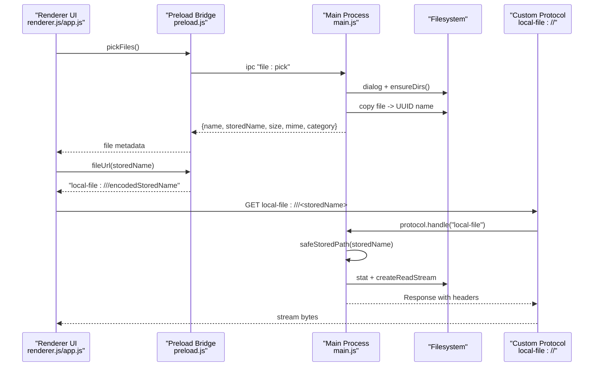
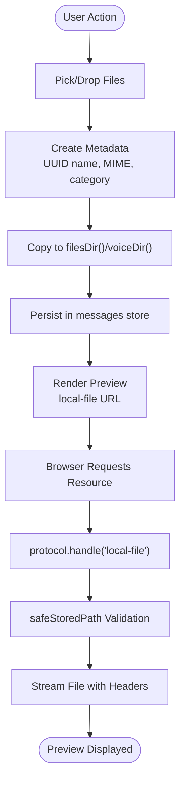
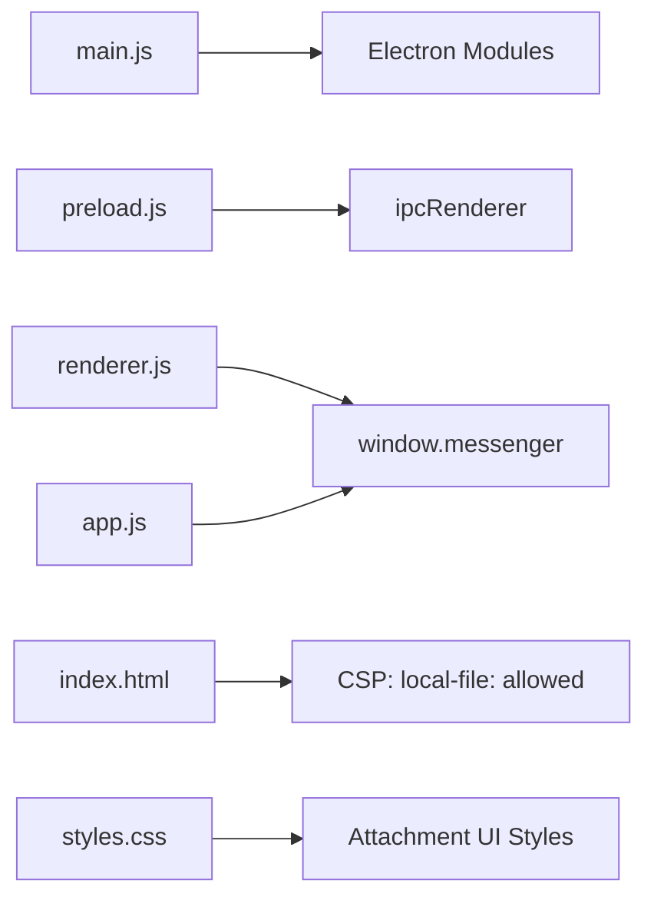

# File Management System

<cite>
**Referenced Files in This Document**
- [main.js](file://main.js)
- [preload.js](file://preload.js)
- [renderer.js](file://renderer.js)
- [app.js](file://app.js)
- [index.html](file://index.html)
- [styles.css](file://styles.css)
- [package.json](file://package.json)
</cite>

## Table of Contents
1. [Introduction](#introduction)
2. [Project Structure](#project-structure)
3. [Core Components](#core-components)
4. [Architecture Overview](#architecture-overview)
5. [Detailed Component Analysis](#detailed-component-analysis)
6. [Dependency Analysis](#dependency-analysis)
7. [Performance Considerations](#performance-considerations)
8. [Troubleshooting Guide](#troubleshooting-guide)
9. [Conclusion](#conclusion)

## Introduction
This document explains the file management subsystem of the application, focusing on secure storage and retrieval of user files. The system uses UUID-based naming for stored files, MIME type detection, category-based organization (image, video, audio, pdf, file), and a custom protocol to serve files securely without exposing the underlying filesystem. It also covers supported file types, preview generation for images/audio/video, drag-and-drop functionality, and the complete lifecycle from upload through storage to retrieval. Security measures against path traversal are detailed, along with performance considerations for large files.

## Project Structure
The file management subsystem spans the main process, preload bridge, renderer UI, and HTML/CSS assets:
- Main process: secure file operations, custom protocol handler, IPC endpoints
- Preload bridge: exposes safe APIs to the renderer
- Renderer UI: file selection, drag-and-drop, previews, and actions
- HTML/CSS: content security policy and attachment UI styles

**Diagram sources**
- [main.js:1-176](file://main.js#L1-L176)
- [preload.js:1-28](file://preload.js#L1-L28)
- [renderer.js:1-800](file://renderer.js#L1-L800)
- [app.js:1-239](file://app.js#L1-L239)
- [index.html:1-303](file://index.html#L1-L303)
- [styles.css:1-274](file://styles.css#L1-L274)

**Section sources**
- [main.js:1-176](file://main.js#L1-L176)
- [preload.js:1-28](file://preload.js#L1-L28)
- [renderer.js:1-800](file://renderer.js#L1-L800)
- [app.js:1-239](file://app.js#L1-L239)
- [index.html:1-303](file://index.html#L1-L303)
- [styles.css:1-274](file://styles.css#L1-L274)

## Core Components
- Secure storage paths and directories
- UUID-based naming and metadata creation
- MIME type mapping and category classification
- Custom protocol handler for secure serving
- IPC endpoints for file operations
- Renderer-side file handling and previews
- Drag-and-drop integration
- Content Security Policy configuration

Key responsibilities:
- main.js: directory setup, safe path resolution, MIME/category mapping, protocol handler, IPC handlers
- preload.js: expose safe API surface to renderer
- renderer.js/app.js: file pickers, drag-and-drop, preview rendering, open/reveal actions
- index.html: CSP allowing local-file scheme for media and images
- styles.css: attachment UI styling

**Section sources**
- [main.js:17-89](file://main.js#L17-L89)
- [main.js:91-101](file://main.js#L91-L101)
- [main.js:127-158](file://main.js#L127-L158)
- [preload.js:3-16](file://preload.js#L3-L16)
- [renderer.js:123-148](file://renderer.js#L123-L148)
- [renderer.js:312-354](file://renderer.js#L312-L354)
- [app.js:54-99](file://app.js#L54-L99)
- [index.html:6](file://index.html#L6)
- [styles.css:212-231](file://styles.css#L212-L231)

## Architecture Overview
The file subsystem follows a layered architecture:
- Renderer UI triggers file operations via window.messenger
- Preload bridge forwards calls to main process via IPC
- Main process performs secure operations and serves files via a custom protocol
- Renderer constructs URLs using the custom protocol to render previews safely

**Diagram sources**
- [main.js:127-132](file://main.js#L127-L132)
- [main.js:82-89](file://main.js#L82-L89)
- [main.js:91-101](file://main.js#L91-L101)
- [preload.js:8-15](file://preload.js#L8-L15)
- [renderer.js:312-354](file://renderer.js#L312-L354)
- [app.js:54-99](file://app.js#L54-L99)

## Detailed Component Analysis

### Secure Storage and Path Resolution
- Directories:
  - filesDir(): app userData/files
  - voiceDir(): app userData/voice
- safeStoredPath(storedName):
  - Rejects names containing slashes, backslashes, or ".."
  - Normalizes and ensures resolved path is within allowed roots
- Directory initialization:
  - ensureDirs() creates required directories recursively

Security implications:
- Prevents path traversal by rejecting dangerous characters and enforcing root containment
- Only allows access to known directories

**Section sources**
- [main.js:17-23](file://main.js#L17-L23)
- [main.js:53-62](file://main.js#L53-L62)

### UUID-Based Naming and Metadata Creation
- storedMeta(filePath):
  - Generates a UUID filename with original extension
  - Copies selected file into filesDir()
  - Returns metadata: original name, storedName, size, mime, category
- saveCanvas(dataUrl):
  - Decodes base64 PNG data and writes to filesDir() with UUID name
  - Returns image metadata
- saveVoice(base64Data):
  - Decodes base64 WebM audio and writes to voiceDir() with UUID name
  - Returns audio metadata

Complexity:
- Copying files is O(n) in file size; memory usage depends on implementation (copyFileSync uses buffers)

**Section sources**
- [main.js:82-89](file://main.js#L82-L89)
- [main.js:133-141](file://main.js#L133-L141)
- [main.js:150-158](file://main.js#L150-L158)

### MIME Type Detection and Category Classification
- mimeFor(name):
  - Maps file extensions to MIME types
  - Defaults to application/octet-stream for unknown types
- categoryFor(mime):
  - Classifies into image, video, audio, pdf, or generic file

Supported MIME types include common image, video, audio, PDF, text, JSON, and ZIP formats.

**Section sources**
- [main.js:64-72](file://main.js#L64-L72)
- [main.js:74-80](file://main.js#L74-L80)

### Custom Protocol Handler: local-file://
- registerProtocol():
  - Registers "local-file" scheme with privileges enabling standard, secure, streaming, and fetch API support
- protocol.handle("local-file"):
  - Decodes storedName from URL pathname
  - Resolves safe path via safeStoredPath
  - Returns 404 if not found
  - Streams file content with correct content-type and content-length

Security implications:
- All requests pass through safeStoredPath, preventing traversal
- Streaming avoids loading entire files into memory

**Section sources**
- [main.js:7-9](file://main.js#L7-L9)
- [main.js:91-101](file://main.js#L91-L101)

### IPC Endpoints for File Operations
- file:pick:
  - Opens native file picker, ensures directories exist, returns array of file metadata
- file:open:
  - Opens file with system shell after safe path validation
- file:reveal:
  - Reveals file in folder via system shell after safe path validation
- file:saveCanvas:
  - Saves canvas data as PNG with UUID name
- voice:save:
  - Saves recorded audio as WebM with UUID name

Error handling:
- Canceled dialogs return empty arrays
- Invalid base64 results in null responses

**Section sources**
- [main.js:127-158](file://main.js#L127-L158)

### Renderer-Side File Handling and Previews
- writeTempAndStore(file) (drag-and-drop):
  - Reads file ArrayBuffer, encodes to base64, constructs data URL
  - Derives storedName with UUID and original extension
  - Determines category based on file.type
- renderFile(file):
  - Uses api.fileUrl(storedName) to build local-file URL
  - Renders img/video/audio elements based on category
  - Provides Open and Show buttons invoking openFile/revealFile
- app.js renderFile:
  - Similar logic for legacy UI

CSP alignment:
- index.html allows local-file: for img-src and media-src, enabling previews

**Section sources**
- [renderer.js:123-148](file://renderer.js#L123-L148)
- [renderer.js:312-354](file://renderer.js#L312-L354)
- [app.js:54-99](file://app.js#L54-L99)
- [index.html:6](file://index.html#L6)

### Drag-and-Drop Functionality
- Chat panel listens for dragenter/dragleave/dragover/drop events
- dropzone overlay indicates active drag state
- On drop, iterates files, converts each via writeTempAndStore, and adds message with attachments

User experience:
- Visual feedback via dashed border overlay
- Supports multiple files

**Section sources**
- [renderer.js:123-138](file://renderer.js#L123-L138)
- [styles.css:230-231](file://styles.css#L230-L231)

### File Lifecycle
1. Upload/Pick:
   - User selects files via dialog or drags into chat
   - Renderer prepares metadata (UUID name, MIME, category)
2. Storage:
   - Main process copies file to filesDir() or voiceDir() with UUID name
   - Metadata persisted in messages store
3. Retrieval:
   - Renderer builds local-file URL via api.fileUrl
   - Browser requests resource; protocol handler streams file safely
4. Actions:
   - Open: launches external app via shell.openPath
   - Show: reveals file in OS file manager via shell.showItemInFolder

**Diagram sources**
- [main.js:82-89](file://main.js#L82-L89)
- [main.js:91-101](file://main.js#L91-L101)
- [renderer.js:312-354](file://renderer.js#L312-L354)

## Dependency Analysis
- main.js depends on Electron modules: app, BrowserWindow, ipcMain, dialog, shell, protocol, Notification, nativeTheme, path, fs, crypto, Readable
- preload.js depends on contextBridge and ipcRenderer
- renderer.js/app.js depend on window.messenger exposed by preload.js
- index.html defines CSP allowing local-file: for images/media
- package.json configures Electron entry point and build settings

**Diagram sources**
- [main.js:1-6](file://main.js#L1-L6)
- [preload.js:1-2](file://preload.js#L1-L2)
- [index.html:6](file://index.html#L6)
- [package.json:5](file://package.json#L5)

**Section sources**
- [main.js:1-6](file://main.js#L1-L6)
- [preload.js:1-2](file://preload.js#L1-L2)
- [index.html:6](file://index.html#L6)
- [package.json:5](file://package.json#L5)

## Performance Considerations
- Large file copying:
  - copyFileSync loads entire file into memory; consider streaming copy for very large files
- Protocol streaming:
  - protocol.handle uses Readable.toWeb(fs.createReadStream(...)) to stream responses efficiently
- Base64 conversions:
  - Drag-and-drop path reads ArrayBuffer and encodes to base64; avoid unnecessary conversions when possible
- Rendering previews:
  - Use lazy loading for large images/videos; limit thumbnail sizes where applicable
- Memory usage:
  - Avoid storing large base64 strings in state; prefer references to stored files

[No sources needed since this section provides general guidance]

## Troubleshooting Guide
Common issues and strategies:
- Path traversal attempts:
  - Ensure storedName does not contain "../", "/", or "\"; safeStoredPath rejects such inputs
- Missing files:
  - protocol.handle returns 404 if file does not exist; verify safeStoredPath resolves correctly
- MIME mismatch:
  - mimeFor maps by extension; ensure storedName has correct extension
- CSP blocking resources:
  - index.html must allow local-file: for img-src and media-src
- Drag-and-drop failures:
  - Verify dropzone visibility and event handling; check that writeTempAndStore produces valid metadata

**Section sources**
- [main.js:53-62](file://main.js#L53-L62)
- [main.js:91-101](file://main.js#L91-L101)
- [index.html:6](file://index.html#L6)
- [renderer.js:123-148](file://renderer.js#L123-L148)

## Conclusion
The file management subsystem implements a secure, category-aware approach to storing and serving user files. UUID-based naming prevents collisions and obfuscates original filenames, while MIME detection and category classification enable appropriate previews. The custom local-file:// protocol, combined with strict path validation, ensures safe file serving without exposing the filesystem. Drag-and-drop and rich UI interactions provide a smooth user experience. For improved scalability with large files, consider streaming copy operations and optimizing base64 handling.