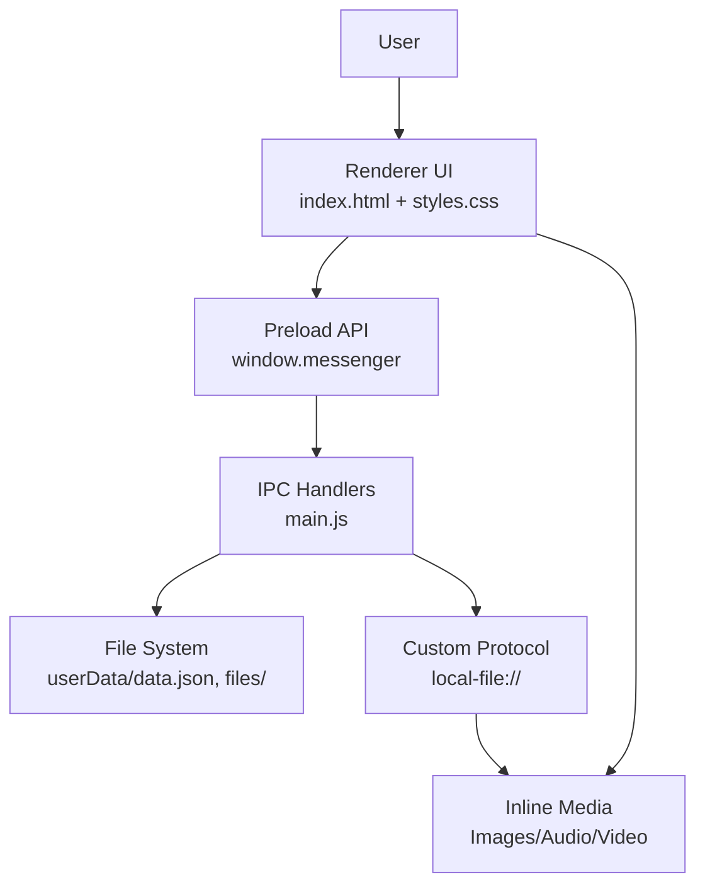
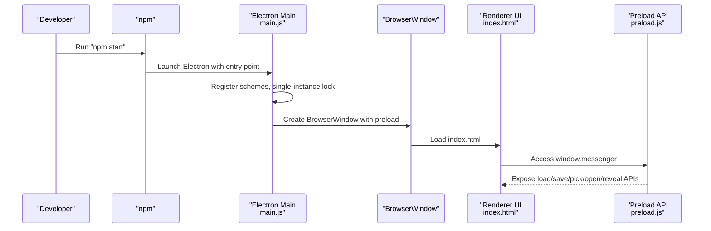
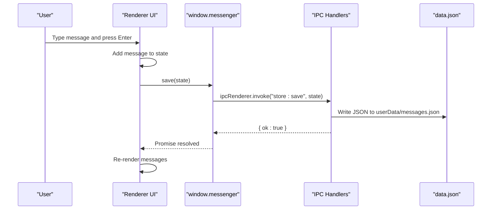
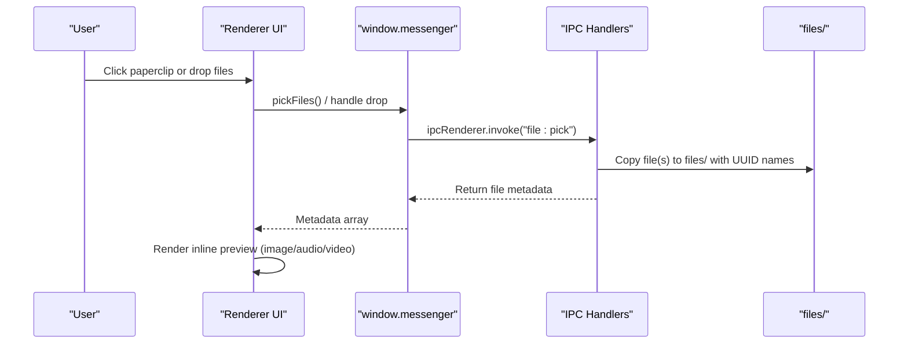
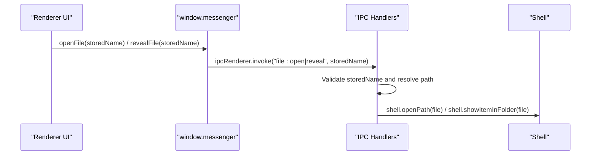
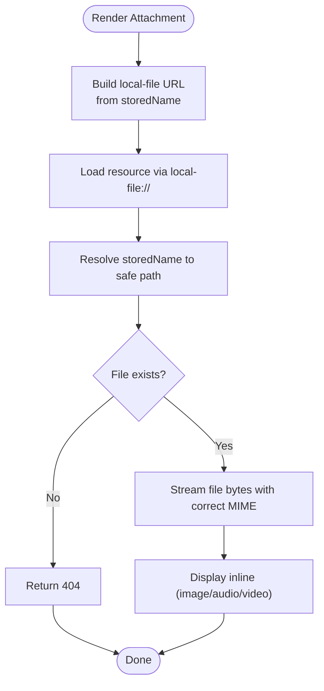
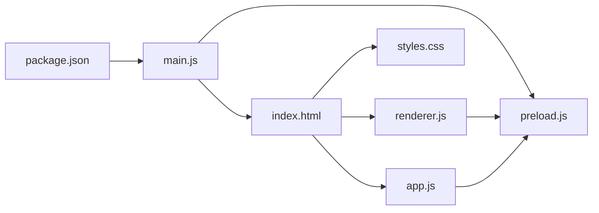

# Getting Started

<cite>
**Referenced Files in This Document**
- [README.md](file://README.md)
- [package.json](file://package.json)
- [main.js](file://main.js)
- [preload.js](file://preload.js)
- [index.html](file://index.html)
- [app.js](file://app.js)
- [renderer.js](file://renderer.js)
- [styles.css](file://styles.css)
</cite>

## Table of Contents
1. [Introduction](#introduction)
2. [System Requirements](#system-requirements)
3. [Installation](#installation)
4. [First Launch](#first-launch)
5. [Quick Walkthrough](#quick-walkthrough)
6. [Where Your Data Lives](#where-your-data-lives)
7. [Architecture Overview](#architecture-overview)
8. [Troubleshooting](#troubleshooting)
9. [Next Steps](#next-steps)

## Introduction
Messenger is a private, offline-first desktop app styled like Facebook Messenger for personal note-taking and file management. It runs entirely on your machine with no server or account required. You can type notes to yourself, attach files (images, PDFs, audio, video, archives, code), and everything persists locally so it’s there when you reopen the app.

Key highlights:
- Private and offline: no network calls, no cloud storage
- File attachments via paperclip button or drag-and-drop
- Inline previews for images, audio, and video; other types open with your system’s default app
- Persistent local storage across sessions

**Section sources**
- [README.md:1-10](file://README.md#L1-L10)

## System Requirements
- Node.js version 18 or newer
- A modern OS supported by Electron (Windows/macOS/Linux)
- For voice notes: microphone access permission from your browser/runtime

These requirements are defined in the project configuration and enforced during installation.

**Section sources**
- [package.json:52-54](file://package.json#L52-L54)

## Installation
Follow these steps to install and run the app locally:

1. Open a terminal in the project folder:
   - Example path: D:\Code folder\Messenger
2. Install dependencies (this downloads Electron on first run):
   - npm install
3. Start the app:
   - npm start

Notes:
- The first npm install may take a minute as it downloads Electron (~90MB).
- After that, npm start launches quickly.

**Section sources**
- [README.md:28-38](file://README.md#L28-L38)
- [package.json:6-11](file://package.json#L6-L11)

## First Launch
After starting the app:
- You will see a chat-like interface with an input at the bottom.
- Type a message and press Enter to send it to yourself.
- Click the paperclip icon to attach one or more files, or simply drag files onto the chat area.
- Images show inline thumbnails; audio/video play in place; other file types display a card with an “Open” action.

You can also use the whiteboard to draw and send sketches as images.

**Section sources**
- [README.md:39-43](file://README.md#L39-L43)
- [index.html:120-138](file://index.html#L120-L138)
- [renderer.js:528-549](file://renderer.js#L528-L549)

## Quick Walkthrough
- Send a text note:
  - Type in the input field and press Enter.
- Attach files:
  - Click the paperclip icon to browse files, or drag and drop files directly into the chat.
- View and manage attachments:
  - Images appear inline; click to open in your system viewer.
  - Audio/video controls appear within the bubble.
  - Other files show a card with “Open” and “Show” actions.
- Use the whiteboard:
  - Open the whiteboard panel, draw, then send the drawing as an image attachment.
- Keyboard shortcuts:
  - Enter sends a message.
  - Escape dismisses menus and panels.
  - Ctrl/Cmd + F opens search inside the conversation.

**Section sources**
- [README.md:24-26](file://README.md#L24-L26)
- [renderer.js:641-651](file://renderer.js#L641-L651)
- [renderer.js:557-637](file://renderer.js#L557-L637)

## Where Your Data Lives
All your messages and settings are stored locally in your Electron user data directory. Attached files are saved under a dedicated subfolder. On Windows, this is typically:
- C:\Users\<you>\AppData\Roaming\messenger-self-chat\
  - data.json: all messages and metadata
  - files/: attached file contents (named with random IDs)

You can open this folder from the app using the menu option described in the README.

Security note:
- The renderer process has no direct Node.js access. All disk I/O goes through a secure IPC bridge exposed by the preload script.
- A custom protocol serves file bytes back to the UI without exposing filesystem paths.

**Section sources**
- [README.md:44-57](file://README.md#L44-L57)
- [main.js:14-23](file://main.js#L14-L23)
- [main.js:123-166](file://main.js#L123-L166)
- [preload.js:3-16](file://preload.js#L3-L16)
- [index.html:6](file://index.html#L6)

## Architecture Overview
The app uses Electron with a clear separation between processes:
- Main process: manages the window, file system access, and exposes a safe API via IPC.
- Preload script: bridges a minimal, secure API to the renderer.
- Renderer process: renders the UI, handles user interactions, and communicates with the main process over IPC.

**Diagram sources**
- [main.js:1-10](file://main.js#L1-L10)
- [main.js:91-101](file://main.js#L91-L101)
- [main.js:123-166](file://main.js#L123-L166)
- [preload.js:3-16](file://preload.js#L3-L16)
- [index.html:6](file://index.html#L6)

## Detailed Component Analysis

### Installation and Startup Flow
This sequence shows how npm start boots the app and loads the UI.

**Diagram sources**
- [package.json:6-11](file://package.json#L6-L11)
- [main.js:11-12](file://main.js#L11-L12)
- [main.js:103-121](file://main.js#L103-L121)
- [preload.js:3-16](file://preload.js#L3-L16)
- [index.html:6](file://index.html#L6)

### Sending a Message and Persisting Data
This flow covers typing a message, saving it, and rendering it in the UI.

**Diagram sources**
- [renderer.js:528-536](file://renderer.js#L528-L536)
- [renderer.js:357-368](file://renderer.js#L357-L368)
- [preload.js:3-7](file://preload.js#L3-L7)
- [main.js:123-126](file://main.js#L123-L126)
- [main.js:25-37](file://main.js#L25-L37)

### Attaching Files via Paperclip or Drag-and-Drop
This flow shows how files are selected, copied to the local files folder, and displayed inline.

**Diagram sources**
- [renderer.js:541-549](file://renderer.js#L541-L549)
- [renderer.js:128-148](file://renderer.js#L128-L148)
- [preload.js:8-11](file://preload.js#L8-L11)
- [main.js:127-132](file://main.js#L127-L132)
- [main.js:82-89](file://main.js#L82-L89)

### Opening and Revealing Files
When you click “Open” or “Show” on an attachment, the main process safely resolves the file path and interacts with the OS.

**Diagram sources**
- [renderer.js:344-350](file://renderer.js#L344-L350)
- [preload.js:10-11](file://preload.js#L10-L11)
- [main.js:142-149](file://main.js#L142-L149)
- [main.js:53-62](file://main.js#L53-L62)

### Rendering Attachments and Serving Files Safely
The renderer requests file content via a custom protocol, which the main process serves securely.

**Diagram sources**
- [preload.js:15](file://preload.js#L15)
- [main.js:91-101](file://main.js#L91-L101)
- [main.js:64-72](file://main.js#L64-L72)
- [renderer.js:312-354](file://renderer.js#L312-L354)

## Dependency Analysis
High-level dependency relationships:
- package.json defines scripts and Electron devDependencies.
- main.js initializes the Electron app, registers IPC handlers, and manages persistence.
- preload.js exposes a minimal API surface to the renderer.
- index.html provides the UI markup and CSP policy.
- renderer.js implements rich UI logic (messages, reactions, search, whiteboard).
- app.js contains a simpler UI implementation variant.
- styles.css applies the Messenger-style theme and responsive layout.

**Diagram sources**
- [package.json:1-11](file://package.json#L1-L11)
- [main.js:103-121](file://main.js#L103-L121)
- [preload.js:3-16](file://preload.js#L3-L16)
- [index.html:6](file://index.html#L6)

**Section sources**
- [package.json:1-11](file://package.json#L1-L11)
- [main.js:103-121](file://main.js#L103-L121)
- [preload.js:3-16](file://preload.js#L3-L16)
- [index.html:6](file://index.html#L6)
- [renderer.js:1-15](file://renderer.js#L1-L15)
- [app.js:1-10](file://app.js#L1-L10)
- [styles.css:1-14](file://styles.css#L1-L14)

## Performance Considerations
- Large attachments: The app copies files to a local folder and streams them via a custom protocol. Avoid extremely large media if you rely on inline playback.
- Rendering many messages: The renderer rebuilds the message list on changes. Keep conversations manageable or use search to navigate efficiently.
- Whiteboard canvas: Resizing preserves drawing content but can be heavy on low-end devices. Clear the canvas before sending to reduce payload size.

[No sources needed since this section provides general guidance]

## Troubleshooting
- Microphone not working for voice notes:
  - Ensure your OS grants microphone permissions to the app.
  - If denied, try again and accept the prompt.
- Files not opening:
  - Verify the file still exists in the local files folder.
  - Use “Show” to reveal the file location in your system explorer.
- App does not launch:
  - Confirm Node.js version is 18+.
  - Delete node_modules and package-lock.json, then re-run npm install and npm start.
- Data loss concerns:
  - Back up the userData folder periodically. Messages and settings are stored in JSON; files are stored under the files/ subfolder.

**Section sources**
- [README.md:70-79](file://README.md#L70-L79)
- [main.js:150-166](file://main.js#L150-L166)
- [main.js:142-149](file://main.js#L142-L149)
- [package.json:52-54](file://package.json#L52-L54)

## Next Steps
- Explore additional features:
  - Emoji picker, theme selection, dark mode toggle.
  - Pin messages, add reactions, edit/delete messages.
  - Search within conversations and sidebar.
- Customize appearance:
  - Choose accent themes and toggle dark mode from the settings panel.
- Backup your data:
  - Locate your userData folder and copy data.json and files/ to a safe location.

**Section sources**
- [README.md:11-26](file://README.md#L11-L26)
- [renderer.js:82-89](file://renderer.js#L82-L89)
- [renderer.js:404-428](file://renderer.js#L404-L428)
- [renderer.js:462-502](file://renderer.js#L462-L502)