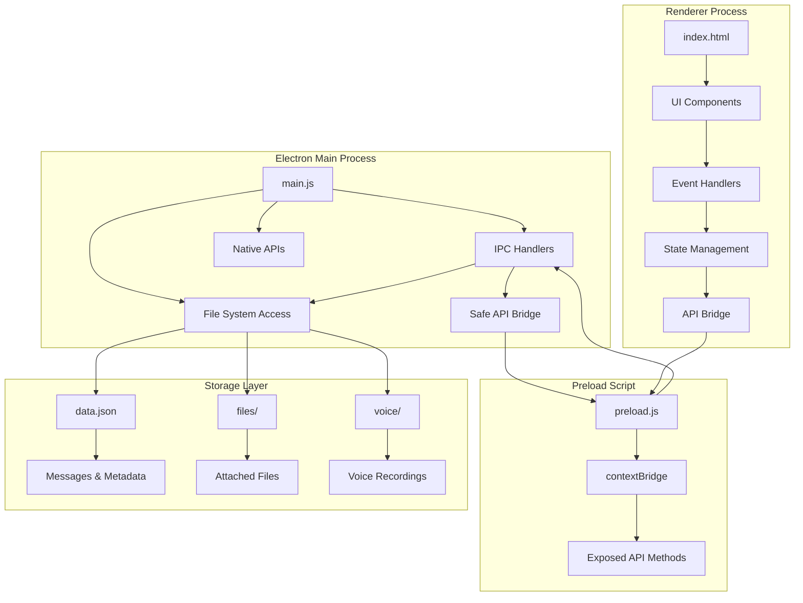

# Getting Started

<cite>
**Referenced Files in This Document**
- [README.md](file://README.md)
- [package.json](file://package.json)
- [main.js](file://main.js)
- [preload.js](file://preload.js)
- [index.html](file://index.html)
- [renderer.js](file://renderer.js)
- [styles.css](file://styles.css)
</cite>

## Update Summary
**Changes Made**
- Updated Introduction to reflect the new three-panel architecture and enhanced features
- Added comprehensive documentation for voice recording, whiteboard, emoji picker, and theme system
- Updated installation process with current Node.js requirements
- Enhanced quick walkthrough with new multi-panel interface navigation
- Added detailed feature descriptions for advanced functionality
- Updated architecture overview to reflect modern desktop application patterns
- Expanded troubleshooting section with new feature-related issues

## Table of Contents
1. [Introduction](#introduction)
2. [System Requirements](#system-requirements)
3. [Installation](#installation)
4. [First Launch](#first-launch)
5. [Three-Panel Interface Overview](#three-panel-interface-overview)
6. [Quick Walkthrough](#quick-walkthrough)
7. [Advanced Features](#advanced-features)
8. [Where Your Data Lives](#where-your-data-lives)
9. [Architecture Overview](#architecture-overview)
10. [Troubleshooting](#troubleshooting)
11. [Next Steps](#next-steps)

## Introduction
Messenger is a private, offline-first desktop app styled like Facebook Messenger for personal note-taking and file management. It runs entirely on your machine with no server or account required. The app features a modern three-panel interface with advanced capabilities including voice recording, drawing whiteboard, emoji picker, search functionality, and customizable themes.

Key highlights:
- **Private and offline**: No network calls, no cloud storage, everything stays on your device
- **Three-panel architecture**: Navigation rail, conversation sidebar, and main chat area
- **Rich media support**: Voice notes, images, videos, documents, and more
- **Creative tools**: Built-in whiteboard for sketches and drawings
- **Enhanced organization**: Search across conversations, pin important messages, add reactions
- **Customizable appearance**: Multiple color themes and dark/light mode options
- **File management**: Drag-and-drop attachments with inline previews

**Section sources**
- [README.md:1-10](file://README.md#L1-L10)
- [index.html:11-122](file://index.html#L11-L122)

## System Requirements
- **Node.js version 18 or newer** (required for modern Electron compatibility)
- **Modern operating system**: Windows 10+, macOS 10.15+, or Linux distributions supported by Electron
- **Microphone access**: Required for voice recording functionality
- **Minimum screen resolution**: 800x600 pixels (recommended 1200x800 for optimal experience)
- **RAM**: At least 2GB available memory
- **Storage**: Minimum 50MB free space for app installation and initial data

These requirements are defined in the project configuration and enforced during installation.

**Section sources**
- [package.json:52-54](file://package.json#L52-L54)
- [main.js:121-131](file://main.js#L121-L131)

## Installation
Follow these steps to install and run the app locally:

### Prerequisites
1. **Install Node.js**: Download and install Node.js version 18 or newer from [nodejs.org](https://nodejs.org/)
2. **Verify installation**: Open terminal/command prompt and run `node --version` to confirm version 18+

### Installation Steps
1. **Open terminal in project folder**:
   - Navigate to: `D:\Code folder\Messenger`
   - Or use your preferred terminal location

2. **Install dependencies** (downloads Electron and other packages):
   ```bash
   npm install
   ```

3. **Start the application**:
   ```bash
   npm start
   ```

### Installation Notes
- **First-time setup**: The initial `npm install` may take 1-2 minutes as it downloads Electron (~90MB) and builds native modules
- **Subsequent launches**: `npm start` typically launches within 2-3 seconds
- **Development mode**: Use `npm run dev` for development with hot reloading
- **Building distributables**: Use `npm run build` or `npm run dist` to create installer packages

**Section sources**
- [README.md:28-38](file://README.md#L28-L38)
- [package.json:6-11](file://package.json#L6-L11)

## First Launch
After starting the app, you'll see the modern three-panel interface:

### Initial Interface Elements
- **Left Rail**: Navigation buttons for different app sections
- **Sidebar**: Conversation list with search functionality
- **Main Chat Area**: Where your messages appear with composer at the bottom

### Basic Actions
- **Send a message**: Type in the input field and press Enter
- **Attach files**: Click the paperclip icon or drag files onto the chat area
- **Access settings**: Click the gear icon in the left rail
- **Toggle dark mode**: Click the moon icon in the left rail

The app automatically loads any existing data from previous sessions and applies your saved preferences.

**Section sources**
- [index.html:11-122](file://index.html#L11-L122)
- [renderer.js:705-723](file://renderer.js#L705-L723)

## Three-Panel Interface Overview
The Messenger app uses a modern three-panel layout designed for productivity and ease of use:

### Left Navigation Rail
- **Width**: Fixed at 64px for minimal screen real estate usage
- **Functions**: App-wide navigation and quick actions
- **Buttons**: Chats view, dark mode toggle, settings panel
- **Design**: Dark background (#1c1e21) with hover effects and active state indicators

### Conversation Sidebar
- **Width**: 340px (collapsible on mobile devices)
- **Features**: 
  - Search bar for filtering conversations
  - Conversation list with last message preview
  - New conversation creation button
  - Active conversation highlighting
- **Search**: Real-time filtering of conversation names and content

### Main Chat Panel
- **Layout**: Flexible width with maximum constraints for readability
- **Components**:
  - Chat header with user info and action buttons
  - Message area with day dividers and pinned messages
  - Search bar for in-conversation searching
  - Composer with attachment, emoji, voice, and send buttons
- **Responsive**: Adapts to different screen sizes and orientations

**Section sources**
- [index.html:11-122](file://index.html#L11-L122)
- [styles.css:31-100](file://styles.css#L31-L100)

## Quick Walkthrough
Master the essential features to get started quickly:

### Sending Messages
- **Text messages**: Type in the composer input and press Enter
- **Rich text**: Messages support line breaks and basic formatting
- **Auto-save**: All messages are automatically saved to local storage
- **Edit capability**: Right-click any message to edit its content

### File Attachments
- **Paperclip button**: Click 📎 to browse and select multiple files
- **Drag-and-drop**: Simply drag files from your desktop into the chat area
- **Inline previews**: Images show thumbnails; audio/video play directly in bubbles
- **File management**: Each attachment shows "Open" and "Show" actions

### Voice Recording
- **Record button**: Click the microphone icon in the composer
- **Recording interface**: Red recording bar appears with timer and cancel option
- **Quality**: Records in WebM format with automatic compression
- **Playback**: Audio files play inline with standard controls

### Whiteboard Drawing
- **Access**: Click the whiteboard icon in the chat header
- **Tools**: Pen tool with adjustable size and eraser functionality
- **Colors**: Full color picker for custom drawing colors
- **Export**: Send drawings as PNG images directly to chat

### Emoji Picker
- **Access**: Click the smiley face icon in the composer
- **Categories**: Organized grid of popular emojis with search functionality
- **Insertion**: Click any emoji to insert it at cursor position
- **Filtering**: Type in search box to filter specific emojis

### Theme Customization
- **Theme picker**: Click the palette icon in chat header
- **Options**: Blue, purple, pink, green, orange, red, teal, and gradient themes
- **Dark mode**: Toggle between light and dark appearances
- **Persistence**: Theme preferences save automatically

**Section sources**
- [README.md:11-26](file://README.md#L11-L26)
- [renderer.js:404-452](file://renderer.js#L404-L452)
- [renderer.js:516-566](file://renderer.js#L516-L566)
- [renderer.js:605-688](file://renderer.js#L605-L688)

## Advanced Features
Explore powerful features for enhanced productivity:

### Search Functionality
- **Conversation search**: Filter conversations by name or content in sidebar
- **In-chat search**: Search through all messages in current conversation
- **Highlighting**: Matching text highlighted with yellow background
- **Navigation**: Previous/next buttons to navigate through search results
- **Keyboard shortcut**: Ctrl/Cmd + F to open search bar

### Message Management
- **Pin messages**: Pin important messages to top of conversation
- **Reactions**: Add emoji reactions to any message
- **Copy text**: Right-click to copy message content to clipboard
- **Delete messages**: Remove unwanted messages with cleanup
- **Reply feature**: Quote and reply to specific messages

### File Organization
- **Multiple file types**: Support for images, PDFs, documents, spreadsheets, archives, code files
- **Smart categorization**: Automatic file type detection and appropriate icons
- **Size display**: Human-readable file sizes (KB, MB)
- **Batch operations**: Select and attach multiple files simultaneously

### Settings and Configuration
- **Appearance**: Dark mode toggle and theme selection
- **Data management**: Clear all messages with confirmation
- **Backup export**: Export all data to JSON for backup purposes
- **Preferences persistence**: All settings saved automatically

### Keyboard Shortcuts
- **Enter**: Send message
- **Escape**: Close menus and panels
- **Ctrl/Cmd + F**: Open search bar
- **/**: Focus input field
- **Right-click**: Context menu for messages

**Section sources**
- [renderer.js:349-402](file://renderer.js#L349-L402)
- [renderer.js:242-328](file://renderer.js#L242-L328)
- [renderer.js:470-482](file://renderer.js#L470-L482)

## Where Your Data Lives
All your data is stored locally on your device with no cloud synchronization:

### Storage Location
**Windows**: `C:\Users\<you>\AppData\Roaming\messenger-self-chat\`
**macOS**: `~/Library/Application Support/messenger-self-chat/`
**Linux**: `~/.config/messenger-self-chat/`

### File Structure
```
messenger-self-chat/
├── messages.json      # All messages and metadata
├── settings.json      # User preferences and theme settings
├── files/             # Attached file contents (UUID-named)
└── voice/             # Voice recording files (.webm)
```

### Data Security
- **Local only**: No network requests, complete privacy
- **Encrypted paths**: File names use UUIDs to prevent directory traversal
- **Secure IPC**: All file operations go through secure inter-process communication
- **Custom protocol**: Safe file serving via `local-file://` protocol

### Backup and Recovery
- **Manual backup**: Copy the entire messenger-self-chat folder
- **JSON export**: Use settings panel to export messages as JSON
- **File preservation**: All attached files remain intact during backup
- **Cross-platform**: Data structure compatible across operating systems

**Section sources**
- [README.md:44-57](file://README.md#L44-L57)
- [main.js:15-18](file://main.js#L15-L18)
- [main.js:25-38](file://main.js#L25-L38)

## Architecture Overview
The app follows modern Electron architecture with clear separation of concerns:

### Process Architecture


### Key Architectural Components

**Main Process (main.js)**
- Window management and lifecycle
- File system operations with security validation
- IPC handler registration
- Custom protocol implementation (`local-file://`)
- Native OS integration (notifications, shell access)

**Preload Script (preload.js)**
- Secure API bridge using contextBridge
- Minimal exposed surface area
- IPC communication layer
- URL generation for safe file access

**Renderer Process (renderer.js)**
- React-like state management
- Event-driven UI updates
- WebSocket-like real-time interactions
- Canvas API for whiteboard functionality
- MediaRecorder API for voice capture

**Security Model**
- Context isolation enabled
- No direct Node.js access in renderer
- Path validation for all file operations
- Content Security Policy enforcement
- Single instance lock prevention

**Diagram sources**
- [main.js:1-155](file://main.js#L1-L155)
- [preload.js:1-17](file://preload.js#L1-L17)
- [index.html:1-232](file://index.html#L1-L232)

## Troubleshooting
Common issues and their solutions:

### Installation Problems
- **Node.js version errors**: Ensure Node.js 18+ is installed and in PATH
- **Permission denied**: Run terminal as administrator or check folder permissions
- **Network timeouts**: Check internet connection for first-time Electron download
- **Build failures**: Delete `node_modules` and `package-lock.json`, then reinstall

### Application Issues
- **App won't launch**: Check if another instance is running, verify Node.js installation
- **Black screen**: Clear app data folder and restart
- **Slow performance**: Close other applications, check disk space availability
- **Crashes on startup**: Delete corrupted data files from user data directory

### Feature-Specific Issues
- **Microphone not working**: Grant microphone permissions in system settings, check browser permissions
- **Files not attaching**: Verify file permissions, check disk space, try smaller files
- **Whiteboard not drawing**: Check canvas element exists, verify pointer events work
- **Voice recordings fail**: Ensure microphone access granted, check audio format support
- **Search not working**: Clear search cache, verify message data integrity

### Data and Storage
- **Lost messages**: Check data.json file integrity, restore from backup if available
- **Missing attachments**: Verify files folder exists, check file permissions
- **Settings not saving**: Check write permissions to user data directory
- **Large file handling**: Consider compressing large attachments before sending

### Performance Optimization
- **Memory usage**: Clear unused conversations periodically
- **Disk space**: Regularly clean up old voice recordings and large files
- **Startup time**: Keep conversation count manageable under 1000 messages
- **Rendering speed**: Avoid extremely large image attachments

**Section sources**
- [README.md:70-79](file://README.md#L70-L79)
- [main.js:135-155](file://main.js#L135-L155)
- [renderer.js:705-723](file://renderer.js#L705-L723)

## Next Steps
Expand your Messenger experience with advanced usage patterns:

### Productivity Tips
- **Organize conversations**: Create separate chats for different topics (Work, Personal, Ideas)
- **Use pins strategically**: Pin important reference messages for quick access
- **Leverage search**: Build searchable knowledge base with detailed notes
- **File organization**: Use descriptive filenames before attaching for better identification

### Creative Workflows
- **Sketch planning**: Use whiteboard for brainstorming and visual planning
- **Voice memos**: Capture ideas quickly with voice recordings
- **Mixed media**: Combine text, images, and files for comprehensive notes
- **Template messages**: Create reusable message templates for common responses

### Data Management
- **Regular backups**: Schedule periodic exports of your data
- **Archive old conversations**: Move completed projects to separate folders
- **Clean up regularly**: Remove deleted messages and unused attachments
- **Migration planning**: Plan for future app upgrades and data migration

### Customization and Themes
- **Color psychology**: Choose themes that match your workflow mood
- **Dark mode benefits**: Reduce eye strain during extended use sessions
- **Consistent branding**: Match app appearance to your other productivity tools
- **Accessibility**: Adjust contrast and sizing for comfortable viewing

### Integration Possibilities
- **External tools**: Use exported JSON files with other note-taking apps
- **Automation**: Script data processing with external tools
- **Backup strategies**: Integrate with cloud storage for off-site backups
- **Multi-device sync**: Manual sync between devices using exported data

**Section sources**
- [README.md:11-26](file://README.md#L11-L26)
- [renderer.js:404-452](file://renderer.js#L404-L452)
- [renderer.js:470-482](file://renderer.js#L470-L482)