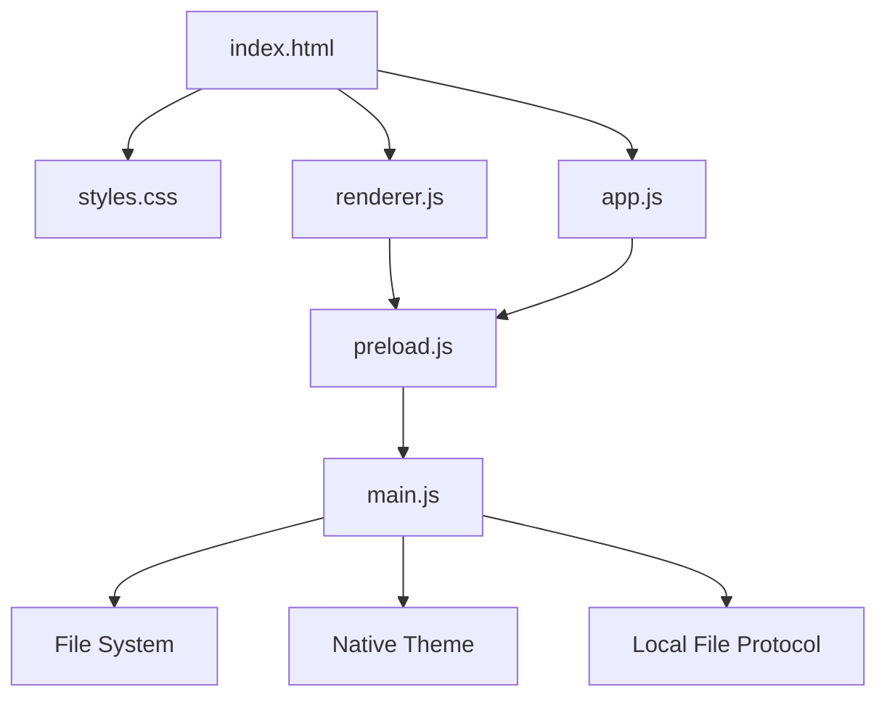
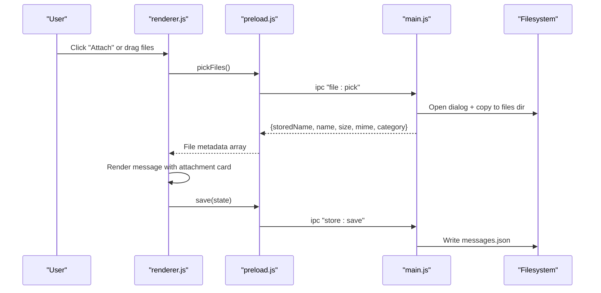
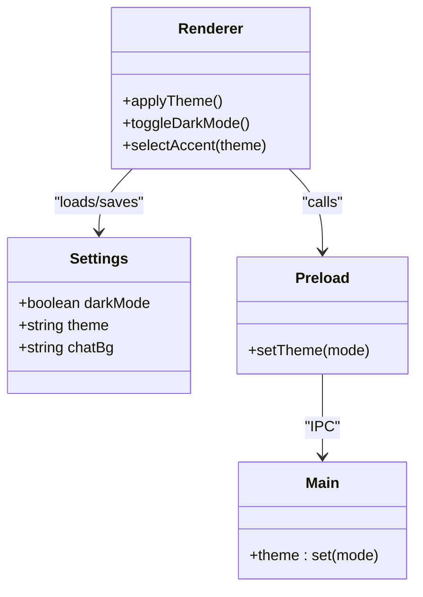
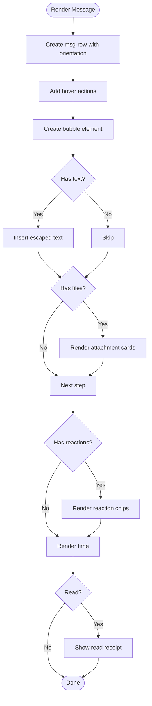
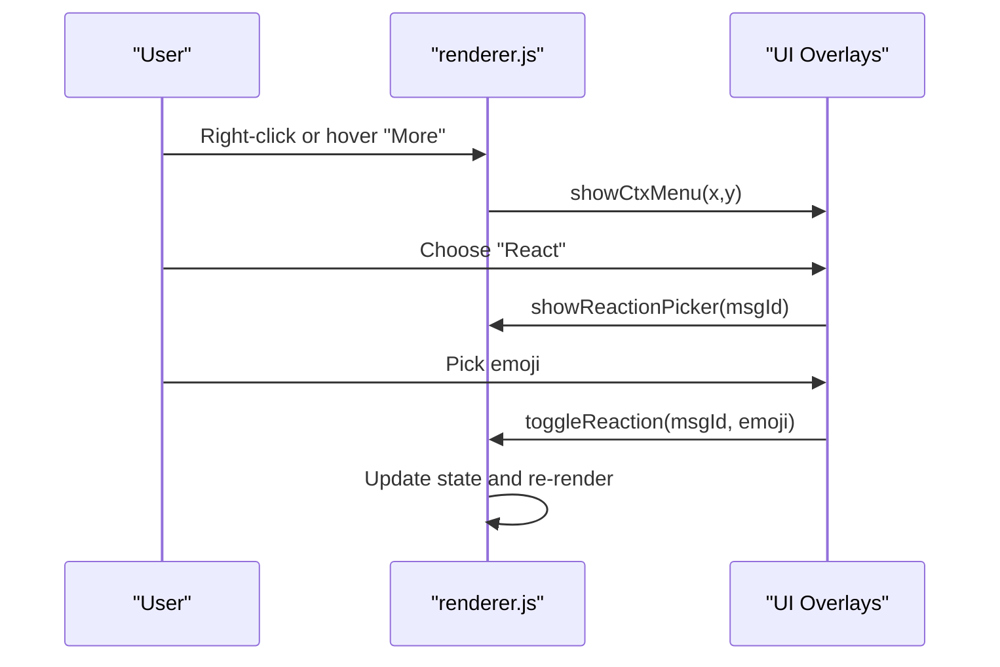
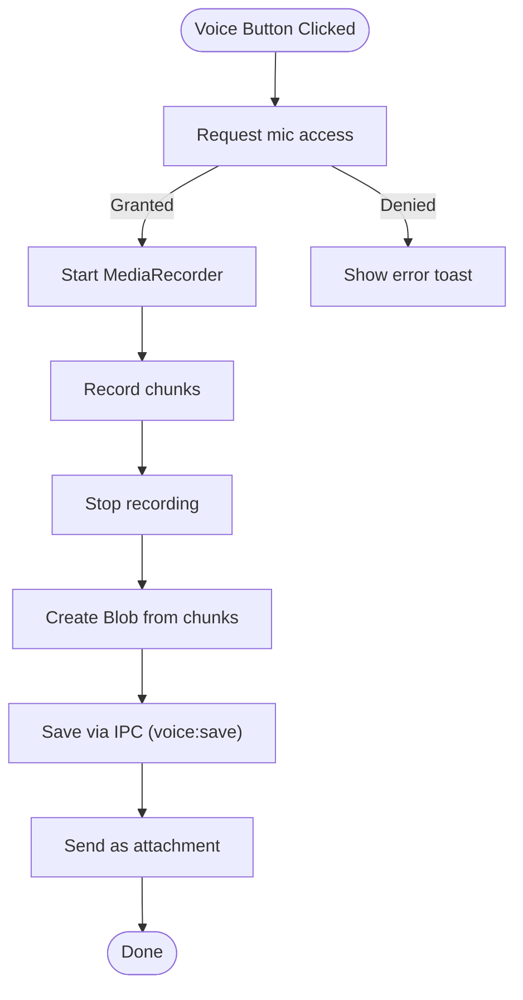
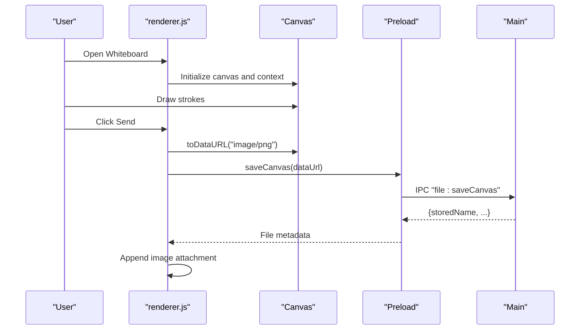
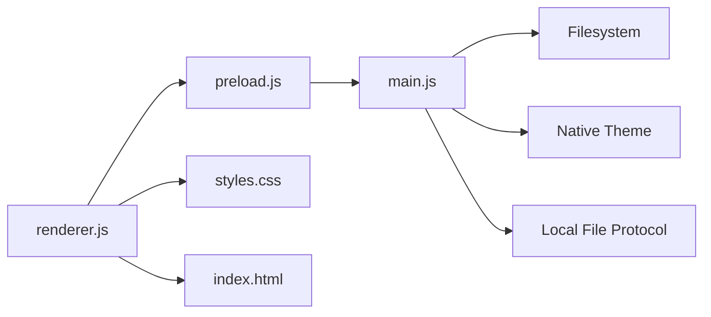

# User Interface Components

<cite>
**Referenced Files in This Document**
- [index.html](file://index.html)
- [styles.css](file://styles.css)
- [renderer.js](file://renderer.js)
- [app.js](file://app.js)
- [preload.js](file://preload.js)
- [main.js](file://main.js)
- [package.json](file://package.json)
</cite>

## Update Summary
**Changes Made**
- Updated three-panel layout architecture (navigation rail, sidebar conversation list, main chat panel)
- Enhanced responsive design with mobile-friendly breakpoints and adaptive layouts
- Expanded theme system with multiple color options and dark/light mode support
- Added comprehensive interactive overlays including context menus, emoji picker, toast notifications, and modal dialogs
- Migrated entire styling system from inline CSS to external styles.css with CSS custom properties
- Implemented advanced message components with reactions, pinning, editing, and search functionality
- Added canvas whiteboard panel with drawing tools and file attachment capabilities

## Table of Contents
1. [Introduction](#introduction)
2. [Project Structure](#project-structure)
3. [Core Components](#core-components)
4. [Architecture Overview](#architecture-overview)
5. [Detailed Component Analysis](#detailed-component-analysis)
6. [Dependency Analysis](#dependency-analysis)
7. [Performance Considerations](#performance-considerations)
8. [Troubleshooting Guide](#troubleshooting-guide)
9. [Conclusion](#conclusion)
10. [Appendices](#appendices)

## Introduction
This document describes the Messenger UI components and comprehensive styling system. The application features a modern three-panel layout with a dark navigation rail, conversation sidebar, and main chat panel. It includes responsive design across all screen sizes, an extensive theme system with multiple color options and dark/light modes, rich interactive elements like context menus, emoji pickers, toast notifications, and modal dialogs. The entire styling system uses external CSS with custom properties for consistent theming and maintainability.

## Project Structure
The application is an Electron desktop app with a sophisticated single-page renderer implementing the complete UI and logic. The key files are:
- index.html: Application shell with three-panel layout and component markup
- styles.css: Comprehensive global styles, theme variables, layout definitions, animations, and responsive rules
- renderer.js: Main UI controller handling message rendering, interactions, panels, canvas whiteboard, and state management
- app.js: Alternative minimal renderer used by a secondary HTML template included in index.html
- preload.js: IPC bridge exposing safe APIs to the renderer for file operations, storage, and native features
- main.js: Electron process handling storage, file operations, native theming, window lifecycle, and protocol registration
- package.json: App metadata and build configuration

**Diagram sources**
- [index.html:1-232](file://index.html#L1-L232)
- [styles.css:1-293](file://styles.css#L1-L293)
- [renderer.js:1-723](file://renderer.js#L1-L723)
- [app.js:1-239](file://app.js#L1-L239)
- [preload.js:1-17](file://preload.js#L1-L17)
- [main.js:1-155](file://main.js#L1-L155)

**Section sources**
- [index.html:1-232](file://index.html#L1-L232)
- [package.json:1-56](file://package.json#L1-L56)

## Core Components
The application implements a comprehensive three-panel messaging interface:

### Layout Architecture
- **Navigation Rail**: Dark-themed left rail with avatar display and action buttons (dark mode toggle, settings)
- **Conversation Sidebar**: Searchable conversation list with header, search input, and scrollable conversation items
- **Main Chat Panel**: Complete messaging interface with header, pinned messages bar, search functionality, message area, typing indicator, drop zone, and composer

### Message System
- **Message Components**: Rich message bubbles with hover actions, reactions, pin badges, read receipts, timestamps, and edit indicators
- **File Attachments**: Category-specific cards supporting images, videos, audio files, PDFs, and generic files with preview capabilities
- **Interactive Features**: Context menus, reaction pickers, emoji picker, theme selector, settings panel, and edit modals

### Advanced Features
- **Canvas Whiteboard**: Full-screen drawing panel with pen/eraser tools, color picker, size controls, and stroke counter
- **Voice Recording**: MediaRecorder-based voice note capture with real-time timer and cancellation
- **Search Functionality**: In-chat search with highlighted results and navigation between matches
- **Theme System**: Multiple accent colors, dark/light modes, and persistent user preferences

**Section sources**
- [index.html:11-232](file://index.html#L11-L232)
- [renderer.js:1-723](file://renderer.js#L1-L723)
- [styles.css:30-293](file://styles.css#L30-L293)

## Architecture Overview
The UI follows a layered architecture with clear separation of concerns:
- **Presentation Layer (HTML/CSS)**: Defines structure, appearance, and responsive behavior
- **Controller Layer (renderer.js/app.js)**: Manages application state, DOM updates, user interactions, and business logic
- **Bridge Layer (preload.js)**: Exposes secure IPC methods to the renderer for native feature access
- **Process Layer (main.js)**: Handles persistent storage, file I/O, OS integrations, native theming, and window lifecycle

**Diagram sources**
- [renderer.js:599-603](file://renderer.js#L599-L603)
- [renderer.js:221-232](file://renderer.js#L221-L232)
- [preload.js:3-16](file://preload.js#L3-L16)
- [main.js:69-76](file://main.js#L69-L76)
- [main.js:64-67](file://main.js#L64-L67)

**Section sources**
- [renderer.js:1-723](file://renderer.js#L1-L723)
- [preload.js:1-17](file://preload.js#L1-L17)
- [main.js:1-155](file://main.js#L1-L155)

## Detailed Component Analysis

### Three-Panel Layout System and Responsive Design
The application implements a sophisticated three-panel layout with comprehensive responsive behavior:

#### Layout Structure
- **Rail Navigation**: Fixed 64px width dark rail with vertical button stack and active states
- **Sidebar**: 340px width conversation list with search, filters, and scrollable items
- **Chat Panel**: Flexible main content area with header, messages, and composer

#### Responsive Breakpoints
- **Desktop (>900px)**: Full three-panel layout with optimal spacing
- **Tablet (720px-900px)**: Reduced padding and adjusted toolbar layout
- **Mobile (<720px)**: Hidden rail, full-width sidebar with overlay capability
- **Small Mobile (<520px)**: Hidden sidebar by default, tight spacing optimization

**Diagram sources**
- [styles.css:289-293](file://styles.css#L289-L293)

**Section sources**
- [styles.css:30-118](file://styles.css#L30-L118)
- [styles.css:289-293](file://styles.css#L289-L293)

### Comprehensive Theme System and Custom Properties
The theme system provides extensive customization through CSS custom properties:

#### Theme Variables
- **Color System**: Accent colors, backgrounds, text colors, borders, and bubble gradients
- **Dark Mode**: Complete dark palette with optimized contrast ratios
- **Theme Variants**: Purple, pink, green, orange, red, teal, and gradient themes
- **Component Theming**: Consistent styling across all UI components

#### Theme Management
- **Dynamic Switching**: Real-time theme changes without page reload
- **Persistent Settings**: User preferences saved and restored automatically
- **Native Integration**: Syncs with system theme preferences
- **Visual Feedback**: Toast notifications confirm theme changes

**Diagram sources**
- [styles.css:8-28](file://styles.css#L8-L28)
- [renderer.js:61-68](file://renderer.js#L61-L68)
- [preload.js:14](file://preload.js#L14)
- [main.js:115](file://main.js#L115)

**Section sources**
- [styles.css:8-28](file://styles.css#L8-L28)
- [renderer.js:61-68](file://renderer.js#L61-L68)
- [main.js:115](file://main.js#L115)

### Advanced Message Bubble Components
Messages feature sophisticated interaction patterns and visual feedback:

#### Message Structure
- **Orientation System**: Right-aligned for sent messages, left-aligned for received
- **Bubble Styling**: Rounded corners with gradient backgrounds and pop-in animations
- **Hover Actions**: Quick access to react, more options, and contextual actions
- **Status Indicators**: Read receipts, edit labels, and pin badges

#### Interactive Features
- **Reaction System**: Emoji reactions with count tracking and chip display
- **Context Menus**: Position-aware menus with dynamic action availability
- **Edit Modal**: Inline editing with confirmation and history tracking
- **Pin Functionality**: Persistent pinned messages with dedicated bar display

**Diagram sources**
- [renderer.js:98-173](file://renderer.js#L98-L173)
- [styles.css:116-141](file://styles.css#L116-L141)

**Section sources**
- [renderer.js:98-173](file://renderer.js#L98-L173)
- [styles.css:116-141](file://styles.css#L116-L141)

### File Attachment Cards and Media Handling
The attachment system supports multiple file types with appropriate previews:

#### Category-Based Rendering
- **Images**: Inline previews with click-to-open functionality
- **Videos**: Embedded video players with native controls
- **Audio**: Audio players with playback controls
- **PDFs**: Compact cards with file information and actions
- **Generic Files**: Universal file cards with extension icons

#### File Operations
- **Open Action**: Launches files with system default applications
- **Show Action**: Reveals files in system file explorer
- **Metadata Display**: Shows file names, sizes, and MIME types
- **Theming Support**: Adapts card appearance for light/dark modes

**Diagram sources**
- [renderer.js:175-219](file://renderer.js#L175-L219)
- [styles.css:244-258](file://styles.css#L244-L258)

**Section sources**
- [renderer.js:175-219](file://renderer.js#L175-L219)
- [styles.css:244-258](file://styles.css#L244-L258)

### Interactive Overlays and User Interfaces
The application provides comprehensive overlay interfaces for enhanced user interaction:

#### Context Menu System
- **Position-Aware**: Automatically positions near click targets within viewport bounds
- **Dynamic Actions**: Context-sensitive menu items based on message state
- **Keyboard Support**: Escape key dismissal and focus management

#### Reaction Picker
- **Floating Interface**: Positioned relative to target message
- **Quick Selection**: Common emoji shortcuts with hover scaling effects
- **State Persistence**: Tracks reaction counts per message

#### Emoji Picker
- **Searchable Grid**: Filterable emoji selection with real-time search
- **Grid Layout**: 8-column responsive grid with hover states
- **Composer Integration**: Direct insertion into message input

#### Theme Picker
- **Visual Swatches**: Gradient preview buttons showing actual theme colors
- **Active State**: Visual indication of current theme selection
- **Instant Preview**: Immediate theme application without confirmation

**Diagram sources**
- [renderer.js:242-274](file://renderer.js#L242-L274)
- [renderer.js:276-303](file://renderer.js#L276-L303)
- [renderer.js:435-452](file://renderer.js#L435-L452)

**Section sources**
- [renderer.js:242-303](file://renderer.js#L242-L303)
- [renderer.js:404-452](file://renderer.js#L404-L452)

### Composer and Voice Note System
The composer provides comprehensive input capabilities with advanced recording features:

#### Input Methods
- **Text Input**: Standard text composition with placeholder guidance
- **File Attachment**: Button-triggered file picker integration
- **Emoji Insertion**: Quick emoji access via dedicated picker
- **Voice Recording**: Professional-grade audio capture with real-time feedback

#### Voice Recording Implementation
- **MediaRecorder API**: Native browser audio capture with WebM format
- **Real-time Timer**: Live duration display with formatted time output
- **Cancellation Support**: Abort recording before completion
- **Quality Validation**: Minimum duration validation prevents accidental submissions

**Diagram sources**
- [renderer.js:517-542](file://renderer.js#L517-L542)
- [renderer.js:552-557](file://renderer.js#L552-L557)
- [main.js:99-109](file://main.js#L99-L109)

**Section sources**
- [renderer.js:517-557](file://renderer.js#L517-L557)
- [main.js:99-109](file://main.js#L99-L109)

### Canvas Whiteboard Panel
The whiteboard provides professional drawing capabilities with comprehensive tool support:

#### Drawing Tools
- **Pen Tool**: Freehand drawing with adjustable stroke width and color
- **Eraser Tool**: Selective erasing with proportional sizing
- **Color Picker**: Native color selection with live preview
- **Size Control**: Adjustable stroke width from 1-36 pixels

#### Canvas Management
- **Responsive Sizing**: Automatic resize handling with device pixel ratio support
- **Stroke Tracking**: Real-time stroke counter for session management
- **Clear Function**: Complete canvas reset with confirmation
- **Export Capability**: PNG export for sharing or saving

**Diagram sources**
- [renderer.js:605-688](file://renderer.js#L605-L688)
- [main.js:78-88](file://main.js#L78-L88)

**Section sources**
- [renderer.js:605-688](file://renderer.js#L605-L688)
- [main.js:78-88](file://main.js#L78-L88)

### Animations and Micro-interactions
The application implements smooth animations throughout the user experience:

#### Core Animations
- **Pop-in Effect**: New messages animate with scale and translation transitions
- **Typing Indicator**: Bouncing dots animation simulates typing activity
- **Recording Pulse**: Pulsing dot indicates active voice recording
- **Hover Transitions**: Smooth background and color changes on interactive elements

#### Performance Optimizations
- **CSS Transitions**: Hardware-accelerated animations using transform properties
- **Animation Timing**: Optimized durations and easing functions for natural feel
- **Memory Management**: Proper cleanup of animation timers and event listeners

**Section sources**
- [styles.css:121](file://styles.css#L121)
- [styles.css:146-149](file://styles.css#L146-L149)
- [styles.css:167-168](file://styles.css#L167-L168)

## Dependency Analysis
The application maintains clear dependency relationships between components:

### Runtime Dependencies
- **Renderer Dependencies**: HTML structure, CSS classes, and preload-exposed messenger API
- **Preload Bridge**: IPC communication layer between renderer and main processes
- **Main Process**: Data persistence, file operations, native theme synchronization, and local file protocol

### External Integrations
- **Electron APIs**: BrowserWindow, ipcMain/ipcRenderer, dialog, shell, nativeTheme
- **Browser APIs**: MediaRecorder, FileReader, localStorage, clipboard API
- **File System**: Local storage for messages, settings, and uploaded files
- **Protocol Handler**: Custom local-file:// protocol for serving stored assets

**Diagram sources**
- [renderer.js:1-723](file://renderer.js#L1-L723)
- [preload.js:1-17](file://preload.js#L1-L17)
- [main.js:1-155](file://main.js#L1-L155)
- [styles.css:1-293](file://styles.css#L1-L293)
- [index.html:1-232](file://index.html#L1-L232)

**Section sources**
- [renderer.js:1-723](file://renderer.js#L1-L723)
- [preload.js:1-17](file://preload.js#L1-L17)
- [main.js:1-155](file://main.js#L1-L155)

## Performance Considerations
The application implements several performance optimizations for smooth operation:

### Rendering Optimization
- **Batch Updates**: DOM modifications grouped within render functions to minimize reflows
- **Efficient Queries**: Cached element references and optimized DOM traversal
- **Lazy Loading**: Progressive loading of large datasets and media content

### Memory Management
- **Stream Cleanup**: Proper disposal of MediaRecorder streams after recording completion
- **Event Listener Management**: Timely removal of event listeners when components are destroyed
- **Timer Cleanup**: Proper cancellation of intervals and timeouts during component teardown

### File Handling
- **Base64 Processing**: Efficient conversion for temporary processing before permanent storage
- **Chunked Operations**: Streaming approach for large file uploads and downloads
- **Resource Cleanup**: Automatic cleanup of temporary blobs and object URLs

### Theme Performance
- **CSS Variable Updates**: Efficient theme switching through CSS custom property manipulation
- **Minimal Repaints**: Strategic use of transforms and opacity for hardware-accelerated animations
- **Cache Optimization**: Leveraging browser caching for static assets and repeated operations

## Troubleshooting Guide
Common issues and their solutions:

### File Access Problems
- **Files Not Opening**: Verify local-file protocol registration and stored file names
- **Missing Files**: Check userData/files and userData/voice directories for existence
- **Permission Issues**: Ensure proper file system permissions and path sanitization

### Theme and Display Issues
- **Theme Not Applying**: Confirm body class toggling and native theme source configuration
- **Display Glitches**: Validate CSS custom property inheritance and responsive breakpoint behavior
- **Color Inconsistencies**: Check theme variable overrides and component-specific styling

### Recording and Media Issues
- **Microphone Access Denied**: Verify browser permissions and microphone availability
- **Recording Too Short**: Implement minimum duration validation and user feedback
- **Audio Playback Problems**: Check MIME type detection and codec compatibility

### Search and Navigation
- **Search Not Highlighting**: Ensure regex escaping and proper DOM manipulation
- **Scroll Position Issues**: Validate scrollIntoView parameters and container boundaries
- **Focus Management**: Implement proper keyboard navigation and focus trapping

### Canvas Drawing Problems
- **Drawing Issues**: Validate pointer capture release and device pixel ratio scaling
- **Resize Problems**: Check canvas dimension calculations and context transformation
- **Performance Issues**: Optimize drawing operations and implement requestAnimationFrame usage

**Section sources**
- [main.js:90-97](file://main.js#L90-L97)
- [main.js:115](file://main.js#L115)
- [renderer.js:517-542](file://renderer.js#L517-L542)
- [renderer.js:385-402](file://renderer.js#L385-L402)
- [renderer.js:639-667](file://renderer.js#L639-L667)

## Conclusion
The Messenger UI delivers a polished, responsive messaging experience with a comprehensive theme system, rich interactive components, and robust file handling capabilities. The three-panel layout architecture provides excellent usability across different screen sizes, while the CSS custom properties system ensures consistent theming throughout the application. The renderer encapsulates complex interactions cleanly, and the modular architecture facilitates easy extension and maintenance. Following the provided guidelines will help developers extend features while maintaining visual coherence and performance standards.

## Appendices

### CSS Architecture Patterns and Custom Properties
The styling system follows established architectural patterns for maintainability and scalability:

#### Centralized Variables
- **Root Tokens**: Base color tokens defined in :root for consistent theming
- **Theme Overrides**: Body class-based overrides for dark mode and accent colors
- **Component Scoping**: Logical region classes (rail, sidebar, chat, composer) for targeted styling

#### Utility Classes
- **Avatar System**: Size variants (sm, md, lg) with gradient backgrounds
- **Status Pills**: Consistent status indicators with color coding
- **Category Badges**: File type indicators with appropriate styling

#### Spacing and Typography
- **Consistent Spacing**: Shared spacing variables for margins and padding
- **Typography Scale**: Hierarchical font sizing with proper line heights
- **Elevation System**: Shadow utilities for depth and hierarchy

**Section sources**
- [styles.css:8-28](file://styles.css#L8-L28)
- [styles.css:30-118](file://styles.css#L30-L118)
- [styles.css:43-52](file://styles.css#L43-L52)

### Guidelines for Extending the UI
Best practices for maintaining consistency and extensibility:

#### Styling Guidelines
- **Variable Usage**: Always use existing CSS variables for colors and backgrounds
- **Naming Conventions**: Follow established class naming patterns (.msg-row, .bubble, .attach-card)
- **Component Isolation**: Keep interactions centralized in renderer.js; avoid inline styles
- **Responsive Design**: Use existing breakpoints and follow mobile-first principles

#### Interaction Patterns
- **State Management**: Persist user preferences via settings API exposed by preload/main
- **Overlay Management**: Follow hidden attribute pattern for modal visibility
- **Keyboard Navigation**: Implement escape key dismissal and focus management
- **Error Handling**: Provide user feedback through toast notifications

#### Performance Best Practices
- **DOM Manipulation**: Batch updates and minimize reflows during rendering
- **Event Delegation**: Use event delegation for dynamic content
- **Memory Management**: Clean up timers, listeners, and media streams appropriately
- **Animation Optimization**: Prefer CSS transforms over JavaScript animations

**Section sources**
- [renderer.js:61-68](file://renderer.js#L61-L68)
- [renderer.js:49-53](file://renderer.js#L49-L53)
- [preload.js:3-16](file://preload.js#L3-L16)
- [main.js:64-67](file://main.js#L64-L67)