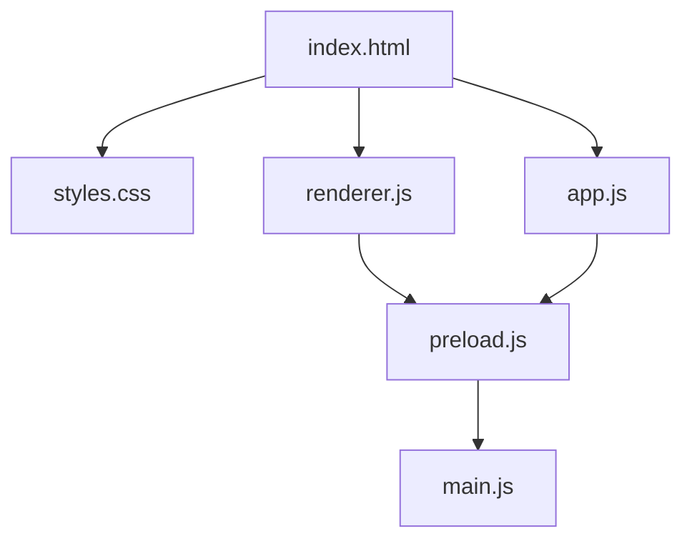
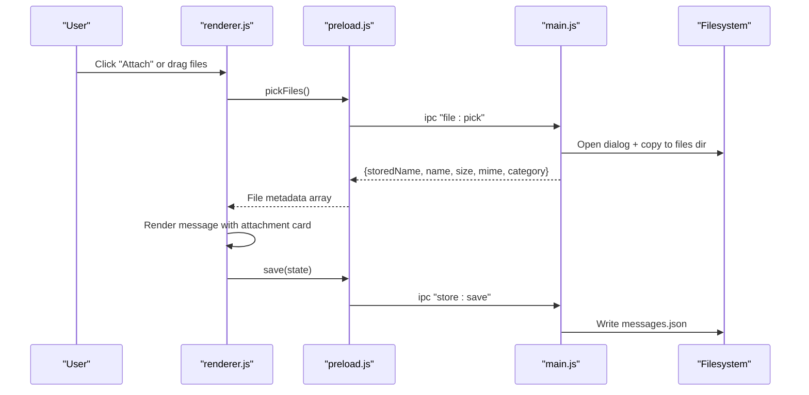
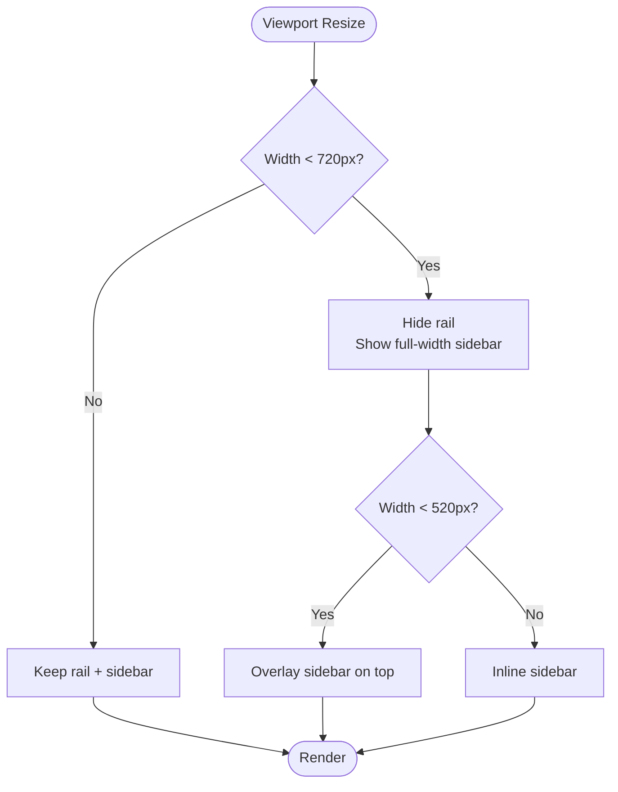
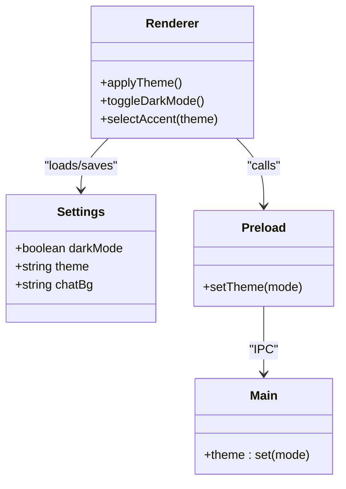
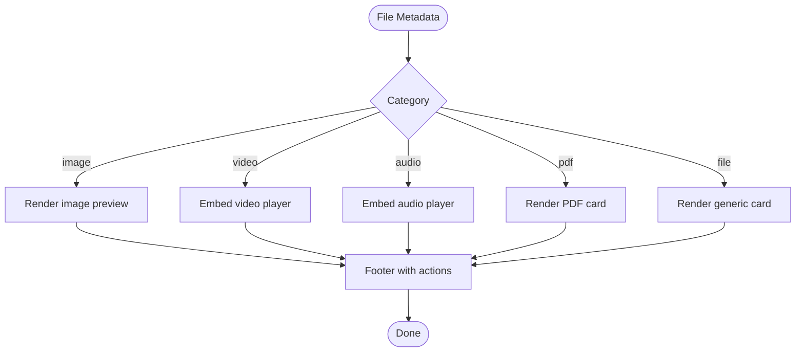
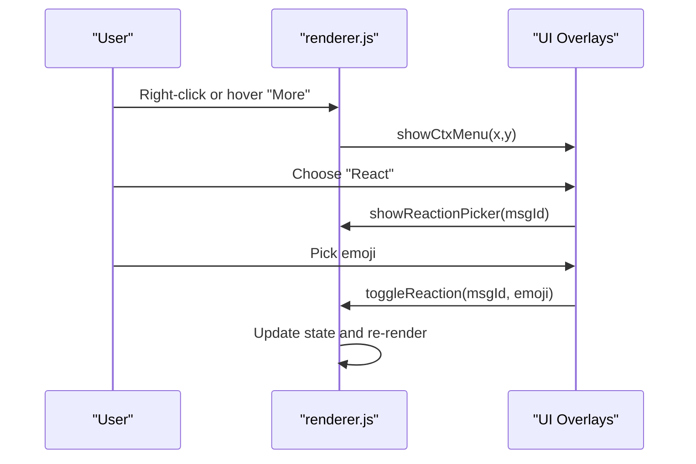
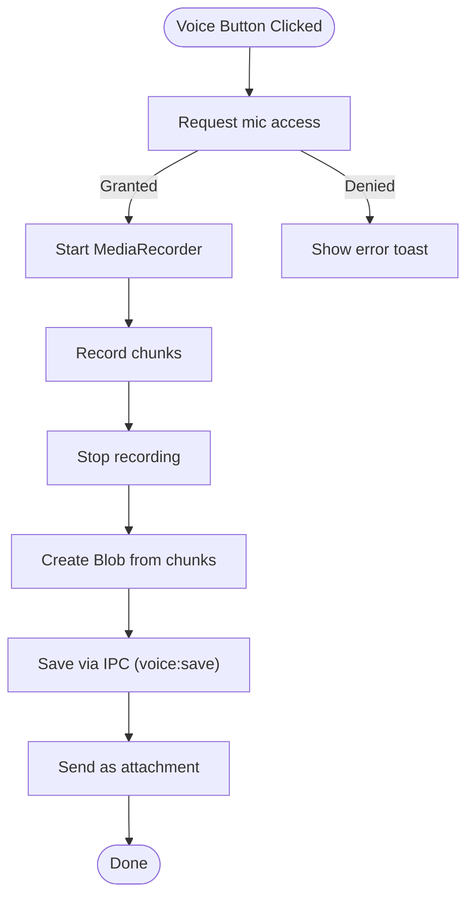
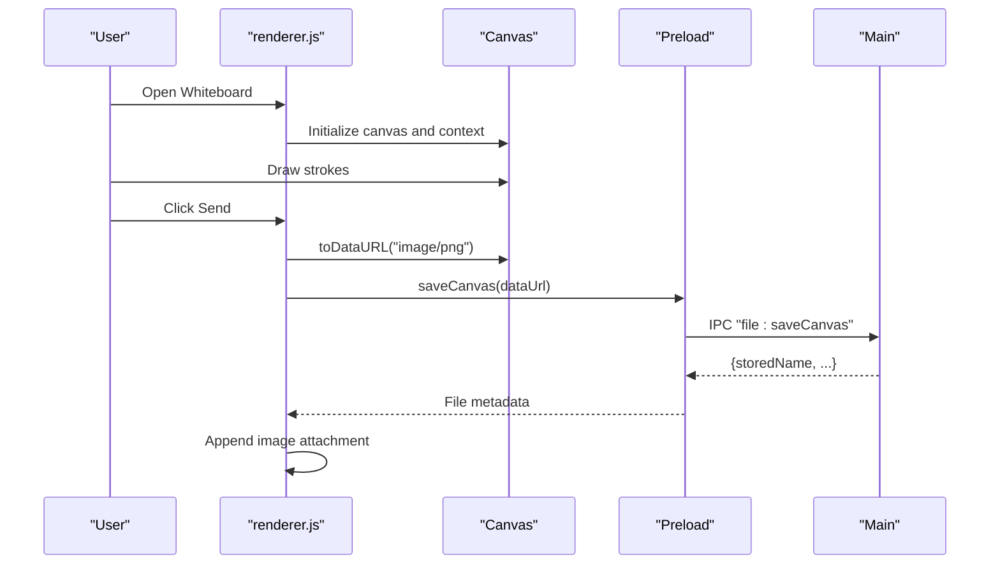
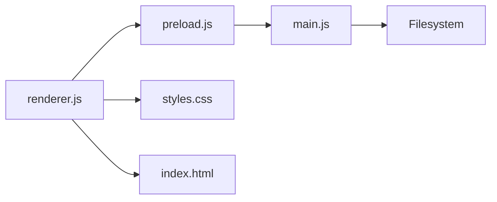

# User Interface Components

<cite>
**Referenced Files in This Document**
- [index.html](file://index.html)
- [styles.css](file://styles.css)
- [renderer.js](file://renderer.js)
- [app.js](file://app.js)
- [preload.js](file://preload.js)
- [main.js](file://main.js)
- [package.json](file://package.json)
</cite>

## Table of Contents
1. [Introduction](#introduction)
2. [Project Structure](#project-structure)
3. [Core Components](#core-components)
4. [Architecture Overview](#architecture-overview)
5. [Detailed Component Analysis](#detailed-component-analysis)
6. [Dependency Analysis](#dependency-analysis)
7. [Performance Considerations](#performance-considerations)
8. [Troubleshooting Guide](#troubleshooting-guide)
9. [Conclusion](#conclusion)
10. [Appendices](#appendices)

## Introduction
This document describes the Messenger UI components and styling system. It covers the messenger-style layout with a dark left rail, conversation sidebar, and blue message bubbles; responsive design across screen sizes; theme system including dark/light modes and color customization; message bubble components; file attachment cards; interactive elements such as context menus and reaction buttons; CSS architecture patterns using custom properties; and animation implementations. It also provides guidelines for extending the UI while maintaining visual consistency.

## Project Structure
The application is an Electron desktop app with a single-page renderer that implements the UI and logic. The key files are:
- index.html: Application shell and component markup
- styles.css: Global styles, theme variables, layout, animations, and responsive rules
- renderer.js: Main UI controller (message rendering, interactions, panels, canvas whiteboard)
- app.js: Alternative minimal renderer used by a secondary HTML template included in index.html
- preload.js: IPC bridge exposing safe APIs to the renderer
- main.js: Electron process handling storage, file operations, native theming, and window lifecycle
- package.json: App metadata and build configuration

**Diagram sources**
- [index.html:1-259](file://index.html#L1-L259)
- [styles.css:1-1250](file://styles.css#L1-L1250)
- [renderer.js:1-656](file://renderer.js#L1-L656)
- [app.js:1-239](file://app.js#L1-L239)
- [preload.js:1-28](file://preload.js#L1-L28)
- [main.js:1-176](file://main.js#L1-L176)

**Section sources**
- [index.html:1-259](file://index.html#L1-L259)
- [package.json:1-56](file://package.json#L1-L56)

## Core Components
- Layout regions:
  - Left rail: Dark navigation rail with avatar and action buttons
  - Sidebar: Conversation list header, search input, filters, and scrollable list
  - Chat panel: Header, pinned bar, optional search bar, messages area, typing indicator, drop zone, composer
- Message components:
  - Message row and bubble with hover actions, reactions, pin badge, read receipt, time
  - File attachment cards with category-specific icons and actions
- Interactive overlays:
  - Context menu, reaction picker, emoji picker, theme picker, settings panel, edit modal
  - Canvas whiteboard panel with tools, color/size controls, clear/send/cancel
- Feedback:
  - Toast notifications, typing indicator, drop zone overlay

Key behaviors implemented in the renderer include:
- Rendering messages with day dividers and timestamps
- Drag-and-drop file attachments
- Voice note recording and sending
- Pinned messages and inline editing
- In-chat search with highlighted results and navigation
- Theme switching (dark/light) and accent color selection
- Keyboard shortcuts (Escape to close overlays, Ctrl/Cmd+F to open search)

**Section sources**
- [index.html:11-259](file://index.html#L11-L259)
- [renderer.js:1-656](file://renderer.js#L1-L656)
- [styles.css:59-533](file://styles.css#L59-L533)

## Architecture Overview
The UI follows a layered architecture:
- Presentation layer (HTML/CSS): Defines structure and appearance
- Controller layer (renderer.js/app.js): Manages state, DOM updates, user interactions
- Bridge layer (preload.js): Exposes secure IPC methods to the renderer
- Process layer (main.js): Handles persistent storage, file I/O, OS integrations, and native theme

**Diagram sources**
- [renderer.js:541-549](file://renderer.js#L541-L549)
- [renderer.js:123-148](file://renderer.js#L123-L148)
- [preload.js:1-16](file://preload.js#L1-L16)
- [main.js:127-132](file://main.js#L127-L132)
- [main.js:123-126](file://main.js#L123-L126)

**Section sources**
- [renderer.js:1-656](file://renderer.js#L1-L656)
- [preload.js:1-16](file://preload.js#L1-L16)
- [main.js:1-176](file://main.js#L1-L176)

## Detailed Component Analysis

### Layout System and Responsive Design
- Grid/Flex layout:
  - .app uses flexbox to arrange rail, sidebar, and chat panel
  - .messages centers content with max-width and auto margins
- Rail:
  - Fixed width, dark background, vertical stack of icon buttons
  - Active states use accent color
- Sidebar:
  - Search input with icon overlay, filter chips, scrollable conversation list
  - Hover and active states for conversations
- Chat panel:
  - Header with avatar, name, status, and action buttons
  - Optional pinned bar and search bar
  - Messages container with smooth scrolling and custom scrollbar styling
- Responsive breakpoints:
  - At 900px: reduce padding and adjust toolbar layout
  - At 720px: hide rail, allow full-width sidebar
  - At 520px: hide sidebar by default; show via class when needed; tighten spacing

**Diagram sources**
- [styles.css:527-533](file://styles.css#L527-L533)

**Section sources**
- [styles.css:59-118](file://styles.css#L59-L118)
- [styles.css:144-179](file://styles.css#L144-L179)
- [styles.css:527-533](file://styles.css#L527-L533)

### Theme System and Custom Properties
- Root variables define colors for backgrounds, text, borders, accents, and bubble gradients
- Body classes control mode and theme:
  - body.dark toggles dark palette
  - body.theme-{color} overrides accent and bubble gradient
- Theme picker UI allows selecting accent colors; changes persist via settings
- Native theme sync: renderer calls setTheme which sets nativeTheme in main process

**Diagram sources**
- [styles.css:19-56](file://styles.css#L19-L56)
- [renderer.js:67-89](file://renderer.js#L67-L89)
- [preload.js:14](file://preload.js#L14)
- [main.js:164-166](file://main.js#L164-L166)

**Section sources**
- [styles.css:19-56](file://styles.css#L19-L56)
- [renderer.js:67-89](file://renderer.js#L67-L89)
- [main.js:104-106](file://main.js#L104-L106)

### Message Bubble Components
- Message rows align right for sent messages and left for received
- Bubbles have rounded corners and a pop-in animation
- Hover actions reveal quick actions (react, more)
- Reactions display as chips with counts
- Pin badge indicates pinned messages
- Read receipts show confirmation
- Edited label appears after edits

**Diagram sources**
- [renderer.js:233-310](file://renderer.js#L233-L310)
- [styles.css:188-207](file://styles.css#L188-L207)

**Section sources**
- [renderer.js:233-310](file://renderer.js#L233-L310)
- [styles.css:188-207](file://styles.css#L188-L207)

### File Attachment Cards
- Category-based visuals: image, video, audio, pdf, generic file
- Image previews render inline; videos and audios embed players
- Generic files show a compact card with extension, name, and size
- Footer includes full metadata and action buttons (Open, Show)
- Theming adapts card colors for light/dark modes

**Diagram sources**
- [renderer.js:312-354](file://renderer.js#L312-L354)
- [styles.css:422-472](file://styles.css#L422-L472)

**Section sources**
- [renderer.js:312-354](file://renderer.js#L312-L354)
- [styles.css:422-472](file://styles.css#L422-L472)

### Interactive Elements: Context Menu, Reaction Picker, Emoji Picker, Theme Picker
- Context menu:
  - Positioned near click target
  - Actions: react, reply, copy, pin/unpin, edit, delete
- Reaction picker:
  - Floating chip tray with common emojis
  - Toggles presence/count per message
- Emoji picker:
  - Searchable grid of emojis inserted into composer
- Theme picker:
  - Swatches update accent and bubble gradient
  - Persists selection

**Diagram sources**
- [renderer.js:372-428](file://renderer.js#L372-L428)
- [renderer.js:91-106](file://renderer.js#L91-L106)
- [renderer.js:82-89](file://renderer.js#L82-L89)

**Section sources**
- [renderer.js:372-428](file://renderer.js#L372-L428)
- [renderer.js:91-106](file://renderer.js#L91-L106)
- [renderer.js:82-89](file://renderer.js#L82-L89)

### Composer and Voice Notes
- Composer supports text input, attach, image, emoji, voice note, and send
- Voice recording:
  - Uses MediaRecorder API
  - Shows recording bar with timer and cancel option
  - Saves audio as webm via IPC and sends as attachment

**Diagram sources**
- [renderer.js:150-194](file://renderer.js#L150-L194)
- [renderer.js:196-201](file://renderer.js#L196-L201)
- [main.js:150-158](file://main.js#L150-L158)

**Section sources**
- [renderer.js:150-201](file://renderer.js#L150-L201)
- [main.js:150-158](file://main.js#L150-L158)

### Canvas Whiteboard Panel
- Full-screen overlay with pen and eraser tools
- Color picker and size slider
- Stroke counter and clear/send/cancel actions
- Resizes with device pixel ratio and preserves drawing on resize

**Diagram sources**
- [renderer.js:557-639](file://renderer.js#L557-L639)
- [main.js:133-141](file://main.js#L133-L141)

**Section sources**
- [renderer.js:557-639](file://renderer.js#L557-L639)
- [main.js:133-141](file://main.js#L133-L141)

### Animations and Micro-interactions
- Pop-in animation for new messages
- Typing dots bounce animation
- Pulse animation for recording dot and status indicators
- Smooth transitions for hover/focus states and panel visibility

**Section sources**
- [styles.css:197](file://styles.css#L197)
- [styles.css:251-257](file://styles.css#L251-L257)
- [styles.css:282-283](file://styles.css#L282-L283)
- [styles.css:477-479](file://styles.css#L477-L479)

## Dependency Analysis
- Renderer depends on:
  - HTML structure and CSS classes
  - Preload-exposed messenger API for persistence and file operations
- Preload bridges renderer to main via IPC handlers
- Main handles:
  - Data persistence (messages.json, settings.json)
  - File storage under userData/files and userData/voice
  - Native theme synchronization
  - Local file protocol for serving stored assets

**Diagram sources**
- [renderer.js:1-656](file://renderer.js#L1-L656)
- [preload.js:1-16](file://preload.js#L1-L16)
- [main.js:1-176](file://main.js#L1-L176)
- [styles.css:1-1250](file://styles.css#L1-L1250)
- [index.html:1-259](file://index.html#L1-L259)

**Section sources**
- [renderer.js:1-656](file://renderer.js#L1-L656)
- [preload.js:1-16](file://preload.js#L1-L16)
- [main.js:1-176](file://main.js#L1-L176)

## Performance Considerations
- Efficient rendering:
  - Batch DOM updates within render functions
  - Use requestAnimationFrame for canvas resizing
- Scroll performance:
  - Smooth scrolling enabled; consider virtualization if message count grows significantly
- File handling:
  - Base64 conversion for temporary processing before saving; ensure large files are handled carefully
- Theme switching:
  - CSS variable updates avoid heavy reflows
- Memory management:
  - Release media streams after recording stops
  - Clear timers and event listeners when closing panels

[No sources needed since this section provides general guidance]

## Troubleshooting Guide
- Files not opening or showing:
  - Ensure local-file protocol is registered and stored names are valid
  - Verify file exists in userData/files or userData/voice directories
- Theme not applying:
  - Confirm body classes are toggled correctly and native theme source is set
- Voice recording denied:
  - Check browser permissions and microphone availability
- Search not highlighting:
  - Ensure regex escaping is applied and current hit scrolls into view
- Canvas drawing issues:
  - Validate pointer capture release and DPR scaling on resize

**Section sources**
- [main.js:91-101](file://main.js#L91-L101)
- [main.js:164-166](file://main.js#L164-L166)
- [renderer.js:150-194](file://renderer.js#L150-L194)
- [renderer.js:481-502](file://renderer.js#L481-L502)
- [renderer.js:567-579](file://renderer.js#L567-L579)

## Conclusion
The Messenger UI delivers a polished, responsive messaging experience with a strong theme system, rich interactive components, and robust file handling. The CSS architecture leverages custom properties for consistent theming, while the renderer encapsulates complex interactions cleanly. Following the provided guidelines will help extend features and maintain visual coherence across components.

[No sources needed since this section summarizes without analyzing specific files]

## Appendices

### CSS Architecture Patterns and Custom Properties
- Centralized variables in :root for base tokens
- Theme overrides via body classes for dark mode and accent colors
- Component-level classes scoped to logical regions (rail, sidebar, chat, composer)
- Utility classes for avatars, status pills, and categories
- Consistent spacing, typography, and elevation through shared variables

**Section sources**
- [styles.css:19-56](file://styles.css#L19-L56)
- [styles.css:59-118](file://styles.css#L59-L118)
- [styles.css:144-179](file://styles.css#L144-L179)
- [styles.css:287-302](file://styles.css#L287-L302)

### Guidelines for Extending the UI
- Use existing CSS variables for colors and backgrounds to preserve theme consistency
- Follow naming conventions for classes (.msg-row, .bubble, .attach-card)
- Keep interactions centralized in renderer.js; avoid inline styles
- Persist user preferences via settings API exposed by preload/main
- For new overlays, follow the pattern of hidden attribute toggling and keyboard dismissal

**Section sources**
- [renderer.js:67-89](file://renderer.js#L67-L89)
- [renderer.js:641-651](file://renderer.js#L641-L651)
- [preload.js:1-16](file://preload.js#L1-L16)
- [main.js:123-126](file://main.js#L123-L126)